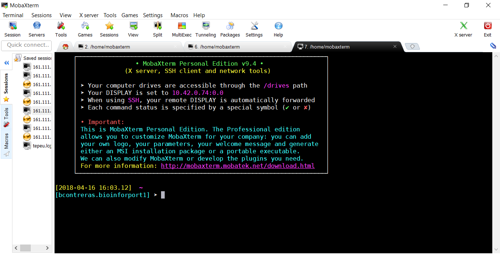

# Session 0: setup

Computer scientists often start counting from zero. In this course, session 0 is about setting up the required environment for the course. Basically, you can use any Linux terminal. Just notice that we are using a user called *osboxes*, which may be different from your username in your system, so that the output of the examples may vary a little.

Therefore, if you already have a Linux terminal available or you want to install Linux as your native OS (either Ubuntu or any other distribution), you may skip this session. Here, we present different ways to install Ubuntu, or other alternative ways to obtain a Linux terminal.

- [Using a virtual machine (VM)](#using-a-virtual-machine--vm-)
- [Ubuntu embedded in Windows 10](#ubuntu-embedded-in-windows-10)
- [Other options](#other-options)

## Using a virtual machine (VM)

A virtual machine allows us to run a different OS (aka *guest OS*) from the one installed as native OS on our computer (aka *host OS*).

There are different virtualization applications. One option to install a VM is:
- Download and install **Oracle VM VirtualBox** (https://www.virtualbox.org/) on your system
- In your web browser, go to https://www.osboxes.org/, search the **downloads** section, and look for and download **Ubuntu 20.04**
- Once the image for Ubuntu has been downloaded, open VirtualBox
- Within VirtualBox, click on **New**. A wizard window will open:
    - Give a name to the VM (e.g. "Ubuntu20")
    - Change the folder where to store the VM if you wish (the virtual hard drive for the whole virtual OS will be created there)
    - As *Type* choose Linux
    - As *Version* choose Ubuntu (64-bit)
    - Click **Next**
- Next you are asked how much memory do you wish to allocate for the VM. Depending on your memory available you may assign a different size for your VM. No less than 2GB and maximum of half of your available memory could be a good choice. Don't worry, you could always change this setting later. Click **Next**.
- Next, you are asked whether to create a new virtual drive or use an existing one:
    - Choose the option to use an existing virtual drive
    - Click on the folder icon.
    - On the new window, click **Add**.
    - Browse and choose the Ubuntu image which you downloaded from *osboxes.org* and click **Open**
    - Click **Choose**, and then **Create**
- Once the process ends, you should see the new Ubuntu VM within VirtualBox. Select it and click **Start**

### Changing the keyboard distribution

It is likely that some user will need to change the keyboard distribution. To do this, within the Ubuntu VM, click on the **Show applications** button, type **settings**, and click on the icon. A **Settings** window will emerge, and on the left menu go down to **Region & Language** and click on it. There, below the **Input Sources** section, just click on the **+** icon, then the **...** icon, and look for your language. If you cannot find it, choose **Other**, to see a full list of languages, and search again for yours. Click on your choice, and click **Add**. Then, you should remove other languages, or change priorities moving the one of your choice to the top of the list below the **Input Sources** section.

### Disabling screen saving

Something which could be useful also is disabling shutting down the screen after some inactivity. To do this, go again to **Settings**, on the left menu click on **Power**, and under **Power Saving**, **Blank Screen**, choose **Never**.

### Guest Additions

It is recommended also to install the Guest Additions. If you installed the *osboxes.org* VM they should be already installed. If the Guest Additions are installed, you should be able to toggle the options to share the clipboard between the guest and the host OS, which are under the **Devices** menu.

### The VirtualBox Host key

Also, it is important to explain how to use the *Host key*. This key can be pressed when within the guest OS, to recover the keyboard and mouse control to the host OS, and also to activate some options. The *Host key* is configurable, but it is usually assigned by default to keys like the *Windows key*, *left Shift*, *left Alt*, *left Ctrl*, or similar. You can check which is your current *Host key* on the group of icons to the bottom right of the window of the guest OS. One example of its use: press *Host key+F* to go full screen.

## Ubuntu embedded in Windows 10

For systems runnings Windows 10 there's a way of running Ubuntu and its terminal. Follow these steps:

1. Make sure you have version 1709 or higher, as explained [here](https://www.protocols.io/view/ubuntu-on-windows-for-computational-biology-sfuebnw)

2. Open Microsoft Store. Search and install "Ubuntu". You can choose a particular version or simply 'Ubuntu' to get the latest supported version.

3. Open system admin and look for "Turn Windows Features on or off". Select the Windows subsystem for Linux.

4. Reboot and launch the Ubuntu app. After a few minutes you should be able to choose your own user and password. You are ready to go.

Note: you will be using a separate filesystem, which can be found at 
	C:\Users\**username**\AppData\Local\Packages\CanonicalGroupLimited.UbuntuonWindows_79rhkp1fndgsc\LocalState\rootfs

This requires enabling "Show Hidden Files and Folders".

Note: the standard Windows filesystem, for instance drive C:, can be found from Ubuntu at 
	/mnt/c 

## Other options 

If you are running a MacOS computer you should be able to run this course on your terminal. You must learn how to install new software though. For instance, you might want to install Xcode Command Line Tools by typing git --version

If you use a Windows system you can install [MobaXterm](https://mobaxterm.mobatek.net). It is a powerfull yet simple tool to connect to SSH and SFTP servers. it also offers Linux terminal and X server. It also allows you to install parts beyond *bash*, such as *git*, *perl* or *python* packages. For example, in order to install Perl under MobaXterm please push "Packages" and select "perl". 

Other options include:

* https://www.vmware.com
* https://www.qemu.org
* https://multipass.run
* https://swcarpentry.github.io/shell-novice/setup.html
