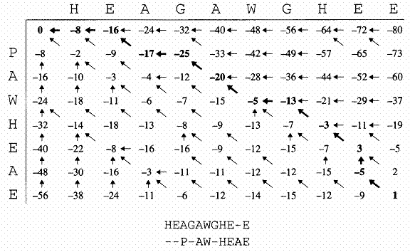
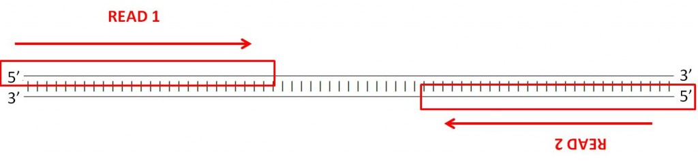
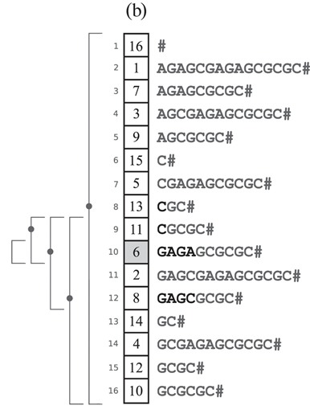
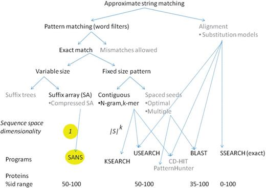
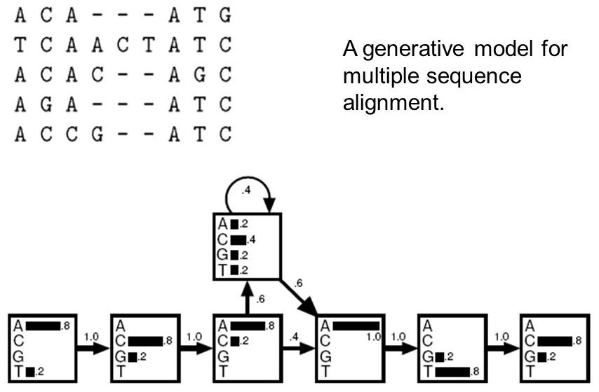

<!-- ~/docencia$ perl -lne 'next if(/^%/); s/\\htmladdnormallink\{\S+?\}\{(\S+)?\}/$1/; print' bib_myarticles.bib > bib_myarticles_md.bib -->


```{r knitr setup, include=FALSE,  eval=TRUE, echo=FALSE, warning=FALSE}
library(knitr)
knitr::opts_chunk$set(eval=TRUE, cache=FALSE, message=FALSE, warning=FALSE, 
                      comment = "", results="markup")
```

# Introduction

In Genomics and Computational Biology, annotating a sequence means decorating it with quantums of biological information, usually about is *molecular function*, the *biological process(es)* in which it participates and the *cellular compartment* where that happens (see the [Gene Ontology](http://geneontology.org)). Other relevant annotations include the evolutionary conservation of a sequence or the biological sample where it was found.

The annotation process requires at least two data sources:

* A collection of previously annotated sequences.

* Indexed literature in repositories such as [PubMed](https://pubmed.ncbi.nlm.nih.gov) or [EuroPMC](https://europepmc.org), where publications are uniquely identified with accession codes such as the [DOI](https://www.doi.org).

Genomic sequences are most often nucleotide and peptide sequences. 
The first can be large genome fragments such as contigs or smaller genes, transcripts, 
coding sequences or non-coding RNAs; peptides are usually proteins translated from open 
reading frames encoded in coding sequences.

In this session we will focus on coding sequences, or in other words, genes that encode proteins.

## Sequence comparison

A natural way of comparing protein or nucleic acid molecules is to align their (primary) sequences. This is due to the general expectation that sequence drives folding and to the fact that sequences are easy to work with in a computer or even your notebook. At least easier than structure.


## Pairwise alignment: edit distance

When two sequences are aligned residues from one sequence are matched one-by-one to residues in the other. Matches are obvious when the sequences are nearly identical, but less so when mutations accumulate. A simple way to compute how similar two sequences are is to compute their edit distance.


## Pairwise alignment: sequence identity

Another way to compute how similar two sequences are is to compute their % sequence identity.


## Substitution matrices

Sequence identity is a simple way of measuring conservation. However, it lacks resolution and handles all residue substitutions the same way. This is not ideal as we know that purine (A,G) and pyrimidine (C,T) nucleotides, or aromatic amino acid resides if we talk about proteins, are often not interchanged with equal probability in real genes or proteins:


These preferences are captured by computing log-odds ratios of frequencies of observed mutations (a,b) with respect to estimates assuming no preference:

$$ s(a,b) = \lambda \ log(\frac{f_{ab}}{f_{a} f_{b}}) \approx  log\frac{f_{homologues}}{f_{bychance}} $$
These log-odds are additive.  <!--and have been scaled so that they can be accurately represented by integers.-->


## BLOSUM substitution matrices

The most frequent substitution matrices used to score protein alignments are the  [BLOSUM](https://en.wikipedia.org/wiki/BLOSUM) matrices. These matrices are described by a number X, as in BLOSUM50, derived from the analysis of alignments of protein blocks/domains with identities < X percent.  Below you can see BLOSUM50:


These log-odds have been scaled so that they can be accurately represented by integers.

BLOSUM matrices are scaled to 1/2-bit units [@Pearson2013]; a substitution score such as s(E,E) can be broken down to: 

$$ s(E,E) = 6 = 2.0 \ log_{2}(\frac{f_{EE}}{f_{E} f_{E}})$$
$$ \frac{f_{EE}}{f_{E} f_{E}} = 2^3 $$

S(E,E) is thus 8 times more likely to occur because of homology than by chance.

## Pairwise alignment: similarity

By using matrices such as BLOSUM it is possible to compute the similarity between two aligned sequences, which is added up along the alignment: 


## Pairwise alignment: handling insertions and deletion (indels)

In addition to residue substitutions, insertions and deletions are usually considered while computing similarity. This can be done in many ways. The simplest is to assume a **linear cost** for insertions, proportional to their length. However, it is more accurate to compute **affine gap costs**, which charge a fix cost to openning a gap (a) and then a linear cost proportional to the gap length (bk). In this way, a gap of k residues receives a total score of -(a+bk)


## Multiple alignment

When more than two sequences are to be aligned we talk about multiple alignments, which can be computed in many ways. The most instuitive way, comparing them all, requires quadratically more resources as more sequences are added.


# Algorithms for sequence alignment

In this section we will visit some of the most frequent algorithms used to align sequences. The goal is to learn what you can and cannot do with each of them so that you can apply them correctly.

## Pairwise alignments

These are the simplest alignments as they involve only two sequences (of length $m$ and $n$). There are several flavours, but the most important are global and local alignments, depicted in this figure taken from [@Makinen2015]:


### Global alignment 

The Needleman-Wunsch (NW) algorithm is the original deterministic approach for the alignment of pairs of protein sequences end-to-end [@Needleman1970]. It was subsequently optimized with more ellaborated algorithms [@Gotoh1982]. These algorithms belong to the family of [dynamic programming (DP) algorithms](https://en.wikipedia.org/wiki/Dynamic_programming). 
The NW and related algorithms break the initial problem in subalignments which are recursively solved. In order to reach the final solution, an alignment matrix DP must be filled iteratively:

+ The top and left margins of DP are filled with gaps of increasing length, and the origin set to zero:

$$
DP(0,0) = 0 \\
DP(i,0) = -id , \text{ for } 1\leq i \leq m \\
DP(0,j) = -jd , \text{ for } 1\leq j \leq n \\
$$

+ The alignment DP matrix can now be computed from top left to bottom right according to the following recursive function, where $s(x,y)$ is a scoring function/substitution matrix and $d$ a linear gap cost:

$$DP(i,j) = max \begin{cases}
    DP(i-1,j-1) + s(x_{i},y_{j})\\
    DP(i-1,j)-d\\
    DP(i,j-1)-d
  \end{cases}
$$

During the computation of the DP matrix, another matrix is used to record the previous cell which was visited before the current cell under consideration. This second matrix is used to perform the traceback step, in which the alignment is reconstructed backwards from the bottom right cell, as illustrated in this figure from [@Durbin1998]:




### Local alignment of two subsequences

Local pairwise alignment is not end-to-end. Instead it assumes that the sequences to be compared might have different domain structure and perhaps share only part of the sequence by homology. The Smith-Waterman (SW) algorithm was designed for this purpose [@Smith1981]. It is a modification of NW with two differences:

$$DP(i,j) = max \begin{cases}
    0\\
    DP(i-1,j-1) + s(x_{i},y_{j})\\
    DP(i-1,j)-d\\
    DP(i,j-1)-d
  \end{cases}
$$

In addition, the traceback step now starts in the cell of DP with the highest score, instead of the bottom right corner [@Durbin1998]:


### Affine gap penalties

The algorithms presented so far have linear gap costs. Affine gap costs, with different cost for openning ($d$) and extending ($e$) an insertion, are believed to be more accurate for protein sequences. They also introduce extra complexity in the algorithm, as they require creating two extra matrices to store indels in sequences $x$ and $y$ [@Durbin1998]:

$$DP(i,j) = max \begin{cases}
    DP(i-1,j-1) + s(x_{i},y_{j})\\
    I_{x}(i-1,j-1) + s(x_{i},y_{j})\\
    I_{y}(i-1,j-1) + s(x_{i},y_{j})
  \end{cases}$$
  
$$I_{x}(i,j) = max \begin{cases}
    DP(i-1,j) -d\\
    I_{x}(i-1,j) -e
  \end{cases}$$
  
$$I_{y}(i,j) = max \begin{cases}
    DP(i,j-1) -d\\
    I_{y}(i,j-1) -e
  \end{cases}$$

### Heuristic pairwise alignments

The DP algorithms just described (NW, SW) are expensive if one wants to compare a **query** sequence to a large collection of sequences (**database**). For each pair of sequences the computation time and memory used is proportional to the product of the sequence lengths. Thus, for a collection of millions of sequences this is unfeasible.

For this reason other approaches have been developed, aiming at running times proportional to the sum of the lengths of the query and database sequences. These approaches are heuristic, meaning that they work fine in most cases, but cannot guarantee to produce always optimal alignments. The most standard of these methods is probably BLAST [@Altschul1997]. 

BLAST saves computing time by pre-processing the sequences producing indexed tables of **words** of size 3 and 11 for BLASTP and BLAST, respectively. For each word, all similar words with high scores (by default BLOSUM62 in BLASTP) are short-listed. BLAST relies on two fundamental assumptions [@Dwyer2003]:

+ Most high-scoring local alignments contain several high-scoring pairs of words. These can be used as *seeds* from which high-scoring alignments can be extended.

+ Homologous proteins contain segments that can be aligned without indels. This simplifies the process of extending seed alignments. 

The natural data structure for indexing words of length $k$, or $k$-mers, is the **$k$-mer index**. The figure below depicts the index for string 'AGAGCGAGAGCGCGC' and $k=2$ [@Makinen2015]:


### Read alignment or mapping

High throughput sequencing has found many applications in all fields of Science in recent years. The primary product of this array of technologies are sequence reads, usually in FASTQ format, of either Single-End (SE) or Paired-End (PE) sequences. PE reads usually have the following arrangement [@PEread]:



Once produced, reads are usually aligned, or mapped, to the closest reference genome [@Makinen2015]:


Since a single sequencing experiment produces millions of reads, and the reference genomes can be very large (see for instance some plant genomes at [RSAT::Plants](http://rsat.eead.csic.es/plants/data/stats)), algorithms for read mapping need to be very efficient in terms of speed and disk space. As sequencers are not error-free, read aligners must also be flexible and tolerate mismatches [@Marco2012]. In addition, these approaches must compute **mapping quality**, as repeated genomic segments imply that some reads could be placed in several locations with equal probability [@Li2008].

They achieve those goals by using a data structure called **suffix array** (SA) which is more flexible than the $k$-mer index, as it supports queries of variable length [@Makinen2015] (see [here](https://bioinfoperl.blogspot.com.es/2011/02/vectores-de-sufijos-para-buscar.html) how to build one, in Spanish):



**Burrows-Wheeler indexes** are space-efficient SA that can be queried and aligned by dynamic programming [@Makinen2015]. See [here](https://bioinfoperl.blogspot.com.es/2011/07/transformada-de-burrows-wheeler-para.html) an example of how the Burrows-Wheeler transform works (in Spanish). 

The next diagram summarizes these and other algorithmic choices in the context of approximate protein sequence matching [@Koskinen2012]:



## Multiple alignments and sequence profiles

<!-- multiple genome align https://academic.oup.com/hmg/article/15/suppl_1/R51/632717 -->

In theory, the DP algorithms described earlier can be generalized to sets of more than two sequences. However, the recursive functions grow in complexity with every new sequence added,
as well as the computational resources required. For this reason, multiple alignments are usually computed using a progressive approach, in which first all sequences are first aligned by pairs, and then these are progressively merged [@Hogeweg1984,@Makinen2015]. This is illustrated in the following diagram [@IntroAppliedWeb]:


One of the many software packages available for multiple alignment, which follows this approach and produces scalable alignments of high quality, is [Clustal Omega](http://www.clustal.org/omega/) [@Sievers2011].

Multiple sequence alignments (MSA) have been used to convey evolutionary information, particularly about protein families, and have been called **sequence profiles** in that context [@Gribskov1987]. Profiles are essentially **position-specific substitution matrices**. The most successful way of encoding protein profiles are Hidden Markov Models (HMM) [@Eddy2004], as those built with [HMMER](http://hmmer.org) for the [Pfam](https://pfam.xfam.org) database of protein families. 
The next figure illustrates how a MSA can be used to build a HMM [@HMMmsa]:




Another standard tool used to build and scan sequence profiles, both protein and DNA, is [MEME](http://meme-suite.org).

Profiles can be aligned to single sequences and also to other profiles [@Soding2005].

# Annotation of protein-coding sequences

Coding sequences are usually abbreviated as CDS. This is a definition from [UniProt](https://www.uniprot.org/help/cds_protein_definition):  

*A CoDing Sequence (CDS) is a region of DNA or RNA whose sequence determines the sequence of amino acids in a protein. It should not be mixed up with an Open Reading Frame (ORF), which is a series of DNA codons that does not contain any STOP codons.*

## CDS and exons

Most genes in plants contain CDS made up of several concatenated exons. This means they contain introns, that is, sequence fragments that must be spliced in order to produce a processed mRNA/transcript.

## Peptide sequences

CDS and ORF sequences are nucleotide sequences, written in the A,C,G,T alphabet. 
By using a codon table, trinucleotides in an ORF can be translated into peptide sequences, which take a third of the original length and a use the 20 amino acid alphabet.

Peptide sequences describe the primary structure of proteins. However, proteins are molecules that must fold in order to carry out their functions, and thus their linear sequences is often not enough to represent them. 

## Secondary, tertiary and quaternary structure of proteins

TODO

Read more [here](http://eead-csic-compbio.github.io/bioinformatica_estructural) (in Spanish).

## Protein domains and motifs

TODO 

<!-- https://www.eead.csic.es/compbio/material/regulatory_proteins/node4.html -->


## Gene Ontology

The gene ontology is a standard language that describes the functions of gene products (protein, RNA) using a controlled and unified vocabularies across all species.

These vocabulary terms (GO terms) annotate the gene products at three different levels:
- Biological process: to which process or pathway is the gen contributing
- Molecular function: the molecular activities of individual gene products
- Cellular component: where the gene products are active

They are organized as a hierarchy and connected to each other through parent-child relationships:   


See [here](https://bioinfoperl.blogspot.com/2011/08/decodificando-la-gene-ontology.html) and [here](https://bioinfoperl.blogspot.com/2011/08/decodificando-la-gene-ontology-cc.html) examples on how to navigate the GO ontology with scripts (in Spanish).

## Phylogentic analysis of sequences

https://www.nature.com/articles/nrg3456


# Exercises

## Annotating sequences by alignment

Here the goal is to learn how to produce different kinds of sequence alignment with standard software. You will need to download the following required software: 

|software|source|documentation|
|----|----|----|
BLAST | [ftp.ncbi.nlm.nih.gov/blast/executables/blast+](ftp://ftp.ncbi.nlm.nih.gov/blast/executables/blast+) | [URL](https://www.ncbi.nlm.nih.gov/books/NBK279690/)  |
Clustal Omega | [www.clustal.org/omega](http://www.clustal.org/omega) | [URL](http://www.clustal.org/omega/#Documentation) | 
HMMER | [hmmer.org](http://hmmer.org) | [URL](http://hmmer.org/documentation.html) |

You will also need some data files, which you can download from [https://github.com/eead-csic-compbio/methods_biostats_bioinfo](https://github.com/eead-csic-compbio/methods_biostats_bioinfo/archive/master.zip) or with *git*:


### Formatting a sequence collection for BLAST

The first task is to format our test sequence set, which was obtained from
[UniProt](http://www.uniprot.org/uniprot/?query=reviewed:yes):

```{r, engine='bash', eval=FALSE}
cd test_data/
gunzip uniprot_Atha.fasta.gz
/path/to/ncbi-blast-2.6.0+/bin/makeblastdb -dbtype prot -in uniprot_Atha.fasta
```
How many sequences have been formatted? 

### Querying the collection with a sample coding sequence

Here you will work with protein ARF6, annotated in [plntfdb.bio.uni-potsdam.de](http://plntfdb.bio.uni-potsdam.de). 
Its protein and transcript sequence is in files *test.faa* and *test.fna*, 
respectively.

```{r exe8.3.2p, eval=FALSE}
>AT1G30330.2 [Arabidopsis thaliana]  ARF6 (AUXIN RESPONSE FACTOR 6)
MRLSSAGFNPQPHEVTGEKRVLNSELWHACAGPLVSLPPVGSRVVYFPQGHSEQVAASTNKEVDAHIPNYPSLHPQL...
```

The transcript is:

```{r exe8.3.2n, eval=FALSE}
>AT1G30330.2 [Arabidopsis thaliana]  ARF6 (AUXIN RESPONSE FACTOR 6)  transcript 
ATGAGATTATCTTCAGCTGGGTTTAATCCTCAACCTCATGAAGTTACAGGAGAGAAAAGAGTTCTTAATTCTGAGCTCTG
GCATGCTTGTGCTGGTCCTCTTGTCTCACTACCTCCTGTTGGAAGCAGAGTTGTGTATTTTCCTCAAGGTCACAGTGAAC
AGGTTGCTGCTTCGACCAACAAAGAAGTAGATGCTCATATACCAAATTATCCGAGCTTGCATCCGCAGCTTATCTGT...
```

We shall now look for similar sequences in our collection:
```{r, engine='bash', eval=FALSE}
/path/to/ncbi-blast-2.6.0+/bin/blastp -db uniprot_Atha.fasta -query test.faa -outfmt 6

/path/to/ncbi-blast-2.6.0+/bin/blastx -db uniprot_Atha.fasta -query test.fna -outfmt 6
```

Can you redirect the output to separate files called *test.faa.blast* and *test.fna.blast* ? 

What is the default alignment format, can you show an example?

Are there differences in the results retrieved in both searches?


### Producing a sequence profile 

Here you will learn to make a sequence profile out of similar sequences matched with several (3) iterations of BLASTP, using PSI-BLAST:

```{r, engine='bash', eval=FALSE}
/path/to/ncbi-blast-2.6.0+/bin/psiblast -db uniprot_Atha.fasta -query test.faa -num_iterations 3 -out_ascii_pssm profile.out
```

Can you explain the contents of the output file *profile.out*?


### Making a Hidden Markov Model (HMM) with aligned sequences

This task comprises four steps:

+ Create a FASTA file with the complete protein sequences of the matches of your protein search with bit score > 200. You might find one-liners useful for this.

+ Compute a multiple alignment of these sequences with Clustal Omega. Check the available output formats.

+ Build a HMM out of these aligned sequences with *hmmbuild*

+ Scan the HMM against your sequence collection with *hmmerscan* and write a short report on the results.

### Annotating function with Gene Ontology (GO) terms

In this exercise we will use the GO-web browser [QuickGo](https://www.ebi.ac.uk/QuickGO/) as it is an intuitive and weekly updated resource.  

We will learn how to:
- [ ]	Search for GO annotations using different inputs (protein IDs, gene IDs and GO terms).
- [ ] Search for all products annotated to specific GO term or GO ID.
- [ ] Customize the research to better fit the user preferences. 

Let's practice:

1.	Search for the GO terms and the functional categories of the following GO IDs GO:0009414, GO:0035618, GO:0016491. **Tip:** For multiple search GO IDs needs to be separated by a space.

2.	What are the GO ID and the functional category corresponding to photosynthesis?

3.	What are the immediate parent(s) and children of the photosynthesis GO term?

4.	Search for the GO annotation terms of the following protein A0A068LKP4,A0A097PR28, A0A059Q6N8? What do you observe?

5.	How many gene products are involved in leaf development? Give the GO ID corresponding to this term.

6.	How many proteins of *Arabidopsis thaliana*, *Prunus perisca* and *Zea mays* are assigned to the leaf development GO term. **Tip:** Zea mays. Taxonomy ID: 4577

7.	Check the total number of **biological** annotations and proteins supported by the **experimental** evidence codes in both *Arabidopsis thaliana* and *Prunus persica*. **Tip :** check the ‘Statistics’ box.


# Bibliography

