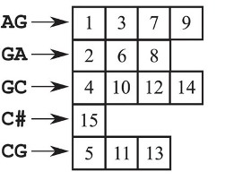

# Session 1: Annotation of coding sequences

<!-- Sequence annotation (alignments, dna, proteins, GO, domains, modelling) --> 
<!-- https://www.eead.csic.es/compbio/material/alineafilog
https://github.com/eead-csic-compbio/biostats_bioinfo
ejercicio GO de Najla -->

In Genomics and Computational Biology, annotating a sequence means decorating it with quantums of biological information, usually about is *molecular function*, the *biological process(es)* in which it participates and the *cellular compartment* where that happens (see the [Gene Ontology](http://geneontology.org)). Other relevant annotations include the evolutionary conservation of a sequence or the biological sample where it was found.

The annotation process requires at least two data sources:

* A collection of previously annotated sequences.

* Indexed literature in repositories such as [PubMed](https://pubmed.ncbi.nlm.nih.gov) or [EuroPMC](https://europepmc.org), where publications are uniquely identified with accession codes such as the [DOI](https://www.doi.org).

Genomic sequences are most often nucleotide and peptide sequences. 
The first can be large genome fragments such as contigs or smaller genes, transcripts, 
coding sequences or non-coding RNAs; peptides are usually proteins translated from open 
reading frames encoded in coding sequences.

In this session we will focus on coding sequences, or in other words, genes that encode proteins.

## Sequence comparison

A natural way of comparing protein or nucleic acid molecules is to align their (primary) sequences. 
This is due to the general expectation that sequence drives folding and to the fact that sequences are easy to work with in a computer or even your notebook. At least easier than structure.

### Pairwise alignment: edit distance

When two sequences are aligned residues from one sequence are matched one-by-one to residues in the other. Matches are obvious when the sequences are nearly identical, but less so when mutations accumulate. A simple way to compute how similar two sequences are is to compute their edit distance.

### Pairwise alignment: sequence identity

Another way to compute how similar two sequences are is to compute their % sequence identity.

### Substitution matrices

Sequence identity is a simple way of measuring conservation. However, it lacks resolution and handles all residue substitutions the same way. This is not ideal as we know that purine (A,G) and pyrimidine (C,T) nucleotides, or aromatic amino acid resides if we talk about proteins, are often not interchanged with equal probability in real genes or proteins:

These preferences are captured by computing log-odds ratios of frequencies of observed mutations (a,b) with respect to estimates assuming no preference:

&space;=&space;\lambda&space;\&space;log(\frac{f_{ab}}{f_{a}&space;f_{b}})&space;\approx&space;log\frac{f_{homologues}}{f_{bychance}})

These log-odds are additive. 

### BLOSUM substitution matrices

The most frequent substitution matrices used to score protein alignments are the  [BLOSUM](https://en.wikipedia.org/wiki/BLOSUM) matrices. These matrices are described by a number X, as in BLOSUM50, derived from the analysis of alignments of protein blocks/domains with identities < X percent.  Below you can see BLOSUM50:

These log-odds have been scaled so that they can be accurately represented by integers.

BLOSUM matrices are scaled to 1/2-bit units [(Pearson2013)](https://www.ncbi.nlm.nih.gov/pmc/articles/PMC3848038); a substitution score such as s(E,E) can be broken down to: 

&space;=&space;6&space;=&space;2.0&space;\&space;log_{2}(\frac{f_{EE}}{f_{E}&space;f_{E}}))

S(E,E) is thus 8 times more likely to occur because of homology than by chance.

### Pairwise alignment: similarity

By using matrices such as BLOSUM it is possible to compute the similarity between two aligned sequences, which is added up along the alignment:

### Pairwise alignment: handling insertions and deletion (indels)

In addition to residue substitutions, insertions and deletions are usually considered while computing similarity. This can be done in many ways. The simplest is to assume a **linear cost** for insertions, proportional to their length. However, it is more accurate to compute **affine gap costs**, which charge a fix cost to openning a gap (a) and then a linear cost proportional to the gap length (bk). In this way, a gap of k residues receives a total score of -(a+bk)

### Multiple alignment

When more than two sequences are to be aligned we talk about multiple alignments, which can be computed in many ways. The most intuitive way, comparing them all, requires quadratically more resources as more sequences are added.

## Algorithms for sequence alignment

In this section we will visit some of the most frequent algorithms used to align sequences. 
The goal is to learn what you can and cannot do with each of them so that you can apply them correctly.

### Pairwise alignments

These are the simplest alignments as they involve only two sequences (of length *m* and *n*). There are several flavours, but the most important are global and local alignments, depicted in this figure taken from [(Makinen2015)](http://www.genome-scale.info):

### Global alignment 

The Needleman-Wunsch (NW) algorithm is the original deterministic approach for 
the alignment of pairs of protein sequences end-to-end [(Needleman1970)](https://www.ncbi.nlm.nih.gov/pubmed/5420325). 
It was subsequently optimized by [(Gotoh1982)](https://doi.org/10.1016/0022-2836(82)90398-9). 
These algorithms belong to the family of [dynamic programming (DP) algorithms](https://en.wikipedia.org/wiki/Dynamic_programming).
The NW and related algorithms break the initial problem in subalignments which are recursively solved. In order to reach the final solution, an alignment matrix DP must be filled iteratively:

+ The top and left margins of DP are filled with gaps of increasing length, and the origin set to zero

+ The alignment DP matrix can now be computed from top left to bottom right according to a recursive function that considers a scoring function/substitution matrix, a linear gap cost and the previously computed scores

During the computation of the DP matrix, another matrix is used to record the previous cell which was visited before the current cell under consideration. This second matrix is used to perform the traceback step, in which the alignment is reconstructed backwards from the bottom right cell, as illustrated in this figure from [(Durbin1998)](http://eddylab.org/cupbook.html):

### Local alignment of two subsequences

Local pairwise alignment is not end-to-end. Instead it assumes that the sequences to be compared might have different domain structure and perhaps share only part of the sequence by homology. The Smith-Waterman (SW) algorithm was designed for this purpose [(Smith1981)](https://www.ncbi.nlm.nih.gov/pubmed/7265238) as a modification of NW. In this case the traceback step now starts in the cell of DP with the highest score, instead of the bottom right corner [(Durbin1998)](http://eddylab.org/cupbook.html):

### Affine gap penalties

The algorithms presented so far have linear gap costs. Affine gap costs, with different cost for openning (*a*) and extending (*b*) an insertion, are believed to be more accurate for protein sequences. They also introduce extra complexity in the algorithm, as they require creating two extra matrices to store indels [(Durbin1998)](http://eddylab.org/cupbook.html).

### Heuristic pairwise alignments

The DP algorithms just described (NW, SW) are expensive if one wants to compare a **query** sequence to a large collection of sequences (**database**). For each pair of sequences the computation time and memory used is proportional to the product of the sequence lengths. Thus, for a large collection of millions of sequences this is unfeasible.

For this reason other approaches have been developed, aiming at running times proportional to the sum of the lengths of the query and database sequences. These approaches are heuristic, meaning that they work fine in most cases, but cannot guarantee to produce always optimal alignments. The most standard of these methods is probably BLAST [(Altschul1997)](https://www.ncbi.nlm.nih.gov/pmc/articles/PMC146917).

BLAST saves computing time by pre-processing the sequences producing indexed tables of **words** of size 3 and 11 for BLASTP and BLAST, respectively. For each word, all similar words with high scores (by default BLOSUM62 in BLASTP) are short-listed. BLAST relies on two fundamental assumptions [(Dwyer2003)](http://www.cambridge.org/052180177X):

+ Most high-scoring local alignments contain several high-scoring pairs of words. These can be used as “seeds” from which high-scoring alignments can be extended.

+ Homologous proteins contain segments that can be aligned without indels. This simplifies the process of extending seed alignments.

The natural data structure for indexing words of length k, or *k-mers*, is the **k-mer index**. The figure below depicts the index for string 'AGAGCGAGAGCGCGC' and *k=2* [(Makinen2015)](http://www.genome-scale.info):

### Read alignment or mapping

High throughput sequencing has found many applications in all fields of Science in recent years. The primary product of this array of technologies are sequence reads, usually in FASTQ format, of either Single-End (SE) or Paired-End (PE) sequences. PE reads usually have the following arrangement [(Minikel2012)](http://www.cureffi.org/2012/12/19/forward-and-reverse-reads-in-paired-end-sequencing):

Once produced, reads are usually aligned, or mapped, to the closest reference genome [(Makinen2015)](http://www.genome-scale.info):

Since a single sequencing experiment produces millions of reads, and the reference genomes can be very large (see for instance some plant genomes at [RSAT::Plants](http://rsat.eead.csic.es/plants/data/stats)), algorithms for read mapping need to be very efficient in terms of speed and disk space. As sequencers are not error-free, read aligners must also be flexible and tolerate mismatches [(Marco2012)](https://www.ncbi.nlm.nih.gov/pubmed/23103880). In addition, these approaches must compute **mapping quality**, as repeated genomic segments imply that some reads could be placed in several locations with equal probability [(Li2008)](https://www.ncbi.nlm.nih.gov/pubmed/18714091).

They achieve those goals by using a data structure called **suffix array** (SA) which is more flexible than the *k-mer* index, as it supports queries of variable length [(Makinen2015)](http://www.genome-scale.info) (see [here](https://bioinfoperl.blogspot.com.es/2011/02/vectores-de-sufijos-para-buscar.html) how to build one, in Spanish):

**Burrows-Wheeler indexes** are space-efficient SA that can be queried and aligned by dynamic programming [(Makinen2015)](http://www.genome-scale.info). See [here](https://bioinfoperl.blogspot.com.es/2011/07/transformada-de-burrows-wheeler-para.html) an example of how the Burrows-Wheeler transform works (in Spanish).

The next diagram summarizes these and other algorithmic choices in the context of approximate protein sequence matching [(Koskinen2012)](https://www.ncbi.nlm.nih.gov/pmc/articles/PMC3436844):

### Multiple alignments and sequence profiles

In theory, the DP algorithms described earlier can be generalized to sets of more than two sequences. 
However, the recursive functions grow in complexity with every new sequence added,
as well as the computational resources required. 
For this reason, multiple alignments are usually computed using a progressive approach, in which first all sequences are first aligned by pairs, and then these are progressively merged [(Hogeweg1984)](https://www.ncbi.nlm.nih.gov/pubmed/6433036) [(Makinen2015)](http://www.genome-scale.info). This is illustrated in the following diagram [(Caporaso2018)](https://github.com/caporaso-lab/An-Introduction-To-Applied-Bioinformatics):

One of the many software packages available for multiple alignment, which follows this approach and produces scalable alignments of high quality, is [Clustal Omega](http://www.clustal.org/omega/) [(Sievers2011)](https://www.ncbi.nlm.nih.gov/pmc/articles/PMC3261699).

Multiple sequence alignments (MSA) have been used to convey evolutionary information, particularly about protein families, and have been called **sequence profiles** in that context [(Gribskov1987)](http://www.pnas.org/content/84/13/4355.long). Profiles are essentially **position-specific substitution matrices**. The most successful way of encoding protein profiles are Hidden Markov Models (HMM) [(Eddy2004)](https://www.ncbi.nlm.nih.gov/pubmed/15470472), as those built with [HMMER](http://hmmer.org) for the [Pfam](https://pfam.xfam.org) database of protein families.
The next figure illustrates how a MSA can be used to build a HMM [(Lindly2018)](http://slideplayer.com/user/4159968):

Another standard tool used to build and scan sequence profiles, both protein and DNA, is [MEME](http://meme-suite.org).

Profiles can be aligned to single sequences and also to other profiles [(Soding2005)](http://www.ncbi.nlm.nih.gov/pubmed/15531603).

## Annotation of protein sequences

### CDS and exons

### Peptide sequences

<!-- https://www.eead.csic.es/compbio/material/alineafilog/ -->

#### Secondary structure 

#### Domains

#### Tertiary structure

<!-- https://www.eead.csic.es/compbio/material/regulatory_proteins/node4.html -->

## Gene Ontology Annotation (GO)
The gene ontology is a standard language that describes the functions of gene products (protein, RNA) using a controlled and unified vocabularies across all species.

These vocabulary terms (GO terms) annotate the gene products at three different levels:
- Biological process: to which process or pathway is the gen contributuing
- Molecular function: the molecular activities of individual gene products
- Cellular component: where the gene products are active

They are organized as an hierarchy and connected to each other through a parent-child relationships (see Figure).  

