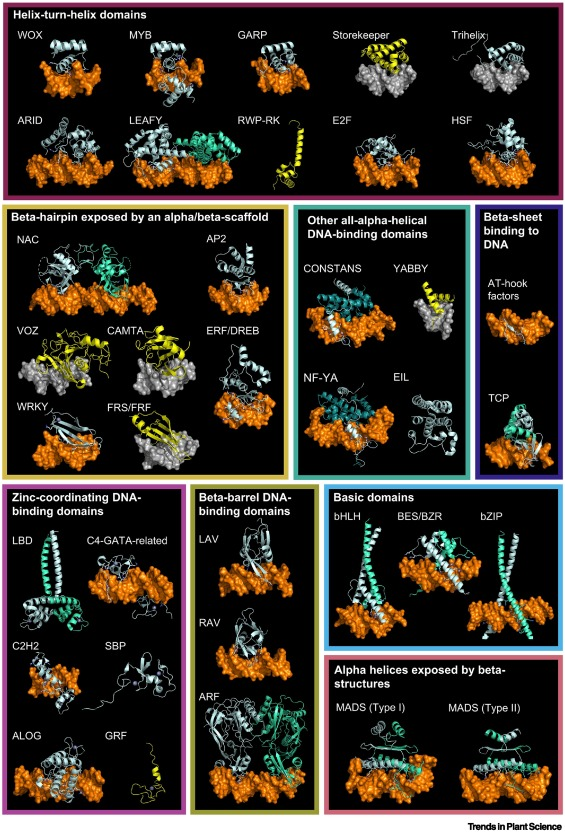
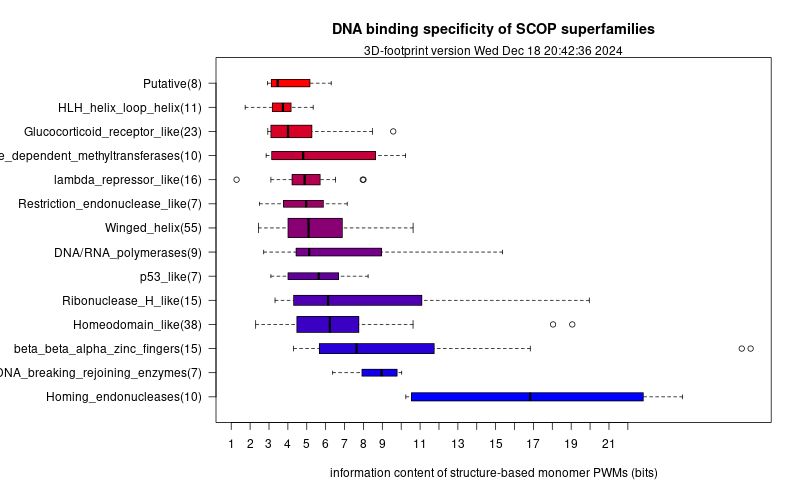

```{r knitr setup, include=FALSE,  eval=TRUE, echo=FALSE, warning=FALSE}
library(knitr)
knitr::opts_chunk$set(eval=TRUE, cache=FALSE, message=FALSE, warning=FALSE, 
                      comment = "", results="markup")
```

# Introduction

In this session we will continue annotating sequences, but now with a focus on non-coding sequences. If we revisit the next figure, I hope you'll see that non-coding sequences are usually the largest fraction of genomes [@Makinen2015]:


For instance, the genome of the model grass *Brachypodium distachyon* is about 270Mbp long, but its genes take only about 122Mbp. The difference increases as the genomes grow larger, as you can see in the next table:

```{r gene_table}
annot.stats <- read.csv(file="test_data/Ensembl_stats.tsv", sep="\t", comment.char=";")
kable(annot.stats,format.args = list(big.mark=","))
```

Therefore, when dealing with genome variation, polymorphisms have a greater chance to occur in non-coding regions. Among these, probably the most interesting are **regulatory sequences** and **repeated elements**.

The goal of this session is to learn how regulatory sequences can be discovered in promoter sequences using statistical tests and aligned to build a **DNA motifs**.

# Genomic repeated sequences

The annotation of Transposable Elements (TEs) within plant genomes can help in the interpretation of observed phenotypes, as sometimes TEs affect the expression of neighbor genes, and in computational tasks such as promoter whole genome alignment, promoter or pan-genome analyses.  

Usually TEs are annotated by alignment to curated libraries of repeated elements such as
[RepetDB](https://urgi.versailles.inra.fr/Data/Transposable-elements/REPETDB) [@Amselem2019],
<!--[REdat](https://pgsb.helmholtz-muenchen.de/plant/recat) [@Nussbaumer2013], -->
where each sequence or element is classified according to the Wicker classification [@Wicker2007]. 
Class I elements are "copy and paste", while Class II are "cut and paste". The next figure summarizes this taxonomy of TEs, which ressembles that of protein domains:


More recently, there are other approaches which don't require any curation; instead, these simply identify repeated elements by counting words ($K$-mers) along the genome. An example of such tools is the [Repeat Detector](https://github.com/BioinformaticsToolsmith/Red) [@Girgis2015], which has been used to routinely mask plant genomes [@ContrerasMoreira2021].

The next table summarizes the fraction of repeated sequences in diverse plant genomes, as annotated with REdat, Red and the original papers describing those genomes:

```{r repeats_table}
annot.stats <- read.csv(file="test_data/Ensembl_repeats.tsv", sep="\t", comment.char=";")
annot.stats = annot.stats[,c(1,2,6,8,10)]
kable(annot.stats,format.args = list(big.mark=","))
```

When the repeats themsleves are not of interest for subsequent analyses, they are said to be masked out. This means that they are marked so that they can be avoided. Hard-masking means replacing the sequences of repeats with polyN oligonucleotides. Soft-masking means leaving the repeated sequences in lower-case.

# DNA-binding proteins and regulatory sequences

The regulation of gene expression is one of the fundamental topics in Genetics.
Here you will learn about transcription factors (TFs) and cis-regulatory elements (CREs).
TFs are proteins that bind specifically to DNA sequences called CREs and affect the expression of nearby genes. 

## Protein-DNA recognition

DNA-binding proteins contain DNA-binding domains and have a specific or general affinity for either single or double stranded DNA. Here we will concentrate mostly on transcription factors, which generally recognize cis-regulatory elements in double-stranded DNA molecules.

### Dissecting a protein-DNA interface

Transcription factors recognize target DNA sequences through a binding interface, composed of protein residues and DNA stretches in intimate contact.
The best descriptions of protein-DNA interfaces are provided by structural biology, usually by X-ray or NMR experiments.

 
 
 

### Atomic interactions between protein and DNA residues

The process of recognition of DNA sequences by proteins involves readout mechanisms, and also stabilizing atomic interactions that do not confer specificity.

**Direct readout** 

* Hydrogen bonds: direct + water-mediated
* Hydrophobic interactions

**Indirect readout**

* Sequence-specific deformation of DNA base steps

**Stabilizing interactions**

* Not sequence-specific, involving DNA backbone

### Direct readout: hydrogen bonds

 

### Direct readout: Van der Waals interactions


### Indirect/shape readout

Besides atomic interactions between protein and DNA, sequence-dependent deformability of duplexes, deduced from crystal complexes, implies that sequence recognition also involves DNA shape.


DNA deformation is described by the increase in energy brought about by instantaneous fluctuations of the step parameters from their equilibrium values:

$deformation = \displaystyle\sum_{i=0}^6 \displaystyle\sum_{j=0}^6 spring_{ij} \Delta\theta_{i,st} \Delta\theta_{j,st}$ (@Olson1998)


The accumulation of experimental and molecular dynamics data of DNA molecules currently supports predictive algorithms, such as [DNAshape](http://rohslab.cmb.usc.edu/DNAshape), which predict the geometry of DNA sequences:  


### Protein-DNA interface graphs

Interfaces can be explored as generic bipartite graphs (@Sathyapriya2008) or with sub-graphs that focus only on specific sequence recognition:

 (@ContrerasMoreira2010)](pics/1je8-intf.png)

## Comparison of DNA-binding proteins

A great variety of DNA-binding proteins have been observed in nature, which can be analyzed and compared in terms of the features introduced above, such as readout, or instead with an evolutionary or topological perspective.  


The  [Structural Classification of Proteins (SCOP)](http://scop.mrc-lmb.cam.ac.uk) systematically groups protein folds in superfamilies, including DNA-binding proteins. The next table shows superfamilies with more than 20 non-redundant complexes in the [Protein Data Bank](http://www.rcsb.org) as of Jun2023, as annotated in the database [3d-footprint](https://3dfootprint.eead.csic.es):

SCOP superfamily | Number of complexes
---------------- | -------------------
Winged helix (WH) | 115
Homeodomain-like (H) | 79
Glucocorticoid-receptor-like (GR) | 40
Restriction endonuclease-like (RE) | 21 
Homing endonuclease (HE) | 38 
p53-like (P53) | 24
Lambda-repressor-like (LR) | 37

DNA-binding proteins can also be grouped in terms of the organisms in which they are found. For instance,
the **Plant-TFClass** structural classification currently accepts 56 plant transcription factor types, which include 
up to 37 DNA-binding domains absent in mammals [@BlancMathieu2023]. 




### Analysis of protein-DNA interfaces in transcription factors families

The available experimental structures of protein-DNA complexes in the PDB support the annotation of interface residues, those involved directly in sequence recognition, within protein families. The database [footprintDB](https://footprintdb.eead.csic.es) does exactly this.
 


Several examples in the literature have demonstrated the correlation between interface patterns and the bound DNA motifs within large transcription factor families, such as the work of @Noyes2008:


<!--Structural data are key for the study of interfaces, as well as the structural superposition of DNA-binding domains:
 -->

The study of interfaces must be done in the appropriate biological context, for instance considering the oligomerization state of TFs _in vivo_, as each family of transcription factors has singularities, such as these (compiled by Álvaro Sebastián):

Family | Motifs | Multimeric | Multidomain
------ | ------ | ---------- | -----------
Homeodomain	| TAATkr,TGAyA | Sometimes | Unusual
Basic helix-loop-helix (bHLH)	| CACGTG,CAsshG	| Always (homodimers, heterodimers)	| Never
Basic leucine zipper (bZIP)	| CACGTG,-ACGT-,TGAGTC | Always (homodimers, heterodimers) | Never
MYB	| GkTwGkTr | Common (multimers)	| Common
High mobility group (HMG)	| mTT(T)GwT,TTATC,ATTCA | Sometimes	| Unusual
GAGA | GAGA	| Never	| Never
Fork head	| TrTTTr | Unusual | Never
Fungal Zn(2)-Cys(6) binuclear cluster |	CGG	| Common (homodimers) | Never
Ets	| GGAw | Common (homodimers, heterodimers, multimers)	| Never
Rel homology domain (RHD) |	GGnnwTyCC |	Always (homodimers, heterodimers)	| Never
Interferon regulatory factor | AAnnGAAA	| Always (homodimers, heterodimers, multimers) |	Never

### Aligning cis elements by superposition of atomic coordinates of interfaces 

Here I briefly describe a structural alignment approach for the comparison of DNA-binding proteins and their interfaces, as discussed in @Siggers2005 and @Sebastian2013. In this context superpositions might guide the correct alignment of cis elements bound by homologous proteins, as illustrated in the figure.


### Specificity-based classification of DNA-binding proteins

DNA motifs inferred from protein-complexes can be analyzed in terms of their information content:



# Discovering cis elements in genomes by counting words ($k$-mers)

Now that we know how transcription factors recognize their target DNA sites, we will how learn how enrichment of DNA words in upstream gene promoter sequences can be computed in order to discover putative regulatory elements. We will follow the method of @vanHelden1998.

Let's have a look at the sample data:

```{r oligoinput, engine='bash'}
# a set of upstream sequences of a group of co-regulated genes on Brachypodium distachyon
# see that they have been cut with coordinates -1000,+200 with respect to 
# transcription start site (TSS)
head test_data/regulon.raw.fna
echo

# same sequences but repeat-masked
head test_data/regulon.rm.fna
echo

# frequency of hexamers in those raw upstream sequences computed with RSAT  
# oligo-analysis -v 1 -seqtype dna -l 6 -return occ,freq -quick -str 2 -ovlp -sort
head -35 test_data/6nt_upstream_regulon.raw.tab | grep -v ";"
echo

# frequency of hexamers in the repeat-masked sequences 
head -35 test_data/6nt_upstream_regulon.rm.tab | grep -v ";"
echo

# frequency of hexamers in all (rm) upstream sequences of that genome
head -35 test_data/6nt_upstream_genome.tab | grep -v ";"
```

Now let's inspect the R code which will be used in this demo. We'll start by checking the function that computes the significance of hexamers (words of length $K=6$):
```{r oligofunction, eval=FALSE}

#' @author Najla Nksouri <najlaksouri@gmail.com> 
#' Revised by Jacques van Helden <Jacques.van-Helden@univ-amu.fr>
#' @description Compare the statistics between query and background k_mer counts
#' @param query.oligo.file file containing k-mer counts computed from the query sequences, as produced by RSAT oligo-analysis.
#' This file must contain 
#' @param background.oligo.file file containing background k-mer occurrences

kmer.stats <- function(query.oligo.file,
                       background.oligo.file) {
  
  ## Check existence of input files
  if (!file.exists(query.oligo.file)) {
    stop("kmer.stats() error: query.oligo.file does not exist: ", query.oligo.file)
  }
  if (!file.exists(background.oligo.file)) {
    stop("kmer.stats() error: background.oligo.file does not exist: ", ... = background.oligo.file)
  }
  
  ## Read tables and rename first column
  oligo.query.freq.table <- 
    read.table(query.oligo.file, sep = "\t", comment.char = ";", header = TRUE)
  names(oligo.query.freq.table)[1] <- "seq"
  
  oligo.genome.freq.table <- 
    read.table(background.oligo.file, sep = "\t", comment.char = ";", header = TRUE)
  names(oligo.genome.freq.table)[1] <- "seq"
  
  oligo.table <- merge(
    oligo.query.freq.table,
    oligo.genome.freq.table,
    by=c("seq", "id"), suffixes=c("_query", "_background")
  )
  
  ## Compute the p-value of the observed occurrences in query frequencies
  nb.oligos <- nrow(oligo.table)
  N <- sum(oligo.table$occ_query) 
  
  ## Compute th number of occurrences expected in random background fragments
  ## of the same size as the query sequences.
  oligo.table$exp.occ <- oligo.table$obs_freq_background * N
  
  ### Compute the nominal (unadjusted) p-value of each oligonucleotide
  
  ## Test the over-representation: righ-tailed test
  oligo.table$pval.over <- pbinom(q = oligo.table$occ_query -1, size = N, 
                                  prob = oligo.table$obs_freq_background, lower.tail=FALSE)
  
  ## Compute log p-value to avoid the floating point limitation to 1e-320
  oligo.table$log.pval.over <- pbinom(q = oligo.table$occ_query -1, size = N, 
                                      prob = oligo.table$obs_freq_background, lower.tail=FALSE, log=TRUE)
  
  ## Test under-representation: left-tailed test
  oligo.table$pval.under <- pbinom(q = oligo.table$occ_query, size = N, 
                                   prob = oligo.table$obs_freq_background, lower.tail=TRUE)
  
  oligo.table$log.pval.under <- pbinom(q = oligo.table$occ_query, size = N, 
                                       prob = oligo.table$obs_freq_background, lower.tail=TRUE, log=TRUE)
  
  ## Two-sided test
  oligo.table$pval <- pmin(oligo.table$pval.under, oligo.table$pval.over) * 2
  oligo.table$log.pval <- pmin(oligo.table$log.pval.under, oligo.table$log.pval.over) * 2
  
  ## Compute the E-value (Bonferroni multiple testing correction).`
  ##  E-value indicates the expected number of false positives 
  ## (i.e. how many oligos would be expected to be be declared positive under 
  ## the null hypothesis)
  oligo.table$eval <- oligo.table$pval * nb.oligos
  
  ## Compute the significance
  ## sig = -log10(eval)
  oligo.table$sig <- -log10(nb.oligos) - oligo.table$log.pval/log(10)
  
  ## Compute maximal frequency for both files
  max.axis <- max(c(oligo.table$obs_freq_query, oligo.table$obs_freq_background))
  
  ## Log2 ratio observed/expected
  oligo.table$freq.ratio <- oligo.table$obs_freq_query/oligo.table$obs_freq_background
  oligo.table$log2.ratio <- log2(oligo.table$freq.ratio)
  
  return(oligo.table)
}
```

Now we shall look at the plotting function:

```{r plotfunction, eval=FALSE}
#' @title Scatter plot of background versus query k-mer frequencies. 
#' @author Najla Nksouri <najlaksouri@gmail.com> 
#' Revised by Jacques van Helden <Jacques.van-Helden@univ-amu.fr>
#' @description Draw a scatter plot comparing background and query k-mer frequencies for a given size. 
#' @param kmer.stat.table a table with k-mer statistics produced by kmer.stats()
#' @param k oligonucleotide (k-mer) size
#' @param sig.threshold=2 Threshold on significance for the volcano plot. 
#' @param volcano.ymax=350
#' @return a data.frame with merged query and background k-mer frequencies + derived statistics
#' @examples
#' ## Plot query versus background 4-mer frequencies
#' plot.kmers(k=8)
#' 
plot.kmers <- function(kmer.stat.table,
                       k,
                       sig.threshold = 2,
                       log2FC.threshold = 1, ## Enrichment threshold
                       volcano.ymax = 350) {
  message(k, "-mer frequency plot")

  ## Define dot colors  
  dot.colors <- ifelse(
    (kmer.stat.table$sig > sig.threshold & kmer.stat.table$log2.ratio > 0.1), "darkred",
         ifelse((kmer.stat.table$sig > sig.threshold & kmer.stat.table$log2.ratio < -0.1),
                "darkblue", "darkgray"))

  ## Draw a scatter plot to compare k-mer frequencies
  max.freq <- max(kmer.stat.table[, c("obs_freq_query","obs_freq_background")])
  plot(x = kmer.stat.table$obs_freq_background,
       y = kmer.stat.table$obs_freq_query,
       
       ## Set axis limits
       xlim = c(0, max.freq),
       ylim = c(0, max.freq),
       
       ## Set labels
       xlab = paste("background ", k,"-mer frequencies", sep = ""),
       ylab = paste("query ", k,"-mer frequencies", sep = ""),
       main = paste("background vs query ", k,"-mer frequencies", sep = ""),
       
       col = dot.colors,
       
       ## Insert grid
       panel.first=grid(),
       
       ## Change symbol
       pch=1
  )
  ## Insert diagonal
  abline(0, 1, col="black", lwd=1, lty = 2)
  
  ## MA plot : log-ratio as a function of the log counts
  ## Note: usually, the MA plot represent the log-ratio versus log(mean) of the two measurements.
  ## However, in our case the query sequences are a subset of the background sequences. 
  ## We will thus plot the log(background freq) on the X axis
  plot(x = log2(kmer.stat.table$obs_freq_background),
       y = kmer.stat.table$log2.ratio,
       
       ## Set labels
       xlab = paste("log2(background)"),
       ylab = paste("log2(query/background)"),
       main = paste(k,"-mer frequencies", sep = ""),
       
       col = dot.colors,
       
       ## Insert grid
       panel.first=grid(),
       
       ## Change symbol
       pch=1
  )
  ## Insert diagonal
  abline(h=0, col="black", lwd=1, lty = 2)
  
  
  ## Draw a volcano plot
  ##
  ## Abcsissa indicates the effect,i.e. the log2-ratio query versus background. 
  ## Ordinate indicates the significance as computed above. 
  ##
  ## Mark in red the over-represented k-mers with sig > given threshold.
  ## and in blue the under-represented k-mers with sig > given threshold.
  
  ## Set axis limit 
  x.lim <- abs(max(kmer.stat.table$log2.ratio))
  ## Plotting
  with(kmer.stat.table,plot(x=log2.ratio, 
                        y=sig, 
                        pch = 1,
                        xlim = c(-x.lim, x.lim),
                        ylim = c (0, volcano.ymax),
                        
                        ## Set labels
                        xlab = paste("Log2.ratio ", k,"-mer frequencies", sep = ""),
                        ylab = paste("Significance ", k,"-mer frequencies", sep = ""),
                        main = paste("Volcano Plot ", k,"-mer frequencies", sep = ""),
                        # Insert grid
                        panel.first=grid(),
                        
                        #set the colors 
                        col = dot.colors))
  
  ## Denote significance exceeding the threshold by 
  above.ymax <- kmer.stat.table$sig > volcano.ymax
  with(kmer.stat.table[above.ymax,],
       points(x=log2.ratio, y=rep(x = volcano.ymax, length.out=sum(above.ymax)), pch=17, col="red",type="p"))
  
  ## insert diagonals
  abline(h=sig.threshold, col= "black", lty = 2)
  abline(v=0, col= "black", lty = 2)
  abline(v=-log2FC.threshold, col= "black", lty = 2)
  abline(v=log2FC.threshold, col= "black", lty = 2)
}
```

With this data and functions we can now compute $k$-mer enrichment in the promoters of a sample set of co-regulated genes or **regulon**:


```{r demooligo}

# adjust as required 
dir_data = "test_data/" # where pre-computed k-mer freq files are 
dir_code = "test_code/" 

source(file.path(dir_code, "kmer_stats.R"))
source(file.path(dir_code, "plot_kmers.R"))

# set word/k-mer size
k = 6 

# set files with pre-computed words/k-mer frequencies
# raw sequences
#oligo.upstream.freq.file = file.path(dir_data,"6nt_upstream_regulon.raw.tab")
# recommended repeat-masked sequences
oligo.upstream.freq.file = file.path(dir_data,"6nt_upstream_regulon.rm.tab")
  
oligo.genome.freq.file = file.path(dir_data, "6nt_upstream_genome.tab")
 
# check the code of this function to see how the probabilities of word occurrences 
# are computed with the binomial function
kmer.stat.table <- kmer.stats(query.oligo.file = oligo.upstream.freq.file, 
                               background.oligo.file = oligo.genome.freq.file)
#View(kmer.stat.table)
  
plot.kmers(kmer.stat.table, k, volcano.ymax = 60) 
```

## Exercises

The plant-dedicated mirror of the Regulatory Sequence Analysis Tools (RSAT, <http://plants.rsat.eu>) offers specialized options for researchers dealing with plant transcriptional regulation. The web site contains whole-sequenced species regularly updated from Ensembl Plants and other sources, and supports an array of tasks frequently required for the analysis of regulatory sequences, such as retrieving upstream sequences, motif discovery, motif comparison, pattern matching. RSAT::Plants also integrates the footprintDB collection of DNA motifs. This exercise consists on following a step-by-step protocol on how to discover DNA motifs in regulatory regions of clusters of co-expressed genes in plants. It also explains how to empirically control the significance of the result, and how to annotate any discovered motis. 

This protocol has been published at [@ContrerasMoreira2016a] and updated at [@Ksouri2021]. Other related protocols can be found at [@CastroMondragon2016; @ContrerasMoreira2016b].

### Background

Transcriptome data (microarrays, RNA-seq) have been extensively used as a proxy for genetic regulation in many organisms, as the analysis of genome-wide profiles of gene transcription under different treatments uncovers clusters of genes with correlated behaviors, which may result from direct or indirect co-regulation. A classical application of this approach was done by @Beer2004 with yeast microarray data sets obtained in a variety of experimental conditions. In that experiment, expression data-mining was demonstrated to be an effective strategy for finding regulons, groups of genes that share regulatory mechanisms and functional annotations.

Other studies have unveiled that the outcome of these approaches largely depends on the genomic background of the species under study. For instance, @Sand2008 reported that the significance of DNA motifs discovered in *Saccharomyces cerevisiae* promoters is much higher for regulons than for random gene sets of the same sizes, but for human promoters the signal-to-noise ratio is almost null, because random gene sets give highly significant motifs due to heterogeneities in promoter compositions and biases due to repetitive elements. For metazoans, it is thus a real challenge to distinguish *bona fide* motifs from noise [@Sand2008]. These observations suggest that motif discovery on sequence clusters faces intrinsic properties of the genomes under study, regardless of the software used for the task. 

Among plants, these strategies have so far been tested on the model *Arabidopsis thaliana*, and they have been successfully applied to the identification of novel cis-regulatory elements validated with synthetic promoters [@Koschmann2012]. Yet, with the exception of this model, these sorts of experiments have not been possible in other plants until recently. In spite of this, the growing list of available plant genomes encourages these analyses in combination with expression profiles obtained from either microarray or RNA-seq data sets, as in the work of @Yu2015, provided that these factors are considered:

* Plant genomes are rich in repetitive elements (RE) distributed along the genome [@Schmidt1998], which pose particular problems for motif discovery statistics (violation of the independence assumption).

* Current genome assemblies range from 120Mb (_A. thaliana_) to 13,420Mb (_Triticum aestivum_). _Brachypodium distachyon_, a model species for grasses, is 272Mb. The quality of these assemblies and their RE content is also quite variable, as shown in __Table 1__.
   
* Upstream regions, defined by annotated gene coordinates, are also of variable length, going from 1,151b on average in _A. thaliana_ to 2,820b in _Triticum_turgidum_ (see __Table 1__). Work by @Ksouri2021 has shown that the choice of upstream region length impacts on the discovery of regulatory sequences.

**Table 1.** Features of some plant genomes in RSAT::Plants, taken from <https://plants.rsat.eu/data/stats>. Each ID concatenates the organism, the assembly version and the source. Most genome IDs add to the end the Ensembl Plants release number. For instance, Arabidopsis_thaliana.TAIR10.55, corresponds to _A.thaliana_ assembly 10 from TAIR <https://www.arabidopsis.org>, annotated in release 55 of Ensembl Plants. “%Ns” are stretches of uncharacterized nucleotides which often connect assembled sequence contigs. “%repeat-masked” segments are sequences with significant similarity to plant repetitive DNA sequences, which are masked. 

```{r genome_stats_table}
genome.stats <- read.delim(file="test_data/summary.tab", row.names = NULL, comment.char=";")
genome.stats[,2] = as.numeric(genome.stats[,2])/1e6 ## Convert genome sizes to Mb
genome.stats[,5] = as.numeric(genome.stats[,5]-genome.stats[,4]) ## raw %mask also includes %N
names(genome.stats) <- c("Organism / assembly ID", "Genome size (Mb)", "Contigs", "%N", "% repeat-masked", "Gene models", "Mean upstream length")
# names(genome.stats)

## Print the table
kable(genome.stats,format.args = list(big.mark=","),
      digits=c(0,0,0,1,1,0,0))
```

The step-by-step protocol below has been tested for the task of discovering and annotating DNA motifs in clusters of upstream sequences for species supported by RSAT::Plants, which have been obtained mostly from Ensembl Plants (<https://plants.ensembl.org>), but also include data from the JGI Genome Portal (<http://genome.jgi.doe.gov>) and other sources. In addition, RSAT::Plants integrates footprintDB (<https://footprintdb.eead.csic.es>), a collection of position-specific scoring matrices (PSSM) representing transcription factor binding motifs (TFBM), as well as their cognate binding proteins [@Sebastian2014], which can be used to annotate discovered motifs and to predict potentially binding transcription factors. 

Discovering regulatory elements within natural genomic sequences is certainly an important scientific goal on its own, but can also be part of the design and validation of synthetic promoters. We envisage at least two applications in this context: 

* The characterization of promoters of genes with known expression properties, which can then be used to engineer the expression of genes of interest.

* The validation of engineered promoters in order to make sure that they contain the expected regulatory elements which might be natural or engineered depending on the application.

### Materials

This protocol requires disposing of:

* A computer with a Web browser

* A set of gene clusters from any of the species currently supported at RSAT::Plants ( <http://plants.rsat.eu>, see __Note __^[As gene models can change from one assembly to another it is important to use the right assembly version, which is indicated for each genome in __Table 1__]). Here we will use three example clusters of co-expressed maize genes, shown on __Table 2__ (see __Note __^[Twelve clusters of maize genes, found to be co-expressed in 22 transcriptomes and enriched on Gene Ontoloy terms were analyzed in detail by @Yu2015]). First, they discovered potential regulatory motifs within their upstream sequences, and then they performed electrophoretic mobility shift assays (EMSA) to confirm them. Table 2 shows three of those clusters which are used in this protocol. For each cluster a list of gene identifiers is given next to the EMSA-confirmed motifs. The remaining nine clusters were left out for being too small, as the statistical approaches in this protocol require at least 10-15 genes. 

### Methods

The following protocol enumerates the steps required to discover DNA motifs, based on the over-representation of $k$-mers (**oligonucleotides**) and **dyads** (spaced pairs of oligonucleotides), in clusters of upstream sequences. The protocol comprises two stages, analyzing first co-expressed genes and then random clusters as a negative control (see __Note __^[A crucial parameter to evaluate the results of motif discovery is to estimate the rate of false positives (FP). RSAT programs compute a significance score, which is the minus log of the expected number of false positives ($\text{e-value} = 10^{-\text{sig}}$). For example, a motif associated with a significance of 1 should be considered as poorly significant, since on average we would expect $10^{-1} = 0.1$ false positives, i.e. one FP every 10 random trials. In contrast, a significance of e.g. 16 is very promising, since on average such a result would be expected every $10^{-16}$ random trials. However, the theoretical significance relies on the correctness of the background model (computed here as k-mer and dyad frequencies in the whole set of promoters). In some cases, sets of plant promoters can discard from the theoretical model, due to heterogeneity of the input  (e.g. inclusion of repetitive sequences). The negative control consists in measuring the significance obtained by submitting a random selection of promoters from the organism of interest (maize in the example). Although each of these genes is likely to be regulated by one or more transcription factors (and its promoter should contain corresponding binding sites), in principle the random set as a whole should not be co-regulated, so that the elements would differ from gene to gene, and there should thus be no over-represented motif in their promoters.]). Only after both stages have been completed it is possible to objectively estimate the relevance of the results.

#### Collecting the full set of promoters for the genome of interest

Before the proper analysis of the gene cluster, we will retrieve the promoter sequences of all the genes of the organism of interest, which will serve below to estimate the background model. **Table 2** shows three clusters of maize (_Zea mays_) genes used along the protocol, extracted from the published work of @Yu2015. The original gene identifiers have been translated to current gene models in the Zm-B73-REFERENCE-NAM-5.0.55 annotation using [maizeGDB](https://www.maizegdb.org) [@Woodhouse2021].

Experimentally verified regulatory motifs of these clusters are indicated:  

| Cluster name | Confirmed motif | #sequences | Original gene IDs | Current gene IDs | 
|:------------:|:---------------:|:-------------------:|:--------:|:------------------------------------:|
|ABI4|GCGCRSGCGGSC|16|GRMZM2G025062 <br>GRMZM2G053503 <br>GRMZM2G069082 <br>GRMZM2G069126 <br>GRMZM2G069146 <br>GRMZM2G076896 <br>GRMZM2G081892 <br>GRMZM2G124011 <br>GRMZM2G129674 <br>GRMZM2G142179 <br>GRMZM2G169654 <br>GRMZM2G172936 <br>GRMZM2G173771 <br>GRMZM2G174347 <br>GRMZM2G175525 <br>GRMZM2G421033|Zm00001eb330490 <br>Zm00001eb340140 <br>Zm00001eb318890 <br>Zm00001eb318900 <br>Zm00001eb318910 <br>Zm00001eb202570 <br>Zm00001eb335190 <br>Zm00001eb335200 <br>Zm00001eb103110 <br>Zm00001eb006160 <br>Zm00001eb119540 <br>Zm00001eb156040 <br>Zm00001eb074730 <br>Zm00001eb193670 <br>Zm00001eb352580 <br>Zm00001eb422470 <br>Zm00001eb432090|
|E2F|TTCCCGCCA|18|AC197146.3_FG001 <br>GRMZM2G017081 <br>GRMZM2G021069 <br>GRMZM2G037700 <br>GRMZM2G057571<br>GRMZM2G062333<br>GRMZM2G065205 <br>GRMZM2G066101 <br>GRMZM2G075978 <br>GRMZM2G100639 <br>GRMZM2G112074<br>GRMZM2G117238<br>GRMZM2G130351 <br>GRMZM2G139894 <br>GRMZM2G154267 <br>GRMZM2G162445<br>GRMZM2G327032<br>GRMZM2G450055|Zm00001eb405460 <br>Zm00001eb227730<br>Zm00001eb350340<br>Zm00001eb228900<br>Zm00001eb284360<br>Zm00001eb028400<br>Zm00001eb162700<br>Zm00001eb257900<br>Zm00001eb290510 <br>Zm00001eb137000 <br>Zm00001eb248940 <br>Zm00001eb421110 <br>Zm00001eb169600	<br>Zm00001eb169610<br>Zm00001eb037700 <br>Zm00001eb351990 <br>Zm00001eb342080 <br>Zm00001eb192270	<br>Zm00001eb192280<br>Zm00001eb243240<br>Zm00001eb243250|
|WRI1|CGGCGGCGS|56|AC210013.4_FG019 <br>GRMZM2G008430 <br>GRMZM2G009968 <br>GRMZM2G010435 <br>GRMZM2G010599 <br>GRMZM2G014444 <br>GRMZM2G015097 <br>GRMZM2G017966 <br>GRMZM2G022019 <br>GRMZM2G027232 <br>GRMZM2G028110 <br>GRMZM2G035017 <br>GRMZM2G041238 <br>GRMZM2G045818 <br>GRMZM2G047727 <br>GRMZM2G048703 <br>GRMZM2G064807 <br>GRMZM2G068745 <br>GRMZM2G074300 <br>GRMZM2G076435 <br>GRMZM2G078779 <br>GRMZM2G078985 <br>GRMZM2G080608 <br>GRMZM2G092663 <br>GRMZM2G096165 <br>GRMZM2G098957 <br>GRMZM2G107336 <br>GRMZM2G108348 <br>GRMZM2G111987 <br>GRMZM2G115265 <br>GRMZM2G119865 <br>GRMZM2G122871 <br>GRMZM2G126603 <br>GRMZM2G126928 <br>GRMZM2G132095 <br>GRMZM2G140799 <br>GRMZM2G148744 <br>GRMZM2G150434 <br>GRMZM2G151252 <br>GRMZM2G152599 <br>GRMZM2G170262 <br>GRMZM2G181336 <br>GRMZM2G311914 <br>GRMZM2G312521 <br>GRMZM2G322413 <br>GRMZM2G325606 <br>GRMZM2G343543 <br>GRMZM2G353785 <br>GRMZM2G409407 <br>GRMZM2G439201 <br>GRMZM5G823135 <br>GRMZM5G827266 <br>GRMZM5G831142 <br>GRMZM5G835323 <br>GRMZM5G870606 <br>GRMZM5G882378|Zm00001eb212470 <br>Zm00001eb347390 <br>Zm00001eb351870 <br>Zm00001eb066830 <br>Zm00001eb420570 <br>Zm00001eb238930 <br>Zm00001eb031300 <br>Zm00001eb267190 <br>Zm00001eb222060 <br>Zm00001eb222210 <br>Zm00001eb283120 <br>Zm00001eb063980 <br>Zm00001eb335620 <br>Zm00001eb342930 <br>Zm00001eb095960 <br>Zm00001eb011490 <br>Zm00001eb174060 <br>Zm00001eb405750 <br>Zm00001eb172130 <br>Zm00001eb166570 <br>Zm00001eb316270 <br>Zm00001eb285610 <br>Zm00001eb061760 <br>Zm00001eb212180 <br>Zm00001eb134780 <br>Zm00001eb037330 <br>Zm00001eb138230 <br>Zm00001eb235710 <br>Zm00001eb271520 <br>Zm00001eb277320 <br>Zm00001eb160070 <br>Zm00001eb359780 <br>Zm00001eb235710 <br>Zm00001eb399010 <br>Zm00001eb036530 <br>Zm00001eb354150 <br>Zm00001eb361700 <br>Zm00001eb317180 <br>Zm00001eb173470 <br>Zm00001eb192860 <br>Zm00001eb205850 <br>Zm00001eb192680 <br>Zm00001eb330480 <br>Zm00001eb372580 <br>Zm00001eb276860 <br>Zm00001eb320920 <br>Zm00001eb282960 <br>Zm00001eb329960 <br>Zm00001eb227700	 <br>Zm00001eb227710 <br>Zm00001eb352030 <br>Zm00001eb158110 <br>Zm00001eb323110 <br>Zm00001eb225190	 <br>Zm00001eb225200 <br>Zm00001eb121240|


1. Open a connection to the RSAT::Plants server. It can be reached at <http://plants.rsat.eu>. On the left-side menu, select 'Sequence tools -> retrieve sequence'.

2. Choose 'Single organism -> Zea mays' for the examples of this protocol (see __Note  1__), which corresponds to 'Zea_mays.Zm-B73-REFERENCE-NAM-5.0.55' in [Ensembl Plants](https://plants.ensembl.org) release 55 [@Yates2021].

3. Choose 'Genes -> all'; this will retrieve all upstream sequences of the maize genome.

4. Set appropriate upstream bounds. To replicate the work of @Yu2015 these should be set to 'From' -1000 'To' +200, with position 0 corresponding to transcriptional start sites (TSS); see __Note __^[According to @Ksouri2021 the range -500,+200 performs better]. Beware that TSS positions in plant genomes often correspond to start codons, probably due to incomplete annotations. 

5. We recommend to tick the option 'Mask repeats', as plant genomes are frequently repeat-rich. This option should NOT be used if you suspect the transcription factors of interest bind to repeated sequences. 

6. Press 'GO' and wait until the retrieve-seq result page is displayed (see __Note __^[Should the connection to the server interrupt it might be safer to go back and choose 'email' as delivery option.  The mail message provides a link to the data, which is actually stored at the server.]). The results include the executed command and a URL to the 'sequences' file, which must be saved. We will refer to this URL as '**all.fasta.URL**'. This FASTA-format file can also be stored as a local file on your computer, but note it can be rather large. 

6.	Press 'GO' and wait until the retrieve-seq result page is displayed (see Note 4). 

#### Analyzing upstream sequences of co-expressed genes

We will now retrieve the upstream sequences of a cluster of co-expressed genes, and use *peak-motifs* to discover exceptional motifs in their promoters. The tool *peak-motifs* was initially conceived to discover motifs in ChIP-seq peaks, but it can also be used to analyze other sequence types, as illustrated here.

1. Choose cluster E2F from __Table 2__, copy the current gene IDs (last column). The IDs should be saved in a new text file, that you will store on your computer. Insert newline characters between genes^[It is crucial to have one gene ID per row for submitting queries to retrieve-seq, because only the first word of each row is considered as a query. Note that any transcript isoform numbers .1, .2 should be removed]. 

2. In the left menu of the RSAT server, click on 'retrieve sequence' to get a fresh form. Make sure that the option 'Genes -> selection' is activated and that the right organism, in this case ‘Zea_mays.Zm-B73-REFERENCE-NAM-5.0.55’, is selected. Tick 'Mask repeats', and set the same size limits as for the whole collection of promoters: from -1000 to +200. Paste the list of IDs of your gene cluster (one gene ID per row). 

3. Press 'GO' and wait a few seconds until the result page is displayed. Inspection of these sequences might reveal N-masked sequence stretches, which correspond to annotated repeats. Save both 'query genes' and 'sequences' files to local files on your computer, we will refer to them as '**cluster.genes**' and '**cluster.fasta**' later on this protocol.

4. Press the 'peak-motifs' button. The __peak sequences__ section is automatically filled with a link to the selected cluster sequences.

5. Add a title for this job, such as 'E2F cluster'.

6.	On the right side of ‘Peak sequences’, under __Control sequences__, paste the '**all.fasta.URL**' on the 'URL of a sequence file available on a Web server' entry.

7. Click on 'Reduce peak sequences' and leave both fields ('number of top sequences to retain' and 'cut peak sequences') blank to avoid having the sequences clipped.

8. Click on 'Motif discovery parameters'. Select two algorithms: 'Discover over-represented words' (**oligo-analysis**) and 'Discover over-represented spaced word pairs' (**dyad-analysis**). Uncheck the program **position-analysis** (see __Note __^[This program is generally relevant when analyzing sets containing a large number of sequences such as ChIP-seq peaks or genome-wide promoter sets.]). 

9. Click on 'Compare discovered motifs with databases' and select appropriate databases which will be used to annotate any found motifs. For plant promoters, we recommend to check '*footprintDB-plants*', but you can also check other databases such as '*JASPAR plants*' (see __Note __^[Plant transcription databases are unfortunately still very fragmentary, so one might be tempted to check more complete collections such as *footprintDB* or *JASPAR*. However, the results should be interpreted with caution, because there is little conservation of cis-regulation between plants and other kingdoms of the tree of life. ]). 

You can also upload your own collection of DNA motifs in TRANSFAC format.

10. Click on 'Reporting Options'. Set 'Origin' to 'end' and 'Offset' to -200 (see __Note __^[The option *'Origin'* indicates the reference position relative to each sequence (start, center or end). When this option is set to 'end', the coordinates are computed relative to the end of the sequence, with negative values indicating upstream location. The option *'Offset'* enables to shift the reference point by a given number. For the current example, setting the offset to -200 will give coordinates from -1000 to +200, the 0 corresponding to the TSS.-]).

11. Select output delivery and press 'GO'.

12. After few seconds the server should have uploaded the sequences and display a page with the URL of the future result page. You can already click on this link: the result page will be periodically updated to show the progress of the analysis. At the end of the processing, a box will appear at the top of the result page, with a short summary of the discovered motifs, and links to different sections of the results. 

Once the job is complete click on the link **[Download all results (peak-motifs_archive.zip)]** to __save the results__ on your computer. You will later be able to uncompress this archive in order to check the result after its removal from the server (results are only available on the server for 7 days after job completion).  We also recommend downloading the full set of discovered motifs, by clicking on the link **[Download all matrices (transfac format)]** and saving a local file named '**cluster.motifs.tf**'. This file contains all motifs in the form of position-weight matrices (PWMs) in TRANSFAC format.

On the result page, the section entitled *'Discovered motifs (with motif comparison)'*  lists the discovered motifs, displays their sequence logos and their distribution along clustered sequences, in addition to top matches with the motif databases selected on **step 9**. 


#### Negative control: random groups of genes

In this section, we propose a procedure to obtain an empirical estimation of the rate of false positives, by discovering motifs in the promoters of genes picked up at random.  

1. On the left-side menu of RSAT::Plants select 'Build control sets -> random gene selection'.

2. Choose 'Organism -> Zea_mays.Zm-B73-REFERENCE-NAM-5.0.55' for the examples of this protocol. 

3. Set 'Number of genes' to the size of one of the sample clusters on **Table 2**. For instance, the size of the negative control sets would be 18 for cluster E2F, 16 for cluster ABI4, and 56 for cluster WRI1. For convenience, in this tutorial only one random group is generated (the default), but this utility can generate several random groups in one go (see __Note __^[Clearly, more than one random cluster should be evaluated, as suggested in __Figure 1__, where the results of up to 50 random groups are displayed next to the clusters of @Yu2015.]).

4. Press 'GO' and click the 'Next step' button 'retrieve sequences' at the bottom of the result page.  In the retrieve-seq form, set the other parameters as above: from -1000 to +200, check the 'Mask repeats' option and press 'GO'. 

5. Save 'query genes' and 'sequences' files to local '**random.genes**' and '**random.fasta**' files and repeat steps 4-11 of section 4.1.3.2. 

#### Validating motifs by scanning promoter sequences

This part of the protocol is devoted to validating sequence motifs discovered by their over-representation, which are scanned against the original sequences from which they were discovered, plus, optionally, orthologous sequences from a related species (see __Note __^[Orthologues reported are annotated in Ensembl Compara, generated by a pipeline where maximum likelihood phylogenetic gene trees play a central role. These gene trees, reconciled with their species tree, have their internal nodes annotated to distinguish duplication or speciation events, and thus support the annotation of orthologous and paralogous genes, which can be part of complex one-to-many and many-to-many relations @compara]). 

The first goal of this section is to check whether the discovered motifs show patterns of occurrence along promoter sequences, and to see how many cluster sequences actually harbor them. This can be done empirically by comparing the results of expression-based motifs with those of shuffled motifs, with columns permuted, which play the role of negative controls.

A second goal is to investigate whether these regulatory motifs are conserved on orthologous promoters of a related plant, _Sorghum bicolor_ in this case study. 

1. On the left-side menu select 'Comparative genomics -> get orthologs-compara'.

2. Choose 'Reference organism -> Sorghum bicolor' for the maize example.

3. Upload file '**cluster.genes**' generated in **step 3** of section 4.1.3.2. Press 'GO' and finally press 'retrieve sequences' on the next screen.

4. Repeat steps 4-6 of section 4.1.3.1 but now select _Sorghum bicolor_ as organism. Save 'sequences' to local file '**cluster_orths.fasta**'.

5. On the left-side menu select 'Build control sets -> permute-matrix'.

6. Upload '**cluster.motifs.tf**' (obtained in **step 12** of section 4.1.3.2) and press 'GO'. Save the results file as '**cluster.motifs.perm1.tf**' (see __Note __^[This will permute the columns of the input PWMs producing matrices with different consensus. Column-permuted matrices are used as negative controls because they conserve the information content and nucleotide frequencies of the original motifs, but at the same time alter the sequence of nucleotides captured by the original motif, which is not recognized anymore.]).

7. Select 'Pattern matching -> matrix scan (full options)'.

8. In the sequence box paste the contents of '**cluster.fasta**' and, optionally,  '**cluster_orths.fasta**', if you wish to assess motif conservation. Alternatively, **steps 7-12** can be performed separately with maize and _S.bicolor_ sequences.

9. Upload file '**cluster.motifs.tf**' and select 'transfac' format.

10. In the 'Background model' section select Markov order 2 and choose 'Organism-specific -> Zea_mays.Zm-B73-REFERENCE-NAM-5.0.55'. Press 'GO'.

11. Save the 'Scan result' file as '**cluster.scan.ft**' and press the 'feature map' button to draw a map of the matched motif instances.

12. Repeat steps 6-11 using the set of permuted PWMs '**cluster.motifs.perm1.tf**' and save the results as '**cluster.perm1.scan.tf**'.

#### Interpretation of results

The last stage of the protocol is the interpretation of results, which is which requires having at hand results of both clusters of co-expressed genes and random clusters, which play the role of negative controls. **Figure 1** summarizes the results of cluster ABI4 compared to 50 random clusters of the same size. There are three types of evidence to look at, which will be discussed with the examples on this figure:


**Figure 1.** Summary of motif discovery results for cluster ABI4. Dark bars correspond to clusters of co-expressed genes, grey bars to 50 random clusters of genes drawn from the maize genome. Maximum significance of *oligo-analysis* (A) and *dyad-analysis* (B) motifs. The sequence logo of motifs reported by each algorithm is shown on top, indicating the number of sites used to compute it and the $\text{Ncor}$ score of the comparison to the expected motif (bottom, see __Note 11__). Panel C shows the scores of discovered motifs when scanned back to the original maize upstream sequences and sequences from orthologous genes in _Sorghum bicolor_. Here dark bars are the reported PWMs, while the grey bars correspond to permuted PWMs. Panel D show the $\text{Ncor}$ scores of discovered motifs when compared to annotated PWMs in footprintDB. 

* The __distribution of motif significance__ yielded by *oligo-analysis* (A) and *dyad-analysis* (B). Motifs discovered in random clusters (grey bars) typically have significances below 4. The motifs found in cluster ABI4 (black bars) are not more significant than those of random gene sets of the same sizes. The reason for having significant motifs in the random gene sets may result from the occasional presence of low complexity motifs, which should not be considered as reliable predictions.

* Panel A, E and I also show the comparisons between some motifs returned by *peak-motifs* and those reported by the authors of the reference experimental study [@Yu2015]; they used MEME as motif discovery tools). 

* The __distribution of scanning scores__ (C) show to which extent motif matches in upstream sequences of both maize and their _S. bicolor_ orthologues (dark boxes) depart from matches of permuted matrices (lighter boxes), used here as negative controls. On these boxplots, the horizontal bars indicate the median score of all the predicted sites in a given set of promoter sequences, and the shaded rectangles show the interquartile range, i.e. the extent between the 25% and 75% percentiles. For the ABI4 cluster there is a noticeable overlap between the interquartile boxes of the cluster and the random gene selections. Besides, the random selections show several "outliers" (circles) indicating sites predicted with high matching scores.  Even though the mean scores are clearly higher for the actual cluster, the results may thus not be considered very significant. 

* The __distribution of scores in footprintDB__ (D) describe how similar  the discovered motifs are when compared to motifs (PWMs) annotated in footprintDB.  Similarities are measured by normalized correlation score ($\text{Ncor}$, see __Note __^['Ncor' is the relative width-normalized Pearson correlation of two PWMs aligned with *matrix-scan*. This normalized score prevents spurious matches that would cover only a subset of the aligned matrices (e.g. matches between the last column of the query matrix and the first column of the reference matrix, or matches of a very small motif against a large one).]). In each example 50 random sets of promoters were analyzed with *peak-motifs*, and the discovered motifs compared to footprintDB. The black bar indicates the best matching score for the original, expression-based gene clusters, and the corresponding logo is overlaid on the histogram. For ABI4, the best-scoring matches correspond to phytochrome interacting factors. These proteins belong to the bHLH family of transcription factors and there are many annotated motifs for them in databases such as footprintDB.

In summary, motifs discovered in promoters of co-expressed genes should always be evaluated based on a combination of complementary criteria:

1. The primary key of interpretation is the significance reported by the motif discovery algorithms. This significance has to be interpreted by comparison with the results obtained in random promoter sets of the same size as the gene cluster of interest (negative controls).
2. Sequence scanning permits to predict putative binding sites, but the matching scores should be evaluated relative to randomized motifs (column-permuted). 
3. Comparison between discovered motifs and databases of known TF-binding motifs suggests candidate transcription factors which could intervene in the co-regulation of the co-expressed cluster.

#### Your report

Your work is to run the protocol with cluster E2F and write a brief report with:

+ a table of the top hexamers and dyads enriched on the E2F cluster of maize usptream sequences and at least a random cluster of the same size. The table shall include the following columns: exp_freq=expected relative frequency, occ=observed occurrences, exp_occ=expected occurrences, occ_P=occurrence probability (binomial), occ_E=E-value for occurrences, occ_sig=occurrence significance.

+ a table with similar DNA motifs in footprintDB

+ an overall interpretation of results


# References and notes
