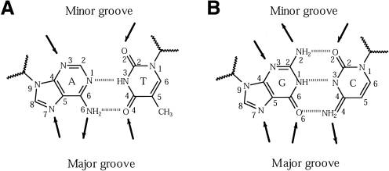
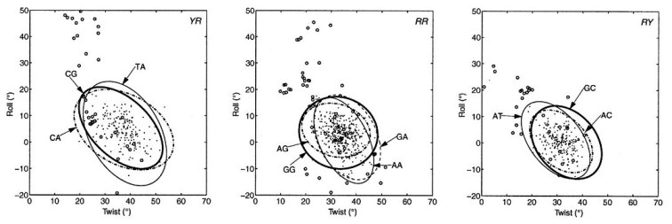

# Session 2: Analysis of non-coding sequences

In this session we will continue annotating sequences, but now with a focus on non-coding sequences.
If we revisit this figure, I hope you'll see that non-coding sequences are usually the largest fraction of genomes [(Makinen2015)](http://www.genome-scale.info):


For instance, the genome of the model grass *Brachypodium distachyon* is about 270Mbp long, but its genes take only about 100Mbp. The difference increases as the genomes grow, as you can see in this [plot](http://rsat.eead.csic.es/plants/data/stats).

Therefore, when dealing with genome variation, polymorphisms have a greater chance to occur in non-coding regions. Among these, probably the most interesting are repetitive and regulatory sequences.

<!-- ## Analysis of repeated sequences -->

## Analysis of regulatory sequences"

The regulation of gene expression is one of the fundamental topics in Genetics.
In this session we will learn about transcription factors (TF), which are proteins that bind specifically to DNA sequences called cis-regulatory elements. Binding affects the expression of nearby genes. Furthermore, we will see how regulatory elements can be discovered in promoter sequences using statistical tests. By aligning the sequence of cis elements bound by the same TF is is possible to build a **DNA motif**.

# Protein-DNA recognition

DNA-binding proteins contain DNA-binding domains and have a specific or general affinity for either single or double stranded DNA. Here we will concentrate mostly on transcription factors, which generally recognize cis-regulatory elements in double-stranded DNA molecules.

## Dissecting a protein-DNA interface

Transcription factors recognize target DNA sequences through a binding interface, composed of protein residues and DNA stretches in intimate contact. The best descriptions of protein-DNA interfaces are provided by structural biology, usually by X-ray or NMR experiments.

 
 
 

## Atomic interactions between protein and DNA residues

The process of recognition of DNA sequences by proteins involves readout mechanisms, and also accessory stabilizing atomic interaction that do not confer specificty.

**Direct readout** 

* Hydrogen bonds: direct + water-mediated
* Hydrophobic interactions

**Indirect readout**

* Sequence-specific deformation of DNA base steps

**Stabilizing interactions**

* Not sequence-specific, involving DNA backbone

## Direct readout: hydrogen bonds

 

## Direct readout: Van der Waals interactions


## Indirect/shape readout

Besides atomic interactions between protein and DNA, sequence-dependent deformability of duplexes, deduced from crystal complexes, implies that sequence recognition also involves DNA shape.


DNA deformation is described by the increase in energy brought about by instantaneous fluctuations of the step parameters from their equilibrium values:

$deformation = \displaystyle\sum_{i=0}^6 \displaystyle\sum_{j=0}^6 spring_{ij} \Delta\theta_{i,st} \Delta\theta_{j,st}$ (@Olson1998)



The accumulation of experimental and molecular dynamics data of DNA molecules currently supports predictive algorithms, such as [DNAshape](http://rohslab.cmb.usc.edu/DNAshape/), which predict the geometry of DNA sequences:  


## Protein-DNA interface graphs

Interfaces can be explored as generic bipartite graphs (@Sathyapriya2008) or with sub-graphs that focus only on specific sequence recognition:

 (@ContrerasMoreira2010)](pics/1je8-intf.png)

# Comparison of DNA-binding proteins

A great variety of DNA-binding proteins has been observed in nature, which can be analyzed and compared in terms of the features introduced above, such as readout, or instead with an evolutionary or topological perspective.  


The  [Structural Classification of Proteins (SCOP)](http://scop.berkeley.edu) systematically groups protein folds in superfamilies, of which some are the most common DNA-binding proteins. The next table shows superfamilies with more than 20 non-redundant complexes in the [Protein Data Bank](http://www.rcsb.org) as of May, 2018, as annotated in the database [3d-footprint](http://floresta.eead.csic.es/3dfootprint/):

SCOP superfamily | Number of complexes
---------------- | -------------------
Winged helix (WH) | 95
Homeodomain-like (H) | 66
Glucocorticoid-receptor-like (GR) | 38
Restriction endonuclease-like (RE) | 24 
Homing endonuclease (HE) | 32 
p53-like (P53) | 23
Lambda-repressor-like (LR) | 23


## Analysis of protein-DNA interfaces in transcription factors families

The available experimental structures of protein-DNA complexes in the PDB support the annotation of interface residues, those involved directly in sequence recognition, within protein families.


Several examples in the literature have demonstrated the correlation between interface patterns and the bound DNA motifs within large transcription factor families, such as the work of @Noyes2008:


<!--Structural data are key for the study of interfaces, as well as the structural superposition of DNA-binding domains:
 -->

The study of interfaces must be done in the appropriate biological context, for instance considering the oligomerization state of TFs _in vivo_, as each family of transcription factors has singularities, such as these (compiled by Álvaro Sebastián):

Family | Motifs | Multimeric | Multidomain
------ | ------ | ---------- | -----------
Homeodomain	| TAATkr,TGAyA | Sometimes | Unusual
Basic helix-loop-helix (bHLH)	| CACGTG,CAsshG	| Always (homodimers, heterodimers)	| Never
Basic leucine zipper (bZIP)	| CACGTG,-ACGT-,TGAGTC | Always (homodimers, heterodimers) | Never
MYB	| GkTwGkTr | Common (multimers)	| Common
High mobility group (HMG)	| mTT(T)GwT,TTATC,ATTCA | Sometimes	| Unusual
GAGA | GAGA	| Never	| Never
Fork head	| TrTTTr | Unusual | Never
Fungal Zn(2)-Cys(6) binuclear cluster |	CGG	| Common (homodimers) | Never
Ets	| GGAw | Common (homodimers, heterodimers, multimers)	| Never
Rel homology domain (RHD) |	GGnnwTyCC |	Always (homodimers, heterodimers)	| Never
Interferon regulatory factor | AAnnGAAA	| Always (homodimers, heterodimers, multimers) |	Never

## Aligning cis elements by superposition of atomic coordinates of interfaces 

Here I briefly describe a structural alignment approach for the comparison of DNA-binding proteins and their interfaces, as discussed in @Siggers2005 and @Sebastian2013. In this context superpositions might guide the correct alignment of cis elements bound by homologous proteins, as illustrated in the figure.


## Specificity-based classification of DNA-binding proteins

DNA motifs inferred from protein-complexes can be analyzed in terms of their information content:


# Discovering cis elements in genomes by counting words ($k$-mers)

Now that we know how transcription factors recognize their target DNA sites, we will how learn how enrichment of DNA words in upstream gene promoter sequences can be computed in order to discover putative regulatory elements. We will follow the method of @vanHelden1998.

For this demo some data files are required, as well as some R functions, which you can download from [https://github.com/eead-csic-compbio/methods_biostats_bioinfo](https://github.com/eead-csic-compbio/methods_biostats_bioinfo/archive/master.zip) or with *git*:

```{r, engine='bash', eval=FALSE}
# if you don't have this yet
#git clone https://github.com/eead-csic-compbio/methods_biostats_bioinfo.git
cd methods_biostats_bioinfo
git pull
```

After this is done, you'll have the required data and code. Let's have a look at the data:

```{r oligoinput, engine='bash'}
# a set of upstream sequences of a group of co-regulated genes on Brachypodium distachyon
# see that they have been cut with coordinates -1000,+200 with respect to 
# transcription start site (TSS)
head test_data/regulon.raw.fna
echo

# same sequences but repeat-masked
head test_data/regulon.rm.fna
echo

# frequency of hexamers in those raw upstream sequences computed with RSAT  
# oligo-analysis -v 1 -seqtype dna -l 6 -return occ,freq -quick -str 2 -ovlp -sort
head -35 test_data/6nt_upstream_regulon.raw.tab | grep -v ";"
echo

# frequency of hexamers in the repeat-masked sequences 
head -35 test_data/6nt_upstream_regulon.rm.tab | grep -v ";"
echo

# frequency of hexamers in all (rm) upstream sequences of that genome
head -35 test_data/6nt_upstream_genome.tab | grep -v ";"
```

Now let's inspect the R code which will be used in this demo. We'll start by checking the function that computes the significance of hexamers:

```{r oligofunction, eval=FALSE}

#' @author Najla Nksouri <najlaksouri@gmail.com> 
#' Revised by Jacques van Helden <Jacques.van-Helden@univ-amu.fr>
#' @description Compare the statistics between query and background k_mer counts
#' @param query.oligo.file file containing k-mer counts computed from the query sequences, as produced by RSAT oligo-analysis.
#' This file must contain 
#' @param background.oligo.file file containing background k-mer occurrences

kmer.stats <- function(query.oligo.file,
                       background.oligo.file) {
  
  ## Check existence of input files
  if (!file.exists(query.oligo.file)) {
    stop("kmer.stats() error: query.oligo.file does not exist: ", query.oligo.file)
  }
  if (!file.exists(background.oligo.file)) {
    stop("kmer.stats() error: background.oligo.file does not exist: ", background.oligo.file)
  }
  
  ## Read tables and rename first column
  oligo.query.freq.table <- 
    read.table(query.oligo.file, sep = "\t", comment.char = ";", header = TRUE)
  names(oligo.query.freq.table)[1] <- "seq"
  
  oligo.genome.freq.table <- 
    read.table(background.oligo.file, sep = "\t", comment.char = ";", header = TRUE)
  names(oligo.genome.freq.table)[1] <- "seq"
  
  oligo.table <- merge(
    oligo.query.freq.table,
    oligo.genome.freq.table,
    by=c("seq", "id"), suffixes=c("_query", "_background")
  )
  
  ## Compute the p-value of the observed occurrences in query frequencies
  nb.oligos <- nrow(oligo.table)
  N <- sum(oligo.table$occ_query) 
  
  ## Compute th number of occurrences expected in random background fragments
  ## of the same size as the query sequences.
  oligo.table$exp.occ <- oligo.table$obs_freq_background * N
  
  ### Compute the nominal (unadjusted) p-value of each oligonucleotide
  
  ## Test the over-representation: righ-tailed test
  oligo.table$pval.over <- pbinom(q = oligo.table$occ_query -1, size = N, 
                                  prob = oligo.table$obs_freq_background, lower.tail=FALSE)
  
  ## Compute log p-value to avoid the floating point limitation to 1e-320
  oligo.table$log.pval.over <- pbinom(q = oligo.table$occ_query -1, size = N, 
                                      prob = oligo.table$obs_freq_background, lower.tail=FALSE, log=TRUE)
  
  ## Test under-representation: left-tailed test
  oligo.table$pval.under <- pbinom(q = oligo.table$occ_query, size = N, 
                                   prob = oligo.table$obs_freq_background, lower.tail=TRUE)
  
  oligo.table$log.pval.under <- pbinom(q = oligo.table$occ_query, size = N, 
                                       prob = oligo.table$obs_freq_background, lower.tail=TRUE, log=TRUE)
  
  ## Two-sided test
  oligo.table$pval <- pmin(oligo.table$pval.under, oligo.table$pval.over) * 2
  oligo.table$log.pval <- pmin(oligo.table$log.pval.under, oligo.table$log.pval.over) * 2
  
  ## Compute the E-value (multiple testing correction).`
  ##  E-value indicates the expected number of false positives 
  ## (i.e. how many oligos would be expected to be be declared positive under 
  ## the null hypothesis)
  oligo.table$eval <- oligo.table$pval * nb.oligos
  
  ## Compute the significance
  ## sig = -log10(eval)
  oligo.table$sig <- -log10(nb.oligos) - oligo.table$log.pval/log(10)
  
  ## Compute maximal frequency for both files
  max.axis <- max(c(oligo.table$obs_freq_query, oligo.table$obs_freq_background))
  
  ## Log2 ratio observed/expected
  oligo.table$freq.ratio <- oligo.table$obs_freq_query/oligo.table$obs_freq_background
  oligo.table$log2.ratio <- log2(oligo.table$freq.ratio)
  
  return(oligo.table)
}
```

Now we shall look at the plotting function:

```{r plotfunction, eval=FALSE}
#' @title Scatter plot of background versus query k-mer frequencies. 
#' @author Najla Nksouri <najlaksouri@gmail.com> 
#' Revised by Jacques van Helden <Jacques.van-Helden@univ-amu.fr>
#' @description Draw a scatter plot comparing background and query k-mer frequencies for a given size. 
#' @param kmer.stat.table a table with k-mer statistics produced by kmer.stats()
#' @param k oligonucleotide (k-mer) size
#' @param sig.threshold=2 Threshold on significance for the volcano plot. 
#' @param volcano.ymax=350
#' @return a data.frame with merged query and background k-mer frequencies + derived statistics
#' @examples
#' ## Plot query versus background 4-mer frequencies
#' plot.kmers(k=8)
#' 
plot.kmers <- function(kmer.stat.table,
                       k,
                       sig.threshold = 2,
                       log2FC.threshold = 1, ## Enrichment threshold
                       volcano.ymax = 350) {
  message(k, "-mer frequency plot")

  ## Define dot colors  
  dot.colors <- ifelse(
    (kmer.stat.table$sig > sig.threshold & kmer.stat.table$log2.ratio > 0.1), "darkred",
         ifelse((kmer.stat.table$sig > sig.threshold & kmer.stat.table$log2.ratio < -0.1),
                "darkblue", "darkgray"))

  ## Draw a scatter plot to compare k-mer frequencies
  max.freq <- max(kmer.stat.table[, c("obs_freq_query","obs_freq_background")])
  plot(x = kmer.stat.table$obs_freq_background,
       y = kmer.stat.table$obs_freq_query,
       
       ## Set axis limits
       xlim = c(0, max.freq),
       ylim = c(0, max.freq),
       
       ## Set labels
       xlab = paste("background ", k,"-mer frequencies", sep = ""),
       ylab = paste("query ", k,"-mer frequencies", sep = ""),
       main = paste("background vs query ", k,"-mer frequencies", sep = ""),
       
       col = dot.colors,
       
       ## Insert grid
       panel.first=grid(),
       
       ## Change symbol
       pch=1
  )
  ## Insert diagonal
  abline(0, 1, col="black", lwd=1, lty = 2)
  
  ## MA plot : log-ratio as a function of the log counts
  ## Note: usually, the MA plot represent the log-ratio versus log(mean) of the two measurements.
  ## However, in our case the query sequences are a subset of the background sequences. 
  ## We will thus plot the log(background freq) on the X axis
  plot(x = log2(kmer.stat.table$obs_freq_background),
       y = kmer.stat.table$log2.ratio,
       
       ## Set labels
       xlab = paste("log2(background)"),
       ylab = paste("log2(query/background)"),
       main = paste(k,"-mer frequencies", sep = ""),
       
       col = dot.colors,
       
       ## Insert grid
       panel.first=grid(),
       
       ## Change symbol
       pch=1
  )
  ## Insert diagonal
  abline(h=0, col="black", lwd=1, lty = 2)
  
  
  ## Draw a volcano plot
  ##
  ## Abcsissa indicates the effect,i.e. the log2-ratio query versus background. 
  ## Ordinate indicates the significance as computed above. 
  ##
  ## Mark in red the over-represented k-mers with sig > given threshold.
  ## and in blue the under-represented k-mers with sig > given threshold.
  
  ## Set axis limit 
  x.lim <- abs(max(kmer.stat.table$log2.ratio))
  ## Plotting
  with(kmer.stat.table,plot(x=log2.ratio, 
                        y=sig, 
                        pch = 1,
                        xlim = c(-x.lim, x.lim),
                        ylim = c (0, volcano.ymax),
                        
                        ## Set labels
                        xlab = paste("Log2.ratio ", k,"-mer frequencies", sep = ""),
                        ylab = paste("Significance ", k,"-mer frequencies", sep = ""),
                        main = paste("Volcano Plot ", k,"-mer frequencies", sep = ""),
                        # Insert grid
                        panel.first=grid(),
                        
                        #set the colors 
                        col = dot.colors))
  
  ## Denote significance exceeding the threshold by 
  above.ymax <- kmer.stat.table$sig > volcano.ymax
  with(kmer.stat.table[above.ymax,],
       points(x=log2.ratio, y=rep(x = volcano.ymax, length.out=sum(above.ymax)), pch=17, col="red",type="p"))
  
  ## insert diagonals
  abline(h=sig.threshold, col= "black", lty = 2)
  abline(v=0, col= "black", lty = 2)
  abline(v=-log2FC.threshold, col= "black", lty = 2)
  abline(v=log2FC.threshold, col= "black", lty = 2)
}
```

With this data and functions we can now compute $k$-mer enrichment in the promoters of a sample set of co-regulated genes or **regulon**:


```{r demooligo}

# adjust as required 
dir_data = "test_data/" # where pre-computed k-mer freq files are 
dir_code = "test_code/" 

source(file.path(dir_code, "kmer_stats.R"))
source(file.path(dir_code, "plot_kmers.R"))

# set word/k-mer size
k = 6 

# set files with pre-computed words/k-mer frequencies
# raw sequences
#oligo.upstream.freq.file = file.path(dir_data,"6nt_upstream_regulon.raw.tab")
# recommended repeat-masked sequences
oligo.upstream.freq.file = file.path(dir_data,"6nt_upstream_regulon.rm.tab")
  
oligo.genome.freq.file = file.path(dir_data, "6nt_upstream_genome.tab")
 
# check the code of this function to see how the probabilities of word occurrences 
# are computed with the binomial function
kmer.stat.table <- kmer.stats(query.oligo.file = oligo.upstream.freq.file, 
                               background.oligo.file = oligo.genome.freq.file)
#View(kmer.stat.table)
  
plot.kmers(kmer.stat.table, k, volcano.ymax = 60) 


```


