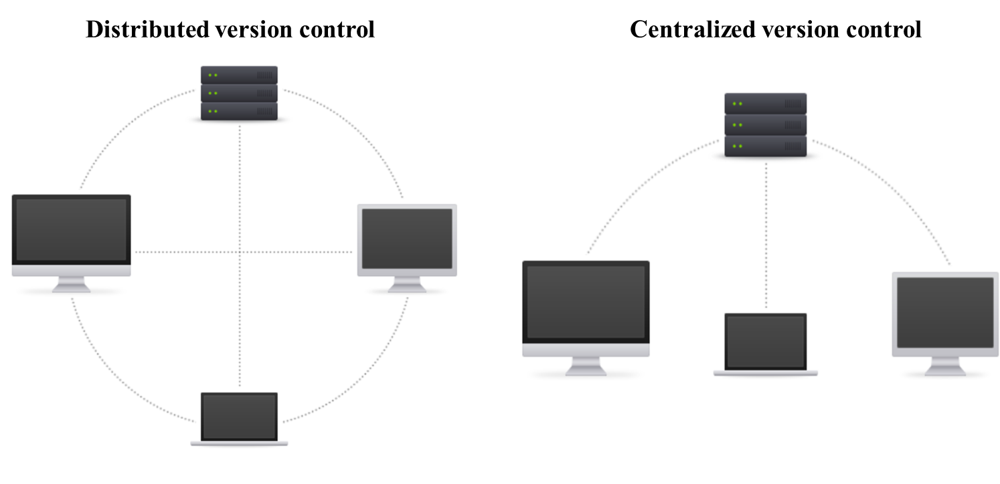
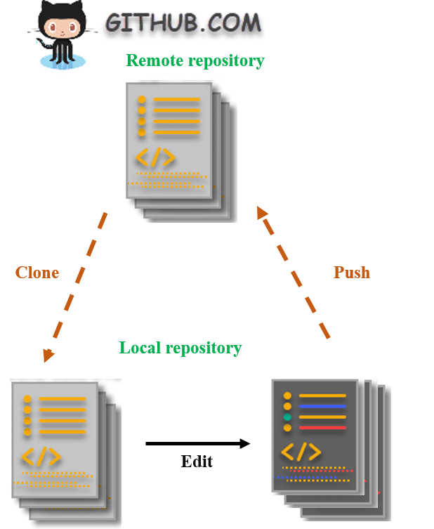
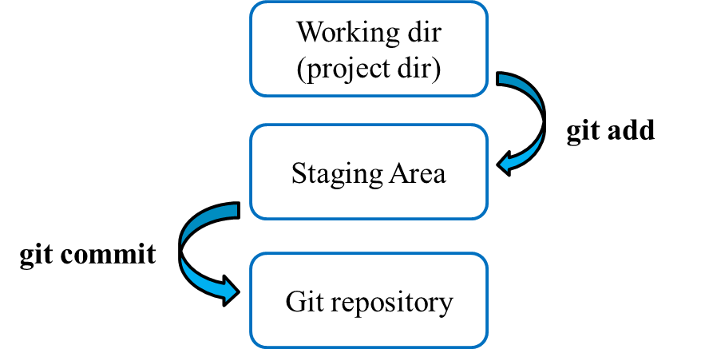

```{r knitr setup, include=FALSE,  eval=TRUE, echo=FALSE, warning=FALSE}
library(knitr)
knitr::opts_chunk$set(eval=TRUE, cache=FALSE, message=FALSE, warning=FALSE, 
                      comment = "", results="markup")
```

# Introduction

If you have ever worked on a project, or collaborated with other team members, then you have already created different versions of your document to update it.  

This is a primitive way of the version control because it's manual and not detailed. If we want to figure out the differences between 2 copies just by putting them side-by-side, it will be very time-consuming and super error-prone. 

In this session, you'll be introduced to the concept of version control system (VCS) to maintain a detailed history of the created versions and the modifications done. By using a VCS, we can know when the changes were made and who made them.

We will be using one of the most popular version control system called [Git](https://git-scm.com/) and we will show you how to interact with Git through the command lines.

We will also learn how to set up an account with the service called [GitHub](https://github.com/), so that you can create your own remote repositories to store your code and data.


# Git Overview

Git is a version control program that keeps track of any changes you make to your files and directories.
There are two main types of version control systems:

  + The centralized model:  all users connect to a central, master repository.

  + The distributed model: each user has a copy of entire repository on their computer and these repositroies can easily be synchronized.

Git is a free distributed model, widely used in the programming world. It was developed in 2005 by Linus Torvalds, the creator of the Linux operating system kernel [@10.5555/2695634]. 

(See figure below adapted from [beanstalkapp](http://guides.beanstalkapp.com/version-control/intro-to-version-control.html)).



## Installation and getting start with Git

The first step is to check whether you have the Git installed on your computer by running:

```{bash, eval=T}
git --version
```


If no version information is shown, you need to install it yourself

```{bash, eval=F}
sudo apt-get update
sudo apt-get install git
git --version #To verify that the installation has succeeded

```

We have already said that by using VCS we can know which user have made the changes. For this, we need to tell Git our identity using the following command lines:

```{bash, eval=T}
git config --global user.name "my_name"
git config --global user.email "name@example.com"
```  

To check if the configuration was properly set
```{bash, eval=F}
git config --list
```

```
user.name=my_name
user.email=name@example.com
```

## Setting up a Git repository

Git stores all related-data of a particular project in a storge space called Git repository ('repo', for short).

There are 2 ways to start with a Git repository:

1. Initializing (creating) a local repository
2. Cloning an existing one from a remote server


### Initializing a Git repository

To create a new local Git repository, we will first create a directory for a project then run the **`git init`** command.  Doing so, a hidden folder “./git" will be created in your current working directory. This is called a Git repository. 

This repository is considered as a storage center where the git software will tracks all changes made and builds a history over time. In other terms, if we delete the .git folder, then the project´s history will be deleted.  

```{bash, eval=F}
mkdir ~/demo_project
cd ~/demo_project
git init
ls -la #check for the hidden directories
ls -l #check the files inside the .git folder
```


### Cloning an existing remote Repository from GitHub
A remote repository is a repository that is hosted in a data center or in the cloud. There are many Git repositories hosting service such as GitHub: owned by Microsoft, GitLab: owned by GitLab and BitBucket. In this session, we will use [GitHub](https://github.com/).

For example; if you would like to contribute to an existing project hosted on GitHub or a similar, the easiest way to do so is to copy (clone) the remote repo on your local machine.

When we clone a repository using the **`git clone`** command, all the files are downloaded to the local computer and the remote repository remains unchanged. 

We can then edit the local files then push the changes to the original repository to makes it available for everyone who is watching it or contributing to it.

The figure below illustrates the concept of cloning.

{height=40% width=40% } 

****
Per default, the git clone will create a local directory with the same name as the orginal git repository. If you want a different folder name, simply specify it as the last parameter

```{bash, eval=F}
git clone Repository URL 
git clone Repository URL <new-folder-name
```

**Note:** git init and git clone are one-time operations needed for the initial setup of the repository

## Adding and commiting the changes

At this point, we need to know that Git has 3 main componemts:

Working directory -> Staging area-> git repository. 

If we add or modify certain files in the working directory, Git won’t notice it unless we ask the program to track these changes using **git add**. Doing so, the changes will be moved from the working directory to the staging area.
Next, to store the modifications in the git repository, we simply use **git commit**.


{ height=40% width=60% }{}


***

Let´s see this with an example


**Example 1**  

  1. Go to the ~/demo_project directory and check the status the working dir by typing  **`git status`**.
  2. Use touch to create a new empty file called index.html
  3. Run the **`git status`** once again and try to compare between the Status messages.
  4. Add the index.html to the staging area using the **`git add`** command.
  
```{bash, eval=F}
  git add index.html
  git add --all #To add edited files at the same time
```
  5. Check again the status.
  6. Commit the changes typing "adding an empty index file".
  
```{bash, eval=F}
  git commit -m <commit message>
```  
 7. Edit the index.html file pasting these lines then run **git diff**. What does git diff do?
 
```html
<html>
<Header> </header>
<style>
table, th, td {
  border: 1px solid black; border-collapse: collapse;}
</style>
<body>
<h2> Learning basic Git commands</h2>
  <table>
  <tr>
      <th>Tasks</th> <th>Git commands </th> 
  </tr>
  <tr>
    <td>Create a new local repository</td> <td> git init</td>
  </tr>
  <tr>
    <td>Check the status of the working direcotry</td> <td>git status</td>
  </tr>
  <tr>
    <td>Add files</td> <td>git add filename </td>
  </tr>
  <tr>
    <td>Commit the changes</td> <td>git commit -m "message" </td>
 </tr>  
   <tr><td>Show the commit</td> <td>git log</td> </tr> 
</table> 
</body> 
</html>
```
  8. Run again the git status,add and commit commands
  9. Execute **git log**. What does this command do? Try also **git log --oneline** 
  

We can ask git to ignore unwanted files (e.g files with .log extensions) by creating .gitignore file.

**Example 2** 

```{bash, eval=F}
  cd ~/demo_project
  touch file1.log file2.log genes_list.txt
  echo -e "PRUPE_1G130300\nPRUPE_4G232600" >> genes_list.txt #add gene ids to the file
  git status
  touch .gitignore
  echo *.log >> .gitignore #to specify unwanted files
  git status
  git add .gitignore genes_list.txt
  git commit -m "Ignore log files and add the gene list"
```

## Undoing the changes with Git

One of the main advantages of version control system, is the ability to undo the changes at different stages.
In this section we will list some useful Git command lines.

Lets practice 

**Example 3** 

1. **Cancel the changes in the working dir(Before git add)**: git chekout filename
```{bash, eval=F}
  cd ~/demo_project
  echo "AT2G38470" >> genes_list.txt 
  cat genes_list.txt 
  git chekout genes_list.txt
  cat genes_list.txt 
```

2. **Cancel staged changes (Before git commit)**: git reset HEAD filename
```{bash, eval=F}
  # Make a new change to the genes list
  echo "transcription factor" >> genes_list.txt 
  # Stage the changes
  git add genes_list.txt
  git status 
  # Cancel the changes
  git reset HEAD genes_list.txt
  git status  
```

3. **Cancel the commits (after git commit)**: git revet HEAD
Note: We saw that git log displays all the commits done, assigning a unique indentifier (HEAD) to each one.
```{bash, eval=F}
# Undo the last commit
git commit --amend

```
4. **Remove files from working dir or staging area**: git rm filename

```{bash, eval=F}
  git rm genes_list.txt
  git status
  git add genes_list.txt
  git commit -m "deleted unwanted file"
  
``` 


## Using branches 

The default branch of a repository is called master. When we are working in parallel with other team members or developing a new project, its always a good practice to create new branches.
Branching allows users to work on different features at the same time keeping stable and safe the original source code.

Practicing:

**Example 4** 

1. Continuing in the initial demo_project create a new branch called test_branch
```{bash, eval=F}
  git branch branchname
```

2. Lets take a look at the branches 

```{bash, eval=F}
  git branch 
```
Actually, the newly created branch is an exact copy of the master branch and the current branch we are working on is marked by (*).

3. From now on we will be working on the test_branch. Any changes we make will affect only the new one and the master branch will remain untouched. To Switch between them:

```{bash, eval=F}
  # Switch to test_branch
  git checkout branchname
  
  # Edit the test_branch, track and commit the changes
  touch script.py
  touch Readme.txt
  echo "Hello, This is a simple a branching exercise" > Readme.txt
  
  git add -all
  git commit -m "added readme and python script to test branch"
  
  # Switch back to the master branch
  git checkout branchname
  
  # List the directory contents
  ls
```

As we can see, the master branch does not have the Readme.txt and script.py file as at the moment it only exists in the test_branch. 

4. Merge the branches: whenever we are satisfied with the changes, they can be merged into the master branch

```{bash, eval=F}

  git merge test_branch

  ls
  
```

5. When the master branch is updated. The additional branch is no longer needed and can be romved 

```{bash, eval=F}

  git branch -d test_branch
  git branch
  
```

## Interacting with Github

Git is version control software. Github, is a web-based Git repository hosting service. It provides a free access to git repositories  To interact with Github, the first thing we need to do is create an [account](https://github.com/join?source=login) 

Until now, we have been using Git locally. In this section, we will learn how to transfer a local repository to a Git hosting server. Means that a repository will pass from local to remote.

**Example 5** 

1. Go to github.
2. Log in to your account.
3. Click the new repository button in the top-right to create a public repository and initialize it with a README file
4. Click the “Create repository” button.
5. Push the existing repository by running the following commands

```{bash, eval=F}
  git remote add origin <repository url>
  git push -u origin master #you need to enter the username and password
```
6. Verify the Github accounf to check if the push was successfully done 


## Exercises

**Exercise 1**.

1. Create a local repository in a new directory called exercises.
2. create a Readme file and check the repository status.
3. Add the Readme file to the staging area and commit the change with appropriate message.
4. Copy the [test_code] (https://github.com/eead-csic-compbio/bioinformatics/tree/main/test_code)folder in the working directory
5. Create and commit a configuration that ignore all files with .tpm extension and all the  test_code directory
6. Check that the configuration is well done
7. Rename the Readme file as Readme.txt
8. Track and commit the changes
9. Check out the comment
10. Summarize all the command used in a text file


**Exercise 2**

 
## Bibliography


