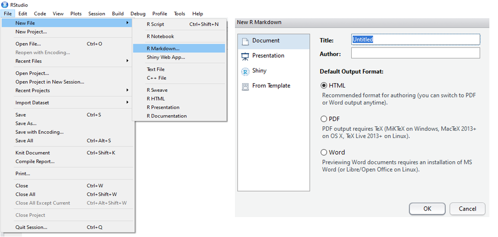

```{r knitr setup, include=T,  eval=TRUE, echo=FALSE, warning=FALSE}
#install.packages("remotes")
#remotes::install_github("rlesur/klippy")
klippy::klippy(position = c('top', 'right'), tooltip_message = 'Click to copy', tooltip_success = 'Copied')
library(knitr)
knitr::opts_chunk$set(eval=T, cache=FALSE, message=FALSE, warning=FALSE, 
                      comment = "", results="markup")
```

<!-- dependencies: 
make, git, wget, r-base, rstudio
R packages:
ggplot2.3.3
gridExtra
ggridges 
dplyr
Rcpp 
rlang
Purrr
Tibble 
gtable 
crayon 
magrittr 
pillar
-->

# Introduction
In most cases, publishing an Open Access paper is not enough for the audience to take advantage of it. The real relevance of a scientific study is its reproducibility.

In fact, a reproducible work means making all the work materials: raw data, source code, figures, results available to the readers by hosting it on an accessible platform.

By doing so, you are

•	Demonstrating to the audience the transparency of your findings.

•	Allowing the readers to apply your described methods and results on their own data.

•	Increasing the visibility and the citation of your study.

Most scientific journals, such as Nature, PNAS, Plant physiology, etc, require to submit manuscripts with data accessible repositories and code links [@Fanelli2628; @Miyakawa2020].
In this session we will be using a set of tools to perform reproducible research. 

# The steps towards a reproducible research

A reproducible analysis doesn’t emerge by sharing the code after the project is done. It’s a series of tasks required, **before**, **during**, and **after** finishing the data analysis.

## Good practices before starting the analysis

The first step needed to ensure the reproducibilty  is a good organization of folders and files. Indeed, it is laborious to reproduce a research when data are disorganized or missing.

### Recommendations for project organization.

+ Have a single directory containing everything related to your project.

+ Save a copy of your raw data

+ Separate raw and processed data.

+ Define the directories (input, scripts, results...)

+ Use simple and descriptive file names (without special characters or spaces).

+ Avoid using "final" when naming the files.

+ Get used to create a Readme file for your project (It is a descriptive file containing useful information about a project such as title, author, data, software used, fundings ...).

+ Keep a  back up of the data to minimize risk of data loss (e.g external hard drive).

**Example 1: a basic project directory structure**

```{bash, eval=F}

project
│   README.md
│
└───codes
│   │   
│   └───R_scripts
│       │   density_plot.R
│       │   heatmap.R
│       │   ..
│   │
│   └───Makefiles
│       │   peak_motifs.mk
│       │   gene_annotation.mk
│           ...
│   
└───data
│   │   
│   └───raw_data
│   │
│   └───processed_data
│         
└───results       
│   │   
│   └───figures
│   │
│   └───tables
│         
└───manuscript
└───bibliography
...


```

 

## Good practices during the analysis

### Source code of scripts

The basic concept of reproducibility is to run the analysis using scripts (R scripts, makefiles, etc) with detailed documentation of each step.

**Recommendations for writing code**

  -	Write clear code for each task (cleaning data, aligning reads, differential analysis, plotting ...) using meaningful file names.
  
  -	Comments need to be informative and easy to understand for non-specialist readers.
  
  -	Output should be redirected automatically to their corresponding directories.
  
  -	Specify the software name and **version**.
  
  -	Use clear variable names.


**Example 2: good code vs. bad Rscript **


Herein we will compare two R scripts written for the same purpose.

1. Check both scripts and choose which one is more informative for you

```{r, eval=FALSE}

required.libs <- c("ggplot2","gridExtra","ggridges")
for (lib in required.libs){
  library(lib, character.only = T)
}

data <- read.table("https://raw.githubusercontent.com/eead-csic-compbio/bioinformatics/main/test_data/binding_sites.tab",header=T, dec = ".", sep = "\t")

p <- ggplot(data,aes(start, algorithm, fill = algorithm)) +
  geom_density_ridges_gradient(scale = 1, show.legend = T) + theme_ridges() + 
  theme(legend.position = "none") + labs(x = "upstream region",y = "density of the sites") +
  scale_fill_manual(values = c("#868686FF","#fdef64"))+
  scale_x_continuous (limit = c(-1500, +200),breaks = c(-1500,-500,0,+200)) + 
  annotate("text", x = c(-250,-250), y = c(2.5,1.5), label = c("CAMTA", "CAMTA"))
p

```

***

```{r density plot, eval=F}
# @author:najlaksouri@gmail.com
# @date: 04/01/2020
# @description this script creates a Ridgeline plots showing the density distrubution of motif sites

# Install the packages if not already installed then import the libraries
required.libs <- c("ggplot2","gridExtra","ggridges")

for (lib in required.libs){
  if (!require(lib, character.only = T)){
    install.packages(lib)
    library(lib, character.only = T)
  }
}

# Reading a text file directly from github then view data
scan_data <- read.table("https://raw.githubusercontent.com/eead-csic-compbio/bioinformatics/main/test_data/binding_sites.tab",header=T, dec = ".", sep = "\t")

head(scan_data)

# Open a PNG file where the plot will be saved
png(file = "~/demo_project/results/figures/densityplot.png", width=600, height=350) 

# Create a density plot for each algorithm
density_plot <- 
  ggplot(scan_data,aes(start, algorithm, fill = algorithm))+
  geom_density_ridges_gradient(scale = 1, show.legend = T) +
  # Choose the theme
  theme_ridges() + 
  # Hide the legend
  theme(legend.position = "none") +
  # Add axes description
  labs(x = "upstream region",y = "density of the sites") +
  # Change the colors
  scale_fill_manual(values = c("#868686FF","#fdef64"))+
  # Customize continuous x and control the breaks
  scale_x_continuous (limit = c(-1500, +200),breaks = c(-1500,-500,0,+200)) + 
  # Add the appropiate annotations 
  annotate("text", x = c(-250,-250), y = c(2.5,1.5), label = c("CAMTA", "CAMTA"))

# Close the plot file 
dev.off()
message("; density plot done and saved")

# Display the plot
density_plot

#display all packages used and their version
sessionInfo()
```

{height=70% width=70% }. 


### Automate the analysis process

When multiple commands are needed, it’s better to compile them into a single script specifying the order in which the instructions need to be executed and indicating the software required for each step. A common way to automate  the analysis is to use makefiles. 

[make](www.gnu.org/software/make) is a standard unix tool that processes makefiles containing shell instructions to tell make what to do.

**Example 3: Using Makefiles**

1. Use mkdir to create a directory called demo_project and a subfolder demo_project/scripts.

2. Download the makefile from the Github then save it in subfolder demo_project/scripts.

```{bash, eval=F}
wget https://raw.githubusercontent.com/eead-csic-compbio/bioinformatics/main/test_code/makefile.mk
```


3. Before running this code, you need first to install samtools and check it´s version:

```{bash, eval=F}
sudo apt update
sudo apt install samtools
samtools --version
```

4. The makefile can be executed target by target using **make -s -f makefilename target_name** or at one go by typing **make -s -f makefilename all**

5. Check the structure organization of your project

```{bash eval=F, class.source='klippy'}

###########################################################################################
## This makefile is to retrieve 5 random gene_ids from a list of arabidopsis genes, 
## then will assign the corresponding fasta sequence to each gene. 
## Gene list will be downloaded from a github and fasta sequence from EnsemblPlants
## Get this file from folder test_code
###########################################################################################

## Define the direcotries
DATA=~/demo_project/sequences
INPUT=~/demo_project/input
RESLTS=~/demo_project/results
FIGURES=~${RESLT}/figures
ARAB_IDS=${INPUT}/arabidopsis_genes.txt
ARAB_SEQ=${DATA}/Arabidopsis_thaliana.TAIR10.cdna.all.fa


## Start with the targets

# Create the directories
# this target is called 'dir'
# all command lines or targets need to be indented with a tab
dir:
	@echo "Creating sequences and results directories"
	mkdir -p ${DATA}
	mkdir -p ${RESLTS}
	mkdir -p ${INPUT}

# Download the data
# Note: this uses wget, which might not be installed in MacOS systems
# wget can often be substituted with curl with minimal changes
get-data:
	@echo "Getting the gene list from github"
	wget https://raw.githubusercontent.com/eead-csic-compbio/bioinformatics/main/test_data/arabidopsis_genes.txt
	@echo "getting the Arabidopsis_thaliana cdna sequences from ensemblPlants"
	wget ftp://ftp.ensemblgenomes.org/pub/plants/release-49/fasta/arabidopsis_thaliana/cdna/Arabidopsis_thaliana.TAIR10.cdna.all.fa.gz
	@echo "Unzipping the cdna file"
	gunzip Arabidopsis_thaliana.TAIR10.cdna.all.fa.gz
	@echo
	@echo "Moving the data to their corresponging folders"
	mv arabidopsis_genes.txt ${INPUT}
	mv Arabidopsis_thaliana.TAIR10.cdna.all.fa ${DATA}

# Get random gene ids
get-ids:
	@echo
	@echo "Generating 5 random genes from the gene list"
	shuf -n 5 ${ARAB_IDS} -o ${RESLTS}/random_genes.txt
	@echo "${RESLTS}/random_genes.txt"

# Assign fasta
get-fasta:
	@echo
	@echo "Assign fasta sequence to each gene"
	cat ${RESLTS}/random_genes.txt | xargs -n 1 samtools faidx ${ARAB_SEQ} > ${RESLTS}/random-sequences.fna
	@echo "${RESLTS}/random-sequences.fna"

# Run all targets at one go
all: dir get-data get-ids get-fasta
	@echo "tasks successfully done"

```

As we can see  instead of executing the instructions one by one in your terminal, searching for the path of each file, saveing the results etc, a **makefile** can run your entire workflow in one-button operation and give you a well organized output. So better to let the computer work for you!.

Working with makefiles will allow you to modify any step and regenerate the results with minimal effort. In case of error, you can easy track and fix the bug as the makefile won’t run if something is missed.

Other options similar to makefiles in spirit but require more coding experience include [snakemake](https://snakemake.readthedocs.io/en/stable) or [nextflow](https://www.nextflow.io). 
A snakemake intro is available [here](https://github.com/harvardinformatics/bioinformatics-coffee-hour).

Options for reproducible software environments include [docker](https://hub.docker.com), 
[conda](https://docs.conda.io/en/latest) or [galaxy](https://usegalaxy.org).
A conda intro is available [here](https://github.com/harvardinformatics/bioinformatics-coffee-hour).

### Turn your scripts into reproducible reports

Generally scripts are very clear for their author not for the others. It is very  helpful and recommended to convert codes to a reproducible report. This report is a single file containing the code and the documentation at the same time. Indeed, when the code is executed, a report is generated including the documented command lines and any outputs(e.g. figures, tables, etc).

Actually, the code is what the machine will read and execute and the documentation is what readers need to understand what we are doing and why we are doing it.

This simultaneous construction of a code and its detailed description is called literate programming. This term was introduced by [@Knuth84] with the purpose that make computer programs written in human-readable way so they can be easly understood.

There are several literate programming tools, such as [Jupiter notebooks](https://jupyter.org) (many languages) or [R Markdown](https://rmarkdown.rstudio.com/) and [knitr](https://yihui.org/knitr/) (R). 
Both integrate sections of code and sections of text in a single document.

In this session, we will be using the Rmarkdown to generate a HTML report.

R Markdown files are plain text filee with extension .Rmd. The rmarkdown package converts this file into a report, most commonly into HTML or PDF.

**Example 4: Writing reports using RMarkdown**

1. Install R and RStudio desktop if required (see __Note__^[In Ubuntu, sudo apt install r-base] and __Note__^[see instructions at <https://rstudio.com/products/rstudio/download>])

2. To get RMarkdown working in RStudio, the first thing you need is the rmarkdown package

```{r, eval=F}
install.packages("rmarkdown")
library(rmarkdown)
```

3. Create a Rmarkdown file, fill the title and author name, then choose HTML output.

{height=70% width=80% }. 

***
4. The newly created .Rmd file comes with basic instructions, to create your own Rmarkdown script delete all except the YAML header section enclosed by three dashes (---) and containing by default; title, author, date and output format.

5. Compile the .Rmd file to .html by clicking on the **Knit** button. 

6. Insert R code chunk (insert ---> R) with the documented R script of section 2.2.1 and click on **knit**.

7. For additional details about Rmardown syntax and code chunks, check this [guide](ruleshttps://www.markdownguide.org/basic-syntax/)


### Use version control systems

If you have ever worked on a project, or collaborated with other team members, then probably you have already created different versions of your files. This is a primitive way of the version control because it’s manual and not detailed. If we want to figure out the differences between 2 copies just by putting them side-by-side, it will be very time-consuming and error-prone.

In this session, you’ll be introduced to the concept of a version control system (VCS) to maintain a detailed history of the created versions and the modifications done. By using a VCS, we can know when the changes were made and who made them. This applies to documents, images, datafiles and source code, which are the bread and butter of research.

#### Git overview

We will be using one of the most popular version control system called [Git](https://git-scm.com) and we will show you how to interact with Git through the command line or terminal.

We will also learn how to set up an account with the service called [GitHub](https://github.com), so that you can create your own remote repositories to store your code and data.

Git is a version control program that keeps track of any changes you make to your files and directories [@Bryan2017].

There are two main types of version control systems:

  + The centralized model: there is a single central copy of the repository on the server and the users need to connect and make the changes on this central copy, where the history will be saved.

  + The distributed model: each user has a copy of entire repository on its own computer and these repositroies can easily be synchronized.

Git is a free distributed model, widely used in the programming world. It was developed in 2005 by Linus Torvalds, the creator of the Linux operating system kernel [@10.5555/2695634]. The next figure was adapted from [beanstalkapp](http://guides.beanstalkapp.com/version-control/intro-to-version-control.html):

{height=60% width=80% }.

#### Installation and getting started with Git

The first step is to check whether you have the Git installed on your computer by running:

```{bash, eval=T}
git --version
```


If no version information is shown, you need to install it yourself

```{bash, eval=F}
sudo apt-get update
sudo apt-get install git
git --version #To verify that the installation has succeeded

```

We have already said that by using VCS we can know which user have made the changes. For this, we need to tell Git our identity using the following command lines:

```{bash, eval=F}
git config --global user.name "name"   #Avoid spaces when writing the user name
git config --global user.email "name@example.com"
```  

To check if the configuration was properly set
```{bash, eval=F}
git config --list
```

```
user.name=name
user.email=name@example.com
```

#### Setting up a Git repository

Git stores all related-data of a particular project in a storge space called Git repository ('repo', for short).

There are 2 ways to start with a Git repository:

1. Initializing (creating) a local repository
2. Cloning an existing one from a remote server


##### Initializing a Git repository

To create a new local Git repository, we will go to the demo_project and run the **`git init`** command.  Doing so, a hidden folder “./git" will be created in your current working directory. This is called a Git repository. 

This repository is considered as a storage center where the git software will tracks all changes made and builds a history over time. In other terms, if we delete the .git folder, then the project´s history will be deleted.  

```{bash, eval=F}
cd ~/demo_project
git init
ls -la #check for the hidden directories
ls -l #check the files inside the .git folder
```


##### Cloning an existing remote Repository from GitHub
A remote repository is a repository that is hosted in a data center or in the cloud. There are many Git repositories hosting service such as GitHub: owned by Microsoft, GitLab: owned by GitLab and BitBucket. In this session, we will use [GitHub](https://github.com/).

For example; if you would like to contribute to an existing project hosted on GitHub or a similar, the easiest way to do so is to copy (clone) the remote repo on your local machine.

When we clone a repository using the **`git clone`** command, all the files are downloaded to the local computer and the remote repository remains unchanged. 

We can then edit the local files then push the changes to the original repository to makes it available for everyone who is watching it or contributing to it.

The figure below illustrates the concept of cloning.

{height=40% width=40% } 

****
Per default, the git clone will create a local directory with the same name as the orginal git repository. If you want a different folder name, simply specify it as the last parameter

```{bash, eval=F}
git clone Repository URL 
git clone Repository URL <new-folder-name>
```

**Note:** git init and git clone are one-time operations needed for the initial setup of the repository

#### Adding and commiting the changes

At this point, we need to know that Git has 3 main componemts:

Working directory -----> Staging area -----> git repository. 

If we add or modify certain files in the working directory, Git won’t notice it unless we ask the program to track these changes using **git add**. Doing so, the changes will be moved from the working directory to the staging area.
Next, to store the modifications in the git repository, we simply use **git commit**.


{ height=40% width=60% }{}


***

Let´s see this with an example


**Example 5**  

  1. Go to the ~/demo_project directory and check the status the working dir by typing  **`git status`**.
  2. Add the untracked folder to the staging area using **`git add`** 
  
```{bash, eval=F}
  git add filename 
  git add --all #To add all folders/files at the same time
```
  3. Check again the status and try to compare between the Status messages.
  4. Commit the changes typing "adding folders and files".
  
```{bash, eval=F}
  git commit -m <commit message>
```   
 
  5. Use touch to create a new empty file called index.html
  3. Run the **`git status`** once again
  4. Add the index.html and commit "adding an empty index"
  5. Edit the index.html  pasting these lines then run **git diff**. What does git diff do?
 
```{html, class.source='klippy'}
<html>
<Header> </header>
<style>
table, th, td {
  border: 1px solid black; border-collapse: collapse;}
</style>
<body>
<h2> Learning basic Git commands</h2>
  <table>
  <tr>
      <th>Tasks</th> <th>Git commands </th> 
  </tr>
  <tr>
    <td>Create a new local repository</td> <td> git init</td>
  </tr>
  <tr>
    <td>Check the status of the working direcotry</td> <td>git status</td>
  </tr>
  <tr>
    <td>Add files</td> <td>git add filename </td>
  </tr>
  <tr>
    <td>Commit the changes</td> <td>git commit -m "message" </td>
 </tr>  
   <tr><td>Show the commit</td> <td>git log</td> </tr> 
</table> 
</body> 
</html>
```
  8. Run git status,add and commit commands
  9. Execute **git log**. What does this command do? Try also **git log --oneline** 
  

We can ask git to ignore unwanted files (e.g files with .log extensions) by creating .gitignore file.

**Example 6** 

```{bash, eval=F}
  cd ~/demo_project
  touch .gitignore
  echo *.log >> .gitignore #to specify unwanted files
  touch file1.log file2.log genes_list.txt
  echo -e "PRUPE_1G130300\nPRUPE_4G232600" >> genes_list.txt #add gene ids to the file
  git status
  git add --all 
  git commit -m "Ignore log files and add the list of genes"
```

**git mv** command lets you move (or rename) files within a repo.

```{bash, eval=F}
  git mv genes_list.txt input/
  git add
  git commit
```
#### Undoing the changes with Git

One of the main advantages of version control systems, is the ability to undo the changes at different stages.

Lets try out with some examples 


##### Cancel the changes before they get staged (Before git add)

In case you have made some changes to a file but you are not statisifed with the modifications,you can cover back its committed state using: **git checkout filename**

**Example 7** 

```{bash, eval=F}
cd ~/demo_project
echo "AT2G38470" >> input/genes_list.txt # add new gene_ID
cat input/genes_list.txt
git checkout input/genes_list.txt
cat input/genes_list.txt
```


#####  Cancel staged changes (Before git commit)

To unstage undesired files, use the following git command: **git reset HEAD filename**

**Example 8**

+ Create a bash script called script.sh containing the following line: echo "Hello, This is a Git tutorial". (Tip: Type chmod u+x script.sh to change the permission, then ./script.sh to run the code)

+ Save the output of script in a text file called message.txt.

+ Add in one go all the files to the staging area.

+ Check the status.

+ Unstage the message file.

+ Check again the status.


##### Modify a commit 

**Example 9**

```{bash, eval=F}

# Go to the sequences folder and create new files
touch prunus_persica.fna zea_mays.fna
#add and commit
git add prunus_persica.fna
git commit -m "added two fasta files"

# add the missing file
git add zea_mays.fna

# Modify the commit (a text editor will open)
git commit --amend
# Modify the commit by adding a description line for each file:
#prunus.fna contains all cdna sequences of prunus persica
#zea_mays.fna contains all cdna sequences of zea_mays.fna

```


##### Remove files from working dir or staging area

For this purpose, we will be using **git rm filename**

**Example 10** 

```{bash, eval=F}
git rm sequences/Arabidopsis_thaliana.TAIR10.cdna.all.fa
git status
git commit -m "deleted unwanted file"

``` 


#### Using branches 

Branches are an important part of Git workflow. The default branch that git creates when you first initialize a repository is called master. When we are working in parallel with other team members or developing a new project, it is always a good practice to create new branches.

Branching allows users to work on different features at the same time without worrying about the safety of the master branch

**Example 11** 

1. Continuing with the initial demo_project create a new branch called test_branch.
```{bash, eval=F}
git branch branchname
```

2. Let's take a look at the branches .

```{bash, eval=F }
git branch 
```
Actually, the newly created branch is an exact copy of the master branch and the current branch we are working on is marked by (*).

3. From now on we will be working on the test_branch. Any changes we make will affect only the new one and the master branch will remain untouched. To switch between them:

```{bash, eval=F}
# Switch to test_branch
git checkout branchname

# Edit the test_branch, track and commit the changes
touch Readme.txt
echo "Hello, This is a simple a branching exercise" > Readme.txt

git add filename
git commit -m "added a readme to the test branch"

# Switch back to the master branch
git checkout master

# List the directory contents
ls
```

As we can see, the master branch does not have the Readme.txt, as at the moment it only exists in the test_branch. 

4. Merge the branches: whenever we are satisfied with the changes, they can be merged into the master branch

```{bash, eval=F}

git merge test_branch

ls

```

5. When the master branch is updated. The additional branch is no longer needed and can be removed. 

```{bash, eval=F}

git branch -d test_branch
git branch

```

### Interacting with GitHub

Git is version control software. GitHub, is a web-based Git repository hosting service. It provides a free access to git repositories. GitHub allows us to share and access repositories on the web and clone them to our local computer, so that we can work on them.

To interact with GitHub, the first thing we need to do is to create an [account](https://github.com/join?source=login).
So now is a great time to create one. (**Tip**: Please remember to use the same username and email defined with git configuration.)


Until now, we have been using Git locally. 
In this section, we will learn how to transfer a local repository to a Git hosting server in the cloud. This means that the repository will change from local to remote.


**Example 12: Create a GitHub repo and pushing a local repo** 

  + Log in to your account.
  
  + Start by creating a new repository, give it a name (ex: demo_project), let it public and initialize it with a README file. 
  
  + Now we will connect the local repository to the empty remote one that we have just created on GitHub.

```{bash, eval=F}

git remote add origin <repository url> #the URL should look something like https://github.com/username/demo_project .git
# Push the files to GitHb
git push -u origin master #GitHub will ask for the username and password
```
6. Refresh the Github account to check if the push was successfully done 


Let´s take a look at the remote command: **git remote add name url**: 

It takes 2 two arguments:

  +	A short name for the remote repository, per default, origin
  
  +	A remote URL, for example, https://[hostname]/username/repo.git
  

In case you have modified locally your repository and you want to synchronize these changes with your remote repo, first you need to add and commit the changes then type **git push**. 

In contrast, to download content from a remote repository and immediately update the local one to match that content,type **git pull**.

****
Other useful tools that can be adopted to make a reproducible research especially for the audience with little programming background are [Docker](https://www.docker.com/) and [Galaxy](https://usegalaxy.org/).

Galaxy is an open web-based platform for accessible and reproducible research, where users can easily run tools without writing code [@Jalili2020]. So that sharing a framework on galaxy is a of great help. 

On the other hand, if your analysis depends on a complex software hard to install, creating a docker container with all the softwares, data, and packages needed for your analysis might be a great solution for users to reproduce your results.


## Good practices after the analysis

### Archiving and citation of the data

The data generated in your project should be archived and published. For instance, genomic data must be deposited and accessioned prior to publication in a [INSDC](http://www.insdc.org/) repository such as the [European Nucleotide Archive](https://www.ebi.ac.uk/ena/browser/home) (ENA) or the [NCBI](https://www.ncbi.nlm.nih.gov).Other related resources are the [European Variation Archive](https://www.ebi.ac.uk/eva) or [BioSamples](https://www.ebi.ac.uk/biosamples).

There are also resources such as [Figshare](https://figshare.com/), [Zenodo](https://zenodo.org/) or [Dryad](https://datadryad.org/stash), where you can accession and make citable data, documentation, code or preprints, or [COPO](https://bigdata.cgiar.org/blog-post/copo-a-portal-to-describe-store-and-retrieve-plant-data/), which will assist you in archiving all your plant data and outputs, whatever the data types.

## Exercises

**Exercise 1**.

1. Create a local repository in a new directory called exercises.
2. Create a Readme file and check the repository status.
3. Add the Readme file to the staging area and commit the change with appropriate message.
4. Copy the [test_code](https://github.com/eead-csic-compbio/bioinformatics/tree/main/test_code) folder in the working directory
5. Create and commit a configuration to ignore all files with .tpm extension and all the test_code directory
6. Check that the configuration is well done
7. Rename the Readme file as Readme.txt
8. Track and commit the changes
9. Check out the comment
10. Summarize all the commands used in a text file

**Exercise 2: Searching and getting data from ENA**.

1.	A paper of interest mentions that data is archived in ENA under the project  “PRJEB12334”. 
Go to the [ENA browser](https://www.ebi.ac.uk/ena/browser/home) and type this accession into the accession box then answer the following questions

  *	What kind of data are available from this project (raw reads, clean reads, assembly, annotation).
  
    **Tip**: Select "show related ENA records", right panel
   
  *	From which organism and analysis does this data originate?
  
  *	How many samples are available?
  
  *	What is the sequencing platform used and which type of libraries were generated (paired-end/single-end)?
  
    **Tip**: Select more options from "Show Column Selection"
  
  *	Download a fastq file of leaf control raw reads and check its format.
  
    **Tip**: Select sample title from "Show Column Selection" box to get information about the samples)
  
  *	Do the same for the assembly file 
  
2.	You can search across the ENA browser using the free text search: 
  *	Open the ENA browser in a new window and type **Arabidopsis thaliana** in "enter text search terms" box; you will get all information about *A.thaliana* archived in ENA
  *	Type the following gene id *GRMZM2G079440*
  *	What organism is this gene from and what is its taxon ID?
  *	What is the description of this gene?


## Bibliography


