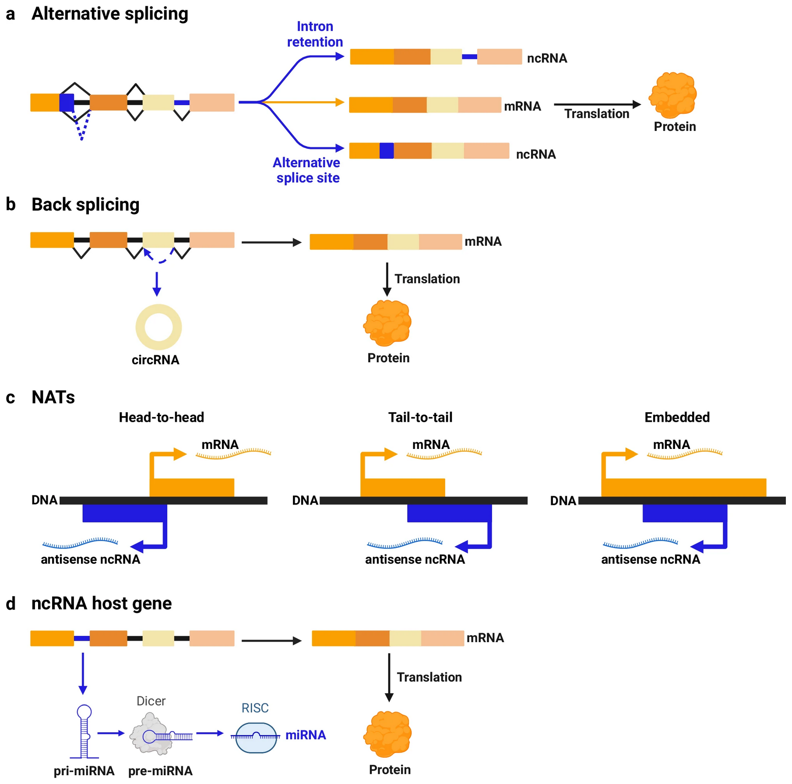

```{r knitr setup, include=T,  eval=TRUE, echo=FALSE, warning=FALSE}
#install.packages("remotes")
#remotes::install_github("rlesur/klippy")
klippy::klippy(position = c('top', 'right'), tooltip_message = 'Click to copy', tooltip_success = 'Copied')
library(knitr)
knitr::opts_chunk$set(eval=T, cache=FALSE, message=FALSE, warning=FALSE, 
                      comment = "", results="markup")
```

<!-- dependencies: 
make, git, wget, r-base, rstudio
R packages:
ggplot2.3.3
gridExtra
ggridges 
dplyr
Rcpp 
rlang
Purrr
Tibble 
gtable 
crayon 
magrittr 
pillar
-->

# Introduction

In this session we will continue annotating sequences, but now with a focus on transcripts, which can be coding and non-coding.
In fact, the same gene can encode both coding and non-coding transcripts [@Poliseno2024]:



TBD including short and long reads, assembly with/wo ref, trinity, stringtie, spatial transcriptomics, expression dbs, etc


# Transcript-based pangenome analysis

We will follow the introduction and protocol at:

<https://eead-csic-compbio.github.io/get_homologues/plant_pangenome/protocol.html>

For the exercises you will need 

Note that the software GET_HOMOLOGUES-EST is a part of the GET_HOMOLOGUES package, which you installed in session 2.

cd /data
    8  ls
    9  rm -rf cds*
   10  tar xvfz /home/vep/test_data/transcripts/cds.tgz 
   11  ls
   12  tar xvfz /home/vep/test_data/transcripts/cds*tgz
   13  tar xvfz /home/vep/test_data/transcripts/cds_est_homologues.tgz


# Coexpression networks


## Your report

Your work is to run both protocols and write a brief report with:

+ a summary of the pantranscriptome analysis, including 
  * A simulation of pan leaf pantranscriptome after comparing 14 barleys, similar to Fig. 6 in the GET_HOMOLOGUES-EST protocol
  * A table of Pfam domains enriched in core and accessory transcripts
  * An overall recapitulation of the analysis.

+ .. 


Please make a folder named 'transcripts/' in the same GitHub repo of
[session 1](https://eead-csic-compbio.github.io/bioinformatics/session1.html), 
and write a report explaining i) how you solved the exercises, explaining the results,
and ii) the problems you faced. See more recommendations [here](https://eead-csic-compbio.github.io/bioinformatics).


## References


