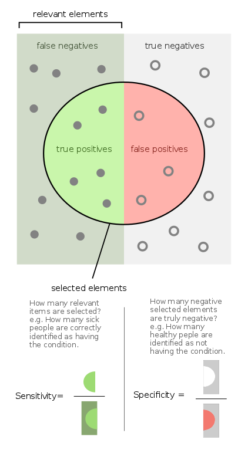

```{r knitr setup, include=FALSE,  eval=TRUE, echo=FALSE, warning=FALSE}
library(knitr)
knitr::opts_chunk$set(eval=TRUE, cache=FALSE, message=FALSE, warning=FALSE, 
                      comment = "", results="markup")
```

# Introduction

In this session we will learn about benchmarks, which are experiments designed to measure the performance of algorithms, methodologies or statistical models. In particular, we will focus on classification problems. These are problems where data instances are assigned to a set of classes.  Note that methods that produce numeric scores can often be disguised as classifiers by adding rules that assign scores to classes. Neurons in neural nets use sigmoid functions for this, see [here](https://bioinfoperl.blogspot.com/2020/04/propagacion-en-una-red-neuronal.html) (in Spanish).

## Definitions

**Data instance:** individual observation within a data class. Example: a phenotype measurement on a plant, or from a single leaf.

**Training set:** Set of data used to train a model or algorithm. You can read about how deep learning machines are trained [here](https://bioinfoperl.blogspot.com/2020/05/entrenamiento-de-una-red-neuronal.html) (in Spanish).

**Validation set:** Fraction of the data used to check the trained model during cross-validation.

**Test set:** Independent set of data used to measure the performance of a trained model or algorithm. If only one dataset is available then test and validations sets might be the same.


**Cross-validation:** model validation procedure based on repeatedly spliting a dataset in to training and validation subsets. Partitions can be done in various ways, such as 80% training and %20 validation, or %50/%50. A test set can still be used to independently measure performance on an independent dataset.

**Imbalanced dataset:** Occurs when the number of data instances in the training dataset in each class is not balanced. Severe imbalance happens when the distribution of instances is uneven by a large amount (e.g. 1:100 or more) and are particularly challenging for training.

**Over-training:** Occurs when the performance on the training sets improve while getting worse on the validation sets. It is a form of over-fitting the training data. Learn more [here](https://bioinfoperl.blogspot.com/2020/05/sobreentrenamiento-de-una-red-neuronal.html) (in Spanish).

**Positive and negative cases:** When classifying data instances, positives are cases that truly belong to a class and negatives those that do not belong to it. The following figure, taken from [@Walber2014], summarizes how predictors or models handle instances and how the four possible outcomes (TP,FP,TN,FN) can be used to compute specificity and sensitivity:



**Sensitivity or recall:** True positive rate.
$$ sens = \frac{TP}{TP+FN} $$

**Specificity or precision:** False positive rate.

$$ spec = \frac{TN}{TN+FP} $$

## A benchmark example

In this example, adapted from [@Miles2018], we will be using a dataset of red wines first published by [@Cortez2009]:

```{r data_sample}
wines <- read.csv(file="./test_data/red_wine_quality.csv", sep=";")
kable(wines[1:5,])
```

The last column (quality) is the dependent variable in this example, the one we will try to predict from the others and use to classify wines as high-quality (HQ) or low-quality (LQ). In order to convert quality estimates to HQ/LQ binary values, the original 3-8 values are assigned 1 when $quality > 5$ or else 0. 

In order to graph performance and to compare different models we will plot 
Receiver Operating Characteristic (ROC) curves, which show specificity vs sensitivity.
The Area Under the Curve (AUC) allows comparing alternative models.
Two different models are trained, a random forest and a logistic regression.
The code shown below requires the following R packages:
+ [pROC](https://cran.r-project.org/web/packages/pROC/index.html):
+ [randomForest](https://cran.r-project.org/web/packages/randomForest/index.html)


```{r wine_bench}
# uncomment to install dependencies
# install.packages(c("pROC", "randomForest"))

# load the data, originally downloaded from
# https://archive.ics.uci.edu/ml/machine-learning-databases/wine-quality/
df = read.csv(file="./test_data/red_wine_quality.csv", sep=";")

# transform the quality column to a 1 (if quality > 5) or a 0
df$quality = ifelse(df$quality>5,1,0)

# change the quality column to a factor type
df$quality = as.factor(df$quality)

# split the dataframe into train and test sets
index = sample(1:nrow(df),size = 0.8*nrow(df))
train <- df[index,]
test <- df[-index,]

# build the random forest model and test it
library(randomForest)
rf_model <- randomForest(quality ~., data = train)
rf_prediction <- predict(rf_model, test, type = "prob")

# build the logistic regression model and test it
lr_model <- glm(quality ~., data = train, family = "binomial")
lr_prediction <- predict(lr_model, test, type = "response")

# ROC curves
library(pROC)
ROC_rf <- roc(test$quality, rf_prediction[,2])
ROC_lr <- roc(test$quality, lr_prediction)

# Area Under Curve (AUC) for each ROC curve (higher -> better)
ROC_rf_auc <- auc(ROC_rf)
ROC_lr_auc <- auc(ROC_lr)

# plot ROC curves
plot(ROC_rf, col="green", 
	main="ROC For Random Forest (GREEN) vs Logistic Regression (RED)")
lines(ROC_lr, col = "red")

# print the performance summary
paste("Accuracy % of random forest: ", 
	mean(test$quality == round(rf_prediction[,2], digits = 0)))
paste("Accuracy % of logistic regression: ", 
	mean(test$quality == round(lr_prediction, digits = 0)))
paste("Area under curve of random forest: ", ROC_rf_auc)
paste("Area under curve of logistic regression: ", ROC_lr_auc)
```

## Exercise


How balanced is the wine dataset?

# References and notes

