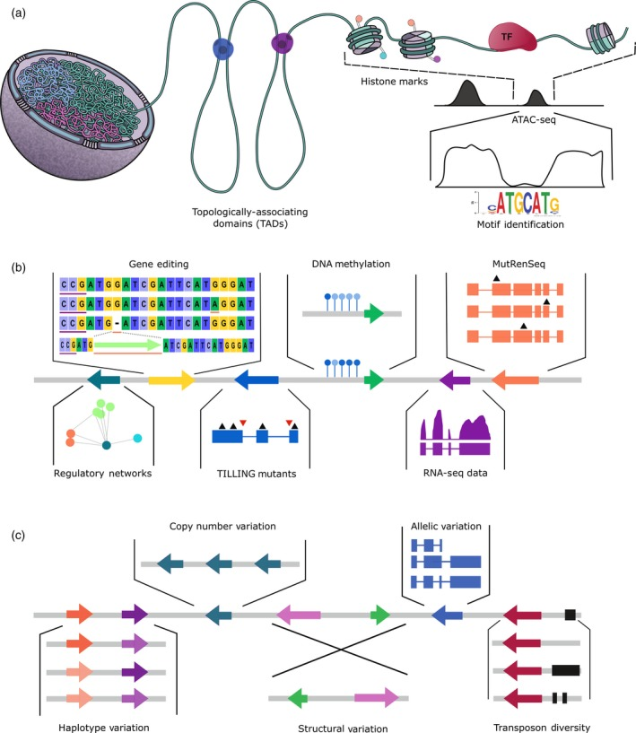

```{r knitr setup, include=FALSE,  eval=TRUE, echo=FALSE, warning=FALSE}
library(knitr)
knitr::opts_chunk$set(eval=TRUE, cache=FALSE, message=FALSE, warning=FALSE, 
                      comment = "", results="markup")
```

# Setup

In order to run the examples in this section you will need to obtain some software and data:

|software|source|documentation|
|----|----|----|
perl | [www.perl.org](https://www.perl.org) | [www.perl.org/docs](https://www.perl.org/docs.html), [perl one-liners](https://github.com/eead-csic-compbio/scripting_linux_shell/blob/master/session4.md) |
bcftools | [samtools.github.io/bcftools/](https://samtools.github.io/bcftools/) | [BCFtools HowTo](https://samtools.github.io/bcftools/howtos/index.html) |

Users of Debian/Ubuntu Linux can easily install these software dependencies with apt:

```{r apt, engine='bash', eval=FALSE}
sudo apt install bcftools
```

Windows users can use the [WSL](https://github.com/eead-csic-compbio/scripting_linux_shell/blob/master/session0.md#ubuntu-embedded-in-windows-10), which can be used to install Ubuntu, or [MobaXterm](https://mobaxterm.mobatek.net). In the latter case, you can install bcftools as follows:

```{r compilation, engine='bash', eval=FALSE}
apt-get install perl_base make git gcc-core zlib-devel liblzma-devel libbz2-devel libcurl-devel
git clone --recurse-submodules https://github.com/samtools/htslib.git
git clone https://github.com/samtools/bcftools.git
cd bcftools/
make
# this might throw errors, but the main binary will be produced anyway
ls -ltr bcftools.exe
```


# Introduction

In Genomics and Computational Biology, annotating a sequence means decorating it with quantums of biological information, usually about its *molecular function*, the *biological process(es)* in which it takes part and the *cellular compartment* where that happens (see the [Gene Ontology](http://geneontology.org)). Other relevant annotations include the evolutionary conservation of a sequence or the biological sample where it was found. The next figure summarizes example genomic features whose annotation has been recognized of importance in wheat breeding by [@Borrill2019]:

<!--  --> 


<!--* Indexed literature in repositories such as [PubMed](https://pubmed.ncbi.nlm.nih.gov) or [EuroPMC](https://europepmc.org), where publications are uniquely identified with accession codes such as the [DOI](https://www.doi.org).-->

<!--

```{r annot_stats_table}
annot.stats <- read.csv(file="test_data/uniprot_stats.tsv", sep="\t", comment.char=";", header=F)
annot.stats = annot.stats[,1:2]
names(annot.stats) <- c("Species", "reviewed proteins")

## Print the table
kable(annot.stats,format.args = list(big.mark=","))
```
-->


# Exercises

## Annotating coding sequences by alignment to other sequences

The goal of this exercise is to learn how to produce different kinds of sequence alignments with standard software. You will need to download the following required software: 


### Formatting a sequence collection for BLAST

The first task is to format our test sequence set, which was obtained from
[UniProt](http://www.uniprot.org/uniprot/?query=reviewed:yes):

```{r, engine='bash', eval=FALSE}
cd test_data/
gunzip uniprot_Atha.fasta.gz
/path/to/ncbi-blast/bin/makeblastdb -dbtype prot -in uniprot_Atha.fasta
```
**Exe1)** How many sequences have been formatted and how does this affect the E-value of BLAST searches?

### Querying the collection with a sample coding sequence

Here you will work with protein ARF6, annotated in [plntfdb.bio.uni-potsdam.de](http://plntfdb.bio.uni-potsdam.de). 
Its protein and transcript sequence is in files *test.faa* and *test.fna*, 
respectively.

```{r exep, eval=FALSE}
>AT1G30330.2 [Arabidopsis thaliana]  ARF6 (AUXIN RESPONSE FACTOR 6)
MRLSSAGFNPQPHEVTGEKRVLNSELWHACAGPLVSLPPVGSRVVYFPQGHSEQVAASTNKEVDAHIPNYPSLHPQL...
```

The transcript is:

```{r exen, eval=FALSE}
>AT1G30330.2 [Arabidopsis thaliana]  ARF6 (AUXIN RESPONSE FACTOR 6)  transcript 
ATGAGATTATCTTCAGCTGGGTTTAATCCTCAACCTCATGAAGTTACAGGAGAGAAAAGAGTTCTTAATTCTGAGCTCTG
GCATGCTTGTGCTGGTCCTCTTGTCTCACTACCTCCTGTTGGAAGCAGAGTTGTGTATTTTCCTCAAGGTCACAGTGAAC
AGGTTGCTGCTTCGACCAACAAAGAAGTAGATGCTCATATACCAAATTATCCGAGCTTGCATCCGCAGCTTATCTGT...
```

We shall now look for similar sequences in our collection:
```{r, engine='bash', eval=FALSE}
/path/to/ncbi-blast/bin/blastp -db uniprot_Atha.fasta -query test.faa -outfmt 6

/path/to/ncbi-blast/bin/blastx -db uniprot_Atha.fasta -query test.fna -outfmt 6
```

**Exe2)** Can you redirect the output to separate files called *test.faa.blast* and *test.fna.blast*?

**Exe3)** What is the default alignment format, can you show an example?

**Exe4)** Are there differences in the results retrieved in both searches?

### Producing a sequence profile

Here you will learn to make a sequence profile out of similar sequences matched with three iterations of BLASTP, using PSI-BLAST:

```{r, engine='bash', eval=FALSE}
/path/to/ncbi-blast/bin/psiblast -db uniprot_Atha.fasta -query test.faa -num_iterations 3 -out_ascii_pssm profile.out
```

**Exe 5)** Can you explain the contents of the output file *profile.out*?

### Making a Hidden Markov Model (HMM) with aligned sequences

This task actually comprises four steps:

+ Create a FASTA file with the complete protein sequences of the matches of your protein search with bit score > 200. You might find one-liners useful for this.

+ Compute a multiple alignment of these sequences with Clustal Omega. Check the available output formats.

+ Build a HMM out of these aligned sequences with *hmmbuild*

+ Scan the HMM against your sequence collection with *hmmerscan* and write a short report on the results. This should be deliverable **Exe6**.

### Annotating function by structural similarity

Search for homologous sequences and define protein domains of AT1G30330.2 with help from [HHPred](https://toolkit.tuebingen.mpg.de/tools/hhpred).

**Exe 7)** Produce a table with domains defined by the boundaries of matched entries from the Protein Data Bank and from Pfam.

### Annotating function on orthology grounds

Search for functional annotations for protein AT1G30330.2 with help from [eggNOG-mapper](http://eggnog-mapper.embl.de). Make sure you set one-to-one orthologues only.

**Exe 8)** What are the GO terms and eggNOG orthology groups of this protein? 

### Annotating function with Gene Ontology (GO) terms

In this exercise we will use the GO-web browser [QuickGo](https://www.ebi.ac.uk/QuickGO) as it is an intuitive and weekly updated resource. Although we won't be using them in this session, there are many other related tools out there, such as [UniProt](https://www.uniprot.org) or [Ensembl Plants](http://plants.ensembl.org). 

The goal of this task is for you to learn how to:
- Search for GO annotations using different inputs (protein IDs, gene IDs and GO terms).
- Search for all products annotated to specific GO term or GO ID.
- Customize the research to better fit the user preferences. 

Let's practice then:

1.	Search for the GO terms and the functional categories of the following GO IDs GO:0009414, GO:0035618, GO:0016491. **Tip :** For multiple search GO IDs needs to be separated by a space.

2.	What are the GO ID and the functional category corresponding to photosynthesis?

3.	What are the immediate parent(s) and children of the photosynthesis GO term?

4.	Search for the GO annotation terms of the following protein A0A068LKP4,A0A097PR28, A0A059Q6N8? What do you observe?

5.	How many gene products are involved in leaf development? Give the GO ID corresponding to this term.

6.	How many proteins of *Arabidopsis thaliana*, *Prunus perisca* and *Zea mays* are assigned to the leaf development GO term. 
**Tip :** Zea mays. Taxonomy ID=4577

7.	Check the total number of BP annotations and proteins supported by the **experimental** evidence codes in both *Arabidopsis thaliana* and *Prunus persica*. (see [the evidence codes](http://geneontology.org/docs/guide-go-evidence-codes/))
**Tip :** check the ‘Statistics’ box.

**Exe 9)** Summarize your results in a table.

### Your report

Your report should be a single document, preferably in PDF format, with solutions Exe1 to Exe9.

# Bibliography

