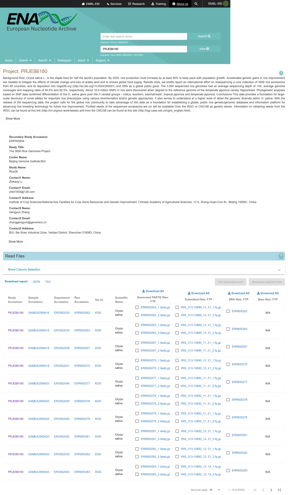
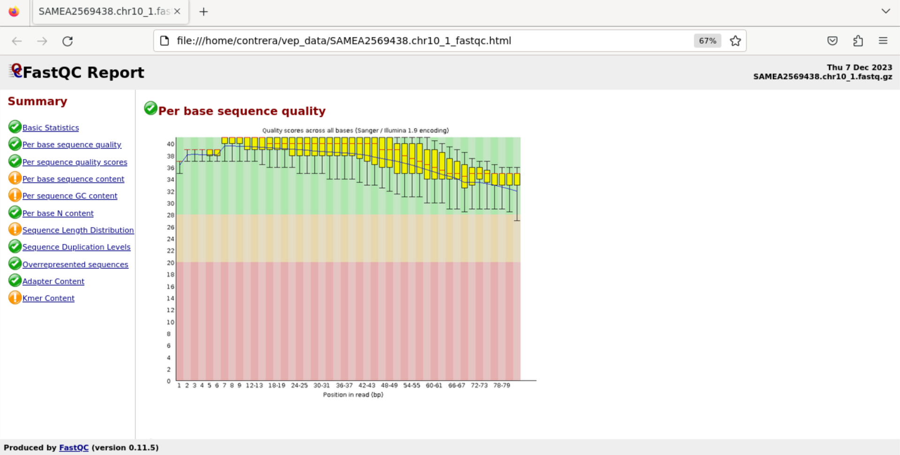
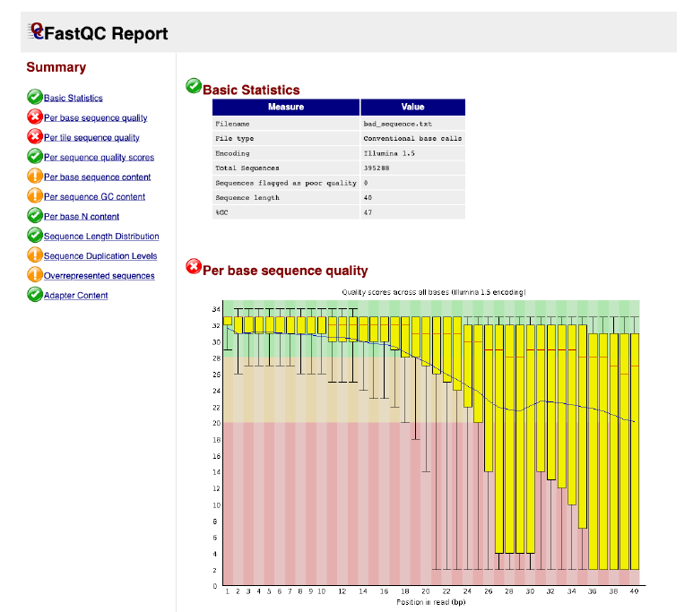
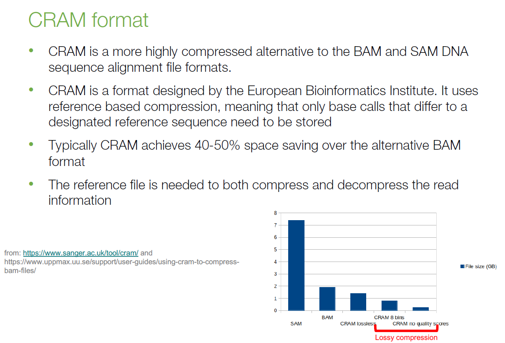
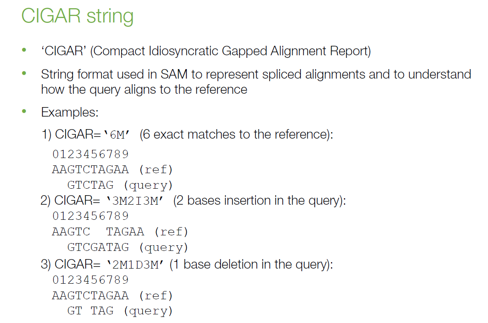
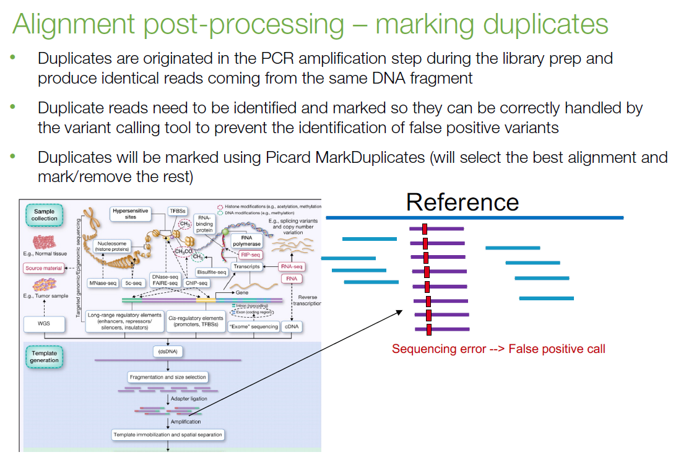
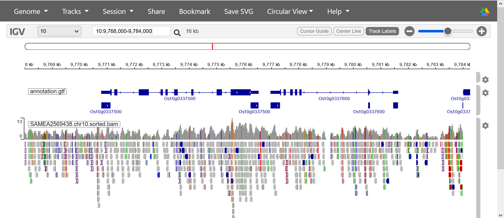

```{r knitr setup, include=FALSE,  eval=TRUE, echo=FALSE, warning=FALSE}
library(knitr)
knitr::opts_chunk$set(eval=TRUE, cache=FALSE, message=FALSE, warning=FALSE, 
                      comment = "", results="markup")
```

This session was adapted from [@masterPlantGenomics2020].

# Setup {#setup}

In order to run the examples in this section you might need to obtain some software and data:

|software|source|documentation|
|----|----|----|
bwa | [GitHub](https://github.com/lh3/bwa) | [FAQ](https://github.com/lh3/bwa#frequently-asked-questions-faqs)|
samtools | [htslib](http://www.htslib.org) | [doc](http://www.htslib.org/doc/samtools.html) [@pmid33590861] |
bedtools | [GitHub](https://github.com/arq5x/bedtools2) | [docs](https://bedtools.readthedocs.io/en/latest)|
bcftools | [GitHub](https://samtools.github.io/bcftools) | [BCFtools HowTo](https://samtools.github.io/bcftools/howtos/index.html) [@pmid33590861] |
picard-tools | [Picard](https://broadinstitute.github.io/picard) | [FAQ](http://broadinstitute.github.io/picard/faq.html) |
FastQC | [GitHub](https://github.com/s-andrews/FastQC) | [project site](https://www.bioinformatics.babraham.ac.uk/projects/fastqc) |
freebayes | [GitHub](https://github.com/freebayes/freebayes) | [issues](https://github.com/freebayes/freebayes/issues) |
tabix | [htslib](http://www.htslib.org) | [docs](http://www.htslib.org/doc/tabix.html) |

## Linux

Users of Debian/Ubuntu Linux can easily install these software dependencies with apt:

```{r apt, engine='bash', eval=FALSE}
sudo apt install bwa samtools bedtools picard-tools	fastqc freebayes bcftools tabix
```

## Windows

Windows users can instead use the [WSL](https://github.com/eead-csic-compbio/scripting_linux_shell/blob/master/session0.md#ubuntu-embedded-in-windows-10), which can be used to install Ubuntu.

## Sample data and code

For this session we will be using data available at https://github.com/eead-csic-compbio/bioinformatics/tree/main/docker/data , 
which ship with the Docker container at https://hub.docker.com/r/csicunam/bioinformatics_iamz .


# Alignment of Next-Generation sequencing data

This part of the session covers the alignment or mapping of the Next generation sequencing (NGS) data generated from a given organism for which a reference sequence for the genome already exists.

In this session, we will use the genomic data generated for the [_Oryza sativa_ Japonica](https://plants.ensembl.org/Oryza_sativa/Info/Index) (rice) species in a project called the 3000 Rice genomes project,
which is an international effort to resequence a core collection of >3000 rice accessions from 92 countries [@10.1186/2047-217X-3-7]. We will use the re-sequencing data generated in this project to identify genomic variants in this plant species.

The data from the 3000 Rice genomes project is openly available at the European Nucleotide Archive [ENA](https://www.ebi.ac.uk/ena/browser/home). It is accessible using the [PRJEB6180](https://www.ebi.ac.uk/ena/browser/view/PRJEB6180) study id. 



## Linux commands used in this session

Most of the bioinformatics tools used for genomic data analysis run in Unix/Linux, so it is recommended to have a basic knowledge of the commands used to move around the different directories in your system. You should also know how to list the contents of a directory or how to print the contents of a given text file.  

* Print the current working directory 

        $ pwd
        /home/vep

* Change directory 

        $ cd variant_data/
        
* Listing the directory contents 

        $ ls -lh
        total 31M
        -rw-rw-r-- 1 root root 406K Sep 20 11:59 Oryza_sativa.IRGSP-1.0.48.chr10.gtf.gz
        -rw-rw-r-- 1 root root 6.8M Sep 20 11:59 Oryza_sativa.IRGSP-1.0.dna.toplevel.chr10.fa.gz
        -rw-rw-r-- 1 root root  449 Dec  5 17:46 rice_variants.vcf
        -rw-rw-r-- 1 root root  11M Sep 20 11:58 SAMEA2569438.chr10_1.fastq.gz
        -rw-rw-r-- 1 root root  12M Sep 20 11:58 SAMEA2569438.chr10_2.fastq.gz
        -rw-rw-r-- 1 root root 1.4M Sep 20 11:57 SAMEA2569438.chr10.filt.vcf.gz
        -rw-rw-r-- 1 root root  478 Dec  5 17:46 wheat_variants.vcf

* Open a flat file to see its contents

        $ head wheat_variants.vcf
        #CHROM  POS     ID      REF     ALT     QUAL    FILTER  INFO
        3A      535183908               T       G       .       .
        3A      535184340               G       A       .       .
        3A      535184480               C       T       .       .
        3A      535184504               G       A       .       .
        3A      535184506               G       A       .       .
        3A      535184575               C       T       .       .
        3A      535184605               C       T       .       .
        3A      535184612               G       A       .       .
        3A      535184617               G       A       .       .

* Piping  

 It is a form of redirection that transfers the standard output of one command to another command for further processing. The different commands in the pipe are connected using the pipe character (`|`). In this way we can combine 2 or more commands. Pipes are unidirectional, i.e. data flows from left to right. Examples:

        $ zcat Oryza_sativa.IRGSP-1.0.48.chr10.gtf.gz | cut -f 1-7 | head -2
        10      RAP2018-11-26   gene    44902   45692   .       +
        10      RAP2018-11-26   transcript      44902   45692   .       

## Sequencing data for sample SAMEA2569438 

In this session we are going to align 2 files in the [FASTQ](https://en.wikipedia.org/wiki/FASTQ_format) format to the rice reference genome. Each of the files contain the forward and the reverse reads from the paired-end sequencing experiment. These reads have been generated for the sample with id `SAMEA2569438` of the 3000 Rice genomes project (see [here](https://www.ebi.ac.uk/ena/browser/view/SAMEA2569438)).  
The first thing we are going to do is check the quality of the sequencing reads.

### Quality control of the FASTQ files

For this, we will use [FASTQC](https://www.bioinformatics.babraham.ac.uk/projects/fastqc) with our FASTQ files. First, move to the directory containing the FASTQ files:

        # go $HOME , should have write permissions here
        $ cd 
        
You can now run`FASTQC` and save the output on a persistent, writable folder:

        # Note: /data is such a folder when running the Docker container
        $ fastqc /home/vep/variant_data/*.fastq.gz -o /data

And then open the two resulting HTML files using a browser such as Firefox or Chrome:

        # Note: if you are running the Docker container you should run firefox
        # from the WSL shell on a different terminal, ie
        # cd vep_data        
        $ firefox SAMEA2569438.chr10_1_fastqc.html SAMEA2569438.chr10_2_fastqc.html

You should obtains something similar to:


Note that FastQC also produces text reports in a ZIP file in case your session does not support graphics.

For your reference, here's how a report with a poor quality FASTQC file would look like: 


### Exercise 1 {-}

* 1.1 Note that there are 2 FASTQ files with the same name but different numeric suffix, why?
* 1.2 Check first SAMEA2569438.chr10_1.fastq.gz and then SAMEA2569438.chr10_2.fastq.gz, can you spot * the difference? Do you recognize the typical FASTQ format of these files?
* 1.3 Are read starts and ends similar in terms of error rate?

## Alignment with BWA

### Preparing the reference genome and annotation for samtools and IGV

[Samtools](http://www.htslib.org/doc/samtools.html) and IGV will be used in this session to manipulate the alignments generated by `bwa`, and they need the reference genome used for generating the alignments to be indexed. 

Let's start by decompressing the file we have in the session data, which is a file in [FASTA](https://en.wikipedia.org/wiki/FASTA_format) format:

        $ cd
        $ zcat /home/vep/variant_data/Oryza_sativa.IRGSP-1.0.dna.toplevel.chr10.fa.gz > /data/reference.fna

Now let's create an index for this FASTA file, which will support quickly extracting a subsequence from the reference:

        $ samtools faidx /data/reference.fna

Check that you have a new file with `.fai` suffix:

        $ ls -lh /data/reference.fna*

Finally, uncompress the gene annotation [GTF](https://www.ensembl.org/info/website/upload/gff.html) file to the persistent, local location: 

        $ zcat /home/vep/variant_data/Oryza_sativa.IRGSP-1.0.48.chr10.gtf.gz > /data/annotation.gtf


### Building an index of the reference genome for BWA

In this session we are going to use [BWA](http://bio-bwa.sourceforge.net/) 
for aligning or mapping short reads to the reference.   
This tool requires a preprocessing step consisting on building an index for the 
reference sequence, which can be done as follows:

       $ bwa index /data/reference.fna

Building the index takes a while, but the good thing is that this index can be reused for different alignment or mapping runs. Once `bwa index` has finished, check that the new files have been generated:

        $ ls -lh /data/reference.fna*
        
### BWA mem

The BWA mapper has different execution options, this can be verified by entering the following in your terminal:

    $ bwa

You will see something very similar to:

    Program: bwa (alignment via Burrows-Wheeler transformation)
    Version: 0.7.17-r1188
    Contact: Heng Li <lh3@sanger.ac.uk>

    Usage:   bwa <command> [options]

    Command: index         index sequences in the FASTA format
         mem           BWA-MEM algorithm
         fastmap       identify super-maximal exact matches
         pemerge       merge overlapping paired ends (EXPERIMENTAL)
         aln           gapped/ungapped alignment
         samse         generate alignment (single ended)
         sampe         generate alignment (paired ended)
         bwasw         BWA-SW for long queries

         shm           manage indices in shared memory
         fa2pac        convert FASTA to PAC format
         pac2bwt       generate BWT from PAC
         pac2bwtgen    alternative algorithm for generating BWT
         bwtupdate     update .bwt to the new format
         bwt2sa        generate SA from BWT and Occ

    Note: To use BWA, you need to first index the genome with `bwa index'.
      There are three alignment algorithms in BWA: `mem', `bwasw', and
      `aln/samse/sampe'. If you are not sure which to use, try `bwa mem'
      first. Please `man ./bwa.1' for the manual.

It is widely accepted that the alignment option used for reads that are 70 bp to 1Mb in length is `BWA mem`, as it is more accurate and faster than the other alignment options [@li2013aligning].

 To run `BWA`, first you need to move to the directory where the output will be generated:

        $ cd /data
 
 Now, enter the following to get an alignment in the BAM format:

        $ bwa mem reference.fna /home/vep/variant_data/SAMEA2569438.chr10_1.fastq.gz /home/vep/variant_data/SAMEA2569438.chr10_2.fastq.gz | samtools view -b -o SAMEA2569438.chr10.bam

You can verify that `BWA` is running by using the `top` Unix command. 

If you want to obtain an alignment file in the `SAM` format simply remove option `-b`.

Finally, if you want to generate an alignment in the `CRAM` format, do the following:

        $ bwa mem reference.fna /home/vep/variant_data/SAMEA2569438.chr10_1.fastq.gz /home/vep/variant_data/SAMEA2569438.chr10_2.fastq.gz |samtools view -C -T reference.fna > SAMEA2569438.chr10.cram

### Exercise 2 {-}

* 2.1 Compare the different file sizes for each of the alignment files generated in the previous section (formats SAM, BAM and CRAM).

### The SAM alignment format

The Sequence Alignment Format (SAM) is a text-based format (check the Wikipedia [entry](https://en.wikipedia.org/wiki/SAM_(file_format)) for more information), 
used for representing the alignment of the short reads in the FASTQ files to the reference sequence.
This format is not compressed and it is preferable to convert it to its binary equivalent (BAM) or to its ultra-compressed equivalent called CRAM to facilitate its handling and storage.



The alignment files in the `SAM` format (click [here](https://samtools.github.io/hts-specs/SAMv1.pdf) for the format specification) start with an optional header section followed by the alignment lines.

All header lines start with '@' and are used to represent different metadata elements such as the reference version and the chromosome sequence IDs used in the alignment, the technology used to generate the sequence data, if the alignment file is sorted or not, etc ... 
 
The alignment lines are characterized by having 11 mandatory fields:

| Col         | Field       | Type     | Brief description                     |
| ----------- | ----------- | -------- | ------------------------------------- |
| 1           | QNAME       |  String  |  Query template NAME                  |
| 2           | FLAG        |  int     |  bitwise FLAG                         |
| 3           | RNAME       |  String  |  References sequence NAME             |
| 4           | POS         |  int     |  1- based leftmost mapping POSition   |
| 5           | MAPQ        |  int     |  Mapping quality                      |
| 6           | CIGAR       |  String  |  CIGAR string                         |
| 7           | RNEXT       |  String  |  Ref. name of the mate/next read      |
| 8           | PNEXT       |  int     |  Position of the mate/next read       |
| 9           | TLEN        |  int     |  observed template length             |
| 10          | SEQ         |  String  |  segment sequence                     |
| 11          | QUAL        |  String  |  ASCII of Phred-scaled base QUALity+33|

The next figure shows a few examples of CIGAR strings:



### Samtools 

[Samtools](http://www.htslib.org/doc/samtools.html) is a command line tool used to interact and manipulate the SAM-related alignment files. 

You can practise  the commands that are more relevant for this session by going to the directory where `bwa` was run:

        $ cd /data

And entering the following commands:

*  print the alignment to stdout

         $ samtools view SAMEA2569438.chr10.bam | more
        
* print the header section

         $ samtools view -H SAMEA2569438.chr10.bam

* And if you want to get the alignments in a particular genomic region:

         $ samtools view SAMEA2569438.chr10.bam 10:10000000-10001000
        [main_samview] random alignment retrieval only works for indexed BAM or CRAM files.

This does not work because first you need to sort and build an index for the `bam` file:

         $ samtools sort SAMEA2569438.chr10.bam -o SAMEA2569438.chr10.sorted.bam -O BAM

Now, build an index for the new sorted `bam` file:

         $ samtools index SAMEA2569438.chr10.sorted.bam

Finally, repeat the `samtools view` command to print a particular region:

         $ samtools view SAMEA2569438.chr10.sorted.bam 10:10000000-10001000

 * Some basic stats on the alignment  

You can use the `flagstat` command for this:

        $ samtools flagstat SAMEA2569438.chr10.sorted.bam

And you get:

       344702 + 0 in total (QC-passed reads + QC-failed reads)
       0 + 0 secondary
       196 + 0 supplementary
       0 + 0 duplicates
       342947 + 0 mapped (99.49% : N/A)
       344506 + 0 paired in sequencing
       172253 + 0 read1
       172253 + 0 read2
       332224 + 0 properly paired (96.43% : N/A)
       340996 + 0 with itself and mate mapped
       1755 + 0 singletons (0.51% : N/A)
       0 + 0 with mate mapped to a different chr
       0 + 0 with mate mapped to a different chr (mapQ>=5)

The explanation of this report can be found in the 
[samtools stats](https://www.htslib.org/doc/samtools-stats.html#:~:text=DESCRIPTION,visualized%20graphically%20using%20plot%2Dbamstats.) manual page.

* Print the base coverage per position  

For this, we can use `samtools mpileup`. The output of this command is explained [here](http://www.htslib.org/doc/samtools-mpileup.html).  
You can run `samtools mpileup` by doing:

        $ samtools mpileup -f reference.fna SAMEA2569438.chr10.sorted.bam | more

### Exercise 3 {-}

* 3.1 Using samtools mpileup estimate the percentage of chr10 with depth > 100.

### Alignment post-processing

The alignment file in the BAM format needs a series of post-processing steps that are required for variant discovery. The different steps that are shown here will produce an analysis-ready BAM file that can be used in the following section of this session.

##### Adding metadata to the alignment file

BWA generates a BAM file without metadata information about the experimental design that has been used during the sequencing, this is why we need to manually add this metadata so it can be used during the variant calling analysis described in the variant calling section of this session. To do this, we are going to use 
[AddOrReplaceReadGroups](https://gatk.broadinstitute.org/hc/en-us/articles/360037226472-AddOrReplaceReadGroups-Picard-) from picard-tools in the following way:

        $ picard-tools AddOrReplaceReadGroups I=SAMEA2569438.chr10.sorted.bam RGSM=SAMEA2569438 RGLB=SAMEA2569438 RGPL=ILLUMINA O=SAMEA2569438.chr10.sorted.reheaded.bam RGPU=SAMEA2569438

This command will add information about the sample id that has been sequenced, which sequencing platform has been used and also information about the sequencing library id. You can verify that the SAM header contains this metadata information by doing:

        $ samtools view -H SAMEA2569438.chr10.sorted.reheaded.bam

And you will see the new metadata in the line starting with `@RG`:

        @HD     VN:1.5  SO:coordinate
        @SQ     SN:10   LN:23207287
        @RG     ID:1    LB:SAMEA2569438 PL:ILLUMINA     SM:SAMEA2569438 PU:SAMEA2569438
        @PG     ID:bwa  PN:bwa  VN:0.7.17-r1188 CL:bwa mem reference.fna /home/vep/variant_data/SAMEA2569438.chr10_1.fastq.gz /home/vep/variant_data/SAMEA2569438.chr10_2.fastq.gz

##### **MarkDuplicates** 

The alignment file we have generated using `BWA` may contain duplicate reads. These reads are originated in the PCR amplification step during the library preparation and might produce an over-representation of identical reads from the same DNA fragment. These duplicate reads must be identified and marked so they can be correctly handled by the variant calling tool.  



There are multiple tools available to handle these duplicates, in this session we will use 
[Picard MarkDuplicates](https://broadinstitute.github.io/picard/command-line-overview.html#MarkDuplicates),  which is one of the most reliable.

         $ picard-tools MarkDuplicates I=SAMEA2569438.chr10.sorted.reheaded.bam O=SAMEA2569438.chr10.sorted.reheaded.mark_duplicates.bam M=SAMEA2569438.chr10.metrics.txt

We use the `M` option so that `MarkDuplicates` generates a text file with metrics on the number of reads duplicates. This file is named `SAMEA2569438.chr10.metrics.txt` in this case. 

Let's check this metrics file:

         $ more SAMEA2569438.chr10.metrics.txt

The first part of the file is the most relevant for us:

        ## METRICS CLASS        picard.sam.DuplicationMetrics
        LIBRARY UNPAIRED_READS_EXAMINED READ_PAIRS_EXAMINED     SECONDARY_OR_SUPPLEMENTARY_RDS  UNMAPPED_READS  UNPAIRED_READ_DUPLICATES READ_PAIR_DUPLICATES    READ_PAIR_OPTICAL_DUPLICATES    PERCENT_DUPLICATION     ESTIMATED_LIBRARY_SIZE
        SAMEA2569438    1755    170498  196     1755    133     5827    0       0.034389        2437223
        ...

<!--Finally, we print the reads that are duplicates using `samtools view` in combination with the bitwise FLAG value in the second column that selects the PCR duplicates:

         $ samtools view -f 1024 SAMEA2569438.chr10.sorted.reheaded.mark_duplicates.bam | more
-->

### Exercise 4 {-}

The online version of the Integrative Genomics Viewer ([IGV](https://igv.org/app)) is a useful interactive tool to explore visually the genomic data resulting from your analysis [@Robinson2011]. We are going to use it in this section of the session to display the alignments we have generated.

We won't be using the Docker container now, instead you can use a Web browser from the WSL terminal, such as firefox, or a native Web browser to access the persistent data path, 
which should be similar to 

    \\wsl.localhost\Ubuntu\home\_username_\vep_data

* 4.1 Outside Docker, open the URL https://igv.org/app in a browser and check the [docs](https://igvteam.github.io/igv-webapp).
* 4.2 Load the reference FASTA and index files with the Genome->Local File option.
* 4.3 Load the gene annotation GTF file with the Tracks->Local File option. 
* 4.4 Load the BAM and index files with sorted, mapped reads with the Tracks->Local File option.
* 4.5 Go to the chr location 10:9,768,000-9,784,000 and zoom in to display the reads, should look like:




# Variant calling 

In the first part of the session, we used the sequencing data generated in the 
*3000 Rice Genomes project* for one particular sample with ENA accession id [SAMEA2569438](https://www.ebi.ac.uk/ena/browser/view/SAMEA2569438), 
to generate an analysis-ready BAM alignment file.  
This part of the session starts from this alignment and will generate a VCF file containing the variants identified in chromosome 10. 

## What is Variant calling?

Variant calling is the process that identifies genetic variants from sequence data. It begins with the alignment of the sequencing data present in the `FASTQ` files, as explained in the first section of the session. Then, the next step in the analysis consists on using a variant discovery tool to identify the germline variants. 

There are multiple variant calling tools available, the ones we have the most experience at Ensembl are [SAMTools mpileup](http://samtools.github.io/bcftools/bcftools.html#mpileup), the [GATK suite](https://gatk.broadinstitute.org/hc/en-us) and [Freebayes](https://github.com/ekg/freebayes). In this session we are going to use FreeBayes, since it is sensitive, accurate and relatively easy to use. 

### Freebayes

Freebayes is a haplotype-based variant detector, that uses a joint genotyping method capable of reporting variants in a single sample or in a cohort of samples [@garrison2012]. It will also be able to detect SNPs (single nucleotide polymorphisms), indels (short insertions and deletions) and MNPs (multi-nucleotide polymorphisms).

#### Reference genome

Freebayes requires the reference sequence in the `FASTA` format. In this section of the session we are going to use the same chromosome 10 sequence extracted from the *Oryza_sativa* (rice) genome that we used for the alignment section of the session.

#### Using Freebayes

To run Freebayes, you will need to specify the ploidy of the genome being analysed, the location of the FASTA reference sequence used for the alignment, and the location of the analysis-ready BAM generated in the first section of the session. Once you have this information, you are ready to run Freebayes.  To do this, go to the persisten directory where the program is going to be run:

        $ cd /data

And enter:

        $ freebayes -f reference.fna SAMEA2569438.chr10.sorted.reheaded.mark_duplicates.bam --ploidy 2 | bgzip -c > SAMEA2569438.chr10.vcf.gz

This command pipes the Freebayes output to `bgzip`, which is a special compression/decompression program included with samtools. It is preferable to compress the VCF to decrease the file size and also to use some of the `BCFTools` commands that are discussed later in this session.

#### Understanding the output VCF

After running Freebayes, you will get a compressed VCF file named `SAMEA2569438.chr10.vcf.gz` containing the identified variants. The full VCF specification with an explanation of each of the components of the file can be found [here](https://samtools.github.io/hts-specs/VCFv4.3.pdf). 

The most relevant sections for us are the meta-information lines (prefixed with `##`), the header line (prefixed with `#`) and then the data lines containing information about the variants. These data lines will contain the following text fields separated by tabs:  

| Col  | Field       | Brief description     |
| -----| ----------- | --------------------- | 
| 1    | CHROM       | Chromosome where the genetic variant was found   |
| 2    | POS         | Position in the chromosome where the genetic variant was found |
| 3    | ID          | SNP id |
| 4    | REF         | Reference allele |
| 5    | ALT         | Alternate allele |
| 6    | QUAL        | Variant quality |
| 7    | FILTER      | Filter string (`PASS` i.e. passed all filters) |
| 8    | INFO        | Semicolon-separated series of variant additional information fields |
| 9    | GENOTYPE    | Genotype information (if present) | 

#### Exploring the VCF file using BCFTools

[BCFTools](http://samtools.github.io/bcftools/bcftools.html) is a set of tools written in C that are quite efficient to manipulate files in the `VCF` format.  
In this section we are going to see some of the most useful commands to manipulate the `VCF` file we have just generated. 

So first go to the directory where you ran Freebayes:

        $ cd /data

* Print the header section

        $ bcftools view -h SAMEA2569438.chr10.vcf.gz
        
You should get something similar to:

       ##fileformat=VCFv4.2
       ##FILTER=<ID=PASS,Description="All filters passed">
       ##fileDate=20231209
       ##source=freeBayes v1.0.0
       ##reference=reference.fna
       ##contig=<ID=10,length=23207287> 
       ##phasing=none
       ##commandline="freebayes -f reference.fna SAMEA2569438.chr10.sorted.reheaded.mark_duplicates.bam --ploidy 2"
       ##INFO=<ID=NS,Number=1,Type=Integer,Description="Number of samples with data">
       ##INFO=<ID=DP,Number=1,Type=Integer,Description="Total read depth at the locus">
       ##INFO=<ID=DPB,Number=1,Type=Float,Description="Total read depth per bp at the locus; bases in reads overlapping / bases in haplotype">
       ##INFO=<ID=AC,Number=A,Type=Integer,Description="Total number of alternate alleles in called genotypes">
       ...
       ##FORMAT=<ID=GT,Number=1,Type=String,Description="Genotype">
       ##FORMAT=<ID=GQ,Number=1,Type=Float,Description="Genotype Quality, the Phred-scaled marginal (or unconditional) probability of the called genotype">
       ##FORMAT=<ID=GL,Number=G,Type=Float,Description="Genotype Likelihood, log10-scaled likelihoods of the data given the called genotype for each possible genotype generated from the reference and alternate alleles given the sample ploidy">
       ##FORMAT=<ID=DP,Number=1,Type=Integer,Description="Read Depth">
       ##FORMAT=<ID=RO,Number=1,Type=Integer,Description="Reference allele observation count">
       ##FORMAT=<ID=QR,Number=1,Type=Integer,Description="Sum of quality of the reference observations">
       ##FORMAT=<ID=AO,Number=A,Type=Integer,Description="Alternate allele observation count">
       ##FORMAT=<ID=QA,Number=A,Type=Integer,Description="Sum of quality of the alternate observations">
       ##contig=<ID=10>
       ##bcftools_viewVersion=1.7+htslib-1.7-2
       ##bcftools_viewCommand=view -h SAMEA2569438.chr10.vcf.gz; Date=Sat Dec  9 11:45:38 2023
       #CHROM  POS     ID      REF     ALT     QUAL    FILTER  INFO    FORMAT  SAMEA2569438
      
* Print some SNPs:

        $ bcftools view -H -v snps SAMEA2569438.chr10.vcf.gz | more

You get:

        10      9000024 .       G       T       52.1811 .       AB=0;ABP=0;AC=2;AF=1;AN=2;AO=2;CIGAR=1X;DP=2;DPB=2;DPRA=0;EPP=7.35324;EPPR=0;GTI=0;LEN=1;MEANALT=1;MQM=60;MQMR=0;NS=1;NUMALT=1;ODDS=7.37776;PAIRED=1;PAIREDR=0;PAO=0;PQA=0;PQR=0;PRO=0;QA=74;QR=0;RO=0;RPL=0;RPP=7.35324;RPPR=0;RPR=2;RUN=1;SAF=2;SAP=7.35324;SAR=0;SRF=0;SRP=0;SRR=0;TYPE=snp;technology.ILLUMINA=1    GT:DP:RO:QR:AO:QA:GL    1/1:2:0:0:2:74:-7.02402,-0.60206,0
        10      9000178 .       T       A       93.4005 .       AB=0;ABP=0;AC=2;AF=1;AN=2;AO=3;CIGAR=1X;DP=3;DPB=3;DPRA=0;EPP=3.73412;EPPR=0;GTI=0;LEN=1;MEANALT=1;MQM=60;MQMR=0;NS=1;NUMALT=1;ODDS=8.76405;PAIRED=1;PAIREDR=0;PAO=0;PQA=0;PQR=0;PRO=0;QA=119;QR=0;RO=0;RPL=2;RPP=3.73412;RPPR=0;RPR=1;RUN=1;SAF=3;SAP=9.52472;SAR=0;SRF=0;SRP=0;SRR=0;TYPE=snp;technology.ILLUMINA=1   GT:DP:RO:QR:AO:QA:GL    1/1:3:0:0:3:119:-11.095,-0.90309,0
        10      9000411 .       G       C       93.3954 .       AB=0;ABP=0;AC=2;AF=1;AN=2;AO=3;CIGAR=1X;DP=3;DPB=3;DPRA=0;EPP=3.73412;EPPR=0;GTI=0;LEN=1;MEANALT=1;MQM=60;MQMR=0;NS=1;NUMALT=1;ODDS=8.76405;PAIRED=1;PAIREDR=0;PAO=0;PQA=0;PQR=0;PRO=0;QA=119;QR=0;RO=0;RPL=3;RPP=9.52472;RPPR=0;RPR=0;RUN=1;SAF=1;SAP=3.73412;SAR=2;SRF=0;SRP=0;SRR=0;TYPE=snp;technology.ILLUMINA=1   GT:DP:RO:QR:AO:QA:GL    1/1:3:0:0:3:119:-11.0945,-0.90309,0
        10      9000729 .       G       A       91.6745 .       AB=0;ABP=0;AC=2;AF=1;AN=2;AO=3;CIGAR=1X;DP=3;DPB=3;DPRA=0;EPP=3.73412;EPPR=0;GTI=0;LEN=1;MEANALT=1;MQM=60;MQMR=0;NS=1;NUMALT=1;ODDS=8.76405;PAIRED=1;PAIREDR=0;PAO=0;PQA=0;PQR=0;PRO=0;QA=112;QR=0;RO=0;RPL=2;RPP=3.73412;RPPR=0;RPR=1;RUN=1;SAF=1;SAP=3.73412;SAR=2;SRF=0;SRP=0;SRR=0;TYPE=snp;technology.ILLUMINA=1   GT:DP:RO:QR:AO:QA:GL    1/1:3:0:0:3:112:-10.4453,-0.90309,0
        ...
        
* Print some INDELs

        $ bcftools view -H -v indels SAMEA2569438.chr10.vcf.gz | more

You get:

        10      9000591 .       TAA     TAAA    97.543  .       AB=0.8;ABP=6.91895;AC=1;AF=0.5;AN=2;AO=4;CIGAR=1M1I2M;DP=5;DPB=6.33333;DPRA=0;EPP=3.0103;EPPR=5.18177;GTI=0;LEN=1;MEANALT=1;MQM=60;MQMR=60;NS=1;NUMALT=1;ODDS=3.03447;PAIRED=1;PAIREDR=1;PAO=0;PQA=0;PQR=0;PRO=0;QA=160;QR=39;RO=1;RPL=2;RPP=3.0103;RPPR=5.18177;RPR=2;RUN=1;SAF=4;SAP=11.6962;SAR=0;SRF=0;SRP=5.18177;SRR=1;TYPE=ins;technology.ILLUMINA=1     GT:DP:RO:QR:AO:QA:GL    0/1:5:1:39:4:160:-13.2783,0,-2.39141
        10      9002447 .       TAAAAAAAT       TAAAAAAAAAT     170.777 .       AB=0;ABP=0;AC=2;AF=1;AN=2;AO=6;CIGAR=1M2I8M;DP=6;DPB=7.33333;DPRA=0;EPP=8.80089;EPPR=0;GTI=0;LEN=2;MEANALT=1;MQM=60;MQMR=0;NS=1;NUMALT=1;ODDS=12.9229;PAIRED=1;PAIREDR=0;PAO=0;PQA=0;PQR=0;PRO=0;QA=210;QR=0;RO=0;RPL=3;RPP=3.0103;RPPR=0;RPR=3;RUN=1;SAF=2;SAP=4.45795;SAR=4;SRF=0;SRP=0;SRR=0;TYPE=ins;technology.ILLUMINA=1  GT:DP:RO:QR:AO:QA:GL    1/1:6:0:0:6:210:-19.2409,-1.80618,0
        10      9003641 .       CTA     CTTA    71.096  .       AB=0;ABP=0;AC=2;AF=1;AN=2;AO=3;CIGAR=1M1I2M;DP=3;DPB=4;DPRA=0;EPP=3.73412;EPPR=0;GTI=0;LEN=1;MEANALT=1;MQM=60;MQMR=0;NS=1;NUMALT=1;ODDS=8.76405;PAIRED=1;PAIREDR=0;PAO=0;PQA=0;PQR=0;PRO=0;QA=95;QR=0;RO=0;RPL=2;RPP=3.73412;RPPR=0;RPR=1;RUN=1;SAF=0;SAP=9.52472;SAR=3;SRF=0;SRP=0;SRR=0;TYPE=ins;technology.ILLUMINA=1        GT:DP:RO:QR:AO:QA:GL    1/1:3:0:0:3:95:-8.86456,-0.90309,0
        10      9009331 .       GC      GGAC    73.5205 .       AB=0;ABP=0;AC=2;AF=1;AN=2;AO=5;CIGAR=1M2I1M;DP=6;DPB=11.5;DPRA=0;EPP=3.44459;EPPR=0;GTI=0;LEN=2;MEANALT=2;MQM=39.2;MQMR=0;NS=1;NUMALT=1;ODDS=12.9229;PAIRED=1;PAIREDR=0;PAO=0.5;PQA=17.5;PQR=17.5;PRO=0.5;QA=129;QR=0;RO=0;RPL=2;RPP=3.44459;RPPR=0;RPR=3;RUN=1;SAF=0;SAP=13.8677;SAR=5;SRF=0;SRP=0;SRR=0;TYPE=ins;technology.ILLUMINA=1        GT:DP:RO:QR:AO:QA:GL    1/1:6:0:0:5:129:-9.8675,-2.10721,0
        10      9009333 .       GATC    GC      63.2885 .       AB=0.833333;ABP=8.80089;AC=1;AF=0.5;AN=2;AO=5;CIGAR=1M2D1M;DP=6;DPB=3.5;DPRA=0;EPP=3.44459;EPPR=5.18177;GTI=0;LEN=2;MEANALT=1;MQM=39.2;MQMR=60;NS=1;NUMALT=1;ODDS=5.84393;PAIRED=1;PAIREDR=1;PAO=0;PQA=0;PQR=0;PRO=0;QA=142;QR=32;RO=1;RPL=3;RPP=3.44459;RPPR=5.18177;RPR=2;RUN=1;SAF=0;SAP=13.8677;SAR=5;SRF=0;SRP=5.18177;SRR=1;TYPE=del;technology.ILLUMINA=1        GT:DP:RO:QR:AO:QA:GL    0/1:6:1:32:5:142:-9.33308,0,-1.39313
        ...

* Print variants located in a specific region

To fetch the variants located in a specific genomic region, first you need to build an index for the VCF, to do this use `bcftools index`:

        $ bcftools index SAMEA2569438.chr10.vcf.gz

And then you can use `bcftools view` with the `-r` option to query a specific region:

        $ bcftools view -H -r 10:11000000-12000000 SAMEA2569438.chr10.vcf.gz | more

* Print some basic stats for the VCF file

We can use the `stats` command to generate a basic report on the number of variants in a VCF file:

        $ bcftools stats SAMEA2569438.chr10.vcf.gz |grep ^SN

We pipe the output of the `stats` command to the UNIX `grep` command to print only the lines starting with `SN`:

       SN      0       number of samples:      1
       SN      0       number of records:      31521
       SN      0       number of no-ALTs:      0
       SN      0       number of SNPs: 26349
       SN      0       number of MNPs: 2484
       SN      0       number of indels:       2426
       SN      0       number of others:       342
       SN      0       number of multiallelic sites:   95
       SN      0       number of multiallelic SNP sites:       7

* Selecting the multiallelic SNPs

Use the following command to select the multiallelic SNPs:

        $ bcftools view -H -m3 -v snps SAMEA2569438.chr10.vcf.gz | more

And you get:

        10      9057625 .       GCC     GC,GCA  166.178 .       AB=0.714286,0.285714;ABP=5.80219,5.80219;AC=1,1;AF=0.5,0.5;AN=2;AO=5,2;CIGAR=1M1D1M,2M1X;DP=7;DPB=5.33333;DPRA=0,0;EPP=6.91895,3.0103;EPPR=0;GTI=0;LEN=1,1;MEANALT=2,2;MQM=60,60;MQMR=0;NS=1;NUMALT=2;ODDS=2.13936;PAIRED=1,1;PAIREDR=0;PAO=0,0;PQA=0,0;PQR=0;PRO=0;QA=194,74;QR=0;RO=0;RPL=3,2;RPP=3.44459,7.35324;RPPR=0;RPR=2,0;RUN=1,1;SAF=3,1;SAP=3.44459,3.0103;SAR=2,1;SRF=0;SRP=0;SRR=0;TYPE=del,snp;technology.ILLUMINA=1,1    GT:DP:RO:QR:AO:QA:GL    1/2:7:0:0:5,2:194,74:-22.375,-6.42337,-4.91822,-16.3265,0,-15.7244
        10      9320227 .       AGCA    GGCG,GGCA       106.742 .       AB=0.5,0.5;ABP=3.0103,3.0103;AC=1,1;AF=0.5,0.5;AN=2;AO=3,3;CIGAR=1X2M1X,1X3M;DP=6;DPB=6.5;DPRA=0,0;EPP=3.73412,3.73412;EPPR=0;GTI=0;LEN=4,1;MEANALT=2,2;MQM=46,60;MQMR=0;NS=1;NUMALT=2;ODDS=4.98145;PAIRED=1,1;PAIREDR=0;PAO=1,1;PQA=34,34;PQR=0;PRO=0;QA=106,115;QR=0;RO=0;RPL=0,0;RPP=9.52472,9.52472;RPPR=0;RPR=3,3;RUN=1,1;SAF=1,2;SAP=3.73412,3.73412;SAR=2,1;SRF=0;SRP=0;SRR=0;TYPE=complex,snp;technology.ILLUMINA=1,1   GT:DP:RO:QR:AO:QA:GL    1/2:6:0:0:3,3:106,115:-16.6863,-9.82069,-7.71348,-8.53081,0,-6.4236
        10      9343463 .       AGGA    GGGG,GGGA       184.726 .       AB=0.4,0.6;ABP=3.87889,3.87889;AC=1,1;AF=0.5,0.5;AN=2;AO=4,6;CIGAR=1X2M1X,1X3M;DP=10;DPB=10;DPRA=0,0;EPP=5.18177,4.45795;EPPR=0;GTI=0;LEN=4,1;MEANALT=2,2;MQM=27.5,56.6667;MQMR=0;NS=1;NUMALT=2;ODDS=2.15329;PAIRED=1,1;PAIREDR=0;PAO=0,0;PQA=0,0;PQR=0;PRO=0;QA=147,226;QR=0;RO=0;RPL=3,5;RPP=5.18177,8.80089;RPPR=0;RPR=1,1;RUN=1,1;SAF=0,5;SAP=11.6962,8.80089;SAR=4,1;SRF=0;SRP=0;SRR=0;TYPE=complex,snp;technology.ILLUMINA=1,1    GT:DP:RO:QR:AO:QA:GL    1/2:10:0:0:4,6:147,226:-26.2074,-18.6652,-17.4611,-7.83766,0,-6.03148
        10      9362283 .       TGCC    CGCG,CGCC       376.577 .       AB=0.5625,0.4375;ABP=3.55317,3.55317;AC=1,1;AF=0.5,0.5;AN=2;AO=9,7;CIGAR=1X2M1X,1X3M;DP=16;DPB=16;DPRA=0,0;EPP=3.25157,3.32051;EPPR=0;GTI=0;LEN=4,1;MEANALT=2,2;MQM=55.3333,53.2857;MQMR=0;NS=1;NUMALT=2;ODDS=31.2564;PAIRED=0,0;PAIREDR=0;PAO=0,0;PQA=0,0;PQR=0;PRO=0;QA=307,256;QR=0;RO=0;RPL=1,2;RPP=14.8328,5.80219;RPPR=0;RPR=8,5;RUN=1,1;SAF=6,3;SAP=5.18177,3.32051;SAR=3,4;SRF=0;SRP=0;SRR=0;TYPE=complex,snp;technology.ILLUMINA=1,1   GT:DP:RO:QR:AO:QA:GL    1/2:16:0:0:9,7:307,256:-45.476,-20.9531,-18.2438,-24.8727,0,-22.7655
        ...

#### Filtering out artifactual variants

The process for identifying variants is not perfect. Freebayes and other variant calling tools will report variants that are not real. These must be identified and flagged so that users or downstream tools using them do not take them into account, or treat them with caution.

There are several filtering tools and strategies available for variant filtering, with varying degrees of complexity and sophistication. However, in this session we will use a very simple, yet effective approach, which consists of using the quality value assigned by Freebayes as a proxy to estimate the likelihood of a variant being real. The lower the quality value, the less likely it is that a variant is real.

In this session, we will use `bcftools filter` with a hard cut-off value of `<=1` to flag the variants that have a low quality.  

For this, first go to the directory where you ran Freebayes if you are not already there:

        $ cd /data

And  enter the following in your terminal:

        $ bcftools filter -sQUALFILTER -e'QUAL<1' SAMEA2569438.chr10.vcf.gz -o SAMEA2569438.chr10.filt.vcf.gz -Oz

Where the string passed using the `-s` option sets the label used for the filtered lines in the 7th column of the VCF, while the `-Oz` option is used to generate the output VCF in a compressed format.

Now, use `bcftools view` to verify that the 7th column has 2 new labels: `QUALFILTER` and `PASS`.

        $ bcftools view -H SAMEA2569438.chr10.filt.vcf.gz | more

The `-H` option is used to skip the header section and print the data lines only:

        10      9000024 .       G       T       52.1811 PASS    AB=0;ABP=0;AC=2;AF=1;AN=2;AO=2;CIGAR=1X;DP=2;DPB=2;DPRA=0;EPP=7.35324;EPPR=0;GTI=0;LEN=1;MEANALT=1;MQM=60;MQMR=0;NS=1;NUMALT=1;ODDS=7.37776;PAIRED=1;PAIREDR=0;PAO=0;PQA=0;PQR=0;PRO=0;QA=74;QR=0;RO=0;RPL=0;RPP=7.35324;RPPR=0;RPR=2;RUN=1;SAF=2;SAP=7.35324;SAR=0;SRF=0;SRP=0;SRR=0;TYPE=snp;technology.ILLUMINA=1    GT:DP:RO:QR:AO:QA:GL    1/1:2:0:0:2:74:-7.02402,-0.60206,0
        10      9000056 .       CA      TC      41.7389 PASS    AB=0;ABP=0;AC=2;AF=1;AN=2;AO=2;CIGAR=2X;DP=2;DPB=2;DPRA=0;EPP=7.35324;EPPR=0;GTI=0;LEN=2;MEANALT=1;MQM=60;MQMR=0;NS=1;NUMALT=1;ODDS=7.37776;PAIRED=1;PAIREDR=0;PAO=0;PQA=0;PQR=0;PRO=0;QA=63;QR=0;RO=0;RPL=2;RPP=7.35324;RPPR=0;RPR=0;RUN=1;SAF=2;SAP=7.35324;SAR=0;SRF=0;SRP=0;SRR=0;TYPE=mnp;technology.ILLUMINA=1    GT:DP:RO:QR:AO:QA:GL    1/1:2:0:0:2:63:-5.97977,-0.60206,0
        10      9000178 .       T       A       93.4005 PASS    AB=0;ABP=0;AC=2;AF=1;AN=2;AO=3;CIGAR=1X;DP=3;DPB=3;DPRA=0;EPP=3.73412;EPPR=0;GTI=0;LEN=1;MEANALT=1;MQM=60;MQMR=0;NS=1;NUMALT=1;ODDS=8.76405;PAIRED=1;PAIREDR=0;PAO=0;PQA=0;PQR=0;PRO=0;QA=119;QR=0;RO=0;RPL=2;RPP=3.73412;RPPR=0;RPR=1;RUN=1;SAF=3;SAP=9.52472;SAR=0;SRF=0;SRP=0;SRR=0;TYPE=snp;technology.ILLUMINA=1   GT:DP:RO:QR:AO:QA:GL    1/1:3:0:0:3:119:-11.095,-0.90309,0
        10      9000411 .       G       C       93.3954 PASS    AB=0;ABP=0;AC=2;AF=1;AN=2;AO=3;CIGAR=1X;DP=3;DPB=3;DPRA=0;EPP=3.73412;EPPR=0;GTI=0;LEN=1;MEANALT=1;MQM=60;MQMR=0;NS=1;NUMALT=1;ODDS=8.76405;PAIRED=1;PAIREDR=0;PAO=0;PQA=0;PQR=0;PRO=0;QA=119;QR=0;RO=0;RPL=3;RPP=9.52472;RPPR=0;RPR=0;RUN=1;SAF=1;SAP=3.73412;SAR=2;SRF=0;SRP=0;SRR=0;TYPE=snp;technology.ILLUMINA=1   GT:DP:RO:QR:AO:QA:GL    1/1:3:0:0:3:119:-11.0945,-0.90309,0
        ......

We can also print only the variants that have been filtered by doing:

        $ bcftools view -H -f QUALFILTER SAMEA2569438.chr10.filt.vcf.gz | more

And you get:

        10      9009050 .       A       G       0.292908        QUALFILTER      AB=0.2;ABP=10.8276;AC=1;AF=0.5;AN=2;AO=2;CIGAR=1X;DP=10;DPB=10;DPRA=0;EPP=7.35324;EPPR=4.09604;GTI=0;LEN=1;MEANALT=1;MQM=39.5;MQMR=54.75;NS=1;NUMALT=1;ODDS=2.66254;PAIRED=1;PAIREDR=1;PAO=0;PQA=0;PQR=0;PRO=0;QA=81;QR=256;RO=8;RPL=2;RPP=7.35324;RPPR=4.09604;RPR=0;RUN=1;SAF=0;SAP=7.35324;SAR=2;SRF=4;SRP=3.0103;SRR=4;TYPE=snp;technology.ILLUMINA=1       GT:DP:RO:QR:AO:QA:GL    0/1:10:8:256:2:81:-4.00694,0,-20.267
        10      9009343 .       A       T       0.142595        QUALFILTER      AB=0.25;ABP=7.35324;AC=1;AF=0.5;AN=2;AO=2;CIGAR=1X;DP=8;DPB=8;DPRA=0;EPP=7.35324;EPPR=3.0103;GTI=0;LEN=1;MEANALT=1;MQM=60;MQMR=42.6667;NS=1;NUMALT=1;ODDS=3.39984;PAIRED=1;PAIREDR=1;PAO=0;PQA=0;PQR=0;PRO=0;QA=60;QR=206;RO=6;RPL=0;RPP=7.35324;RPPR=3.0103;RPR=2;RUN=1;SAF=0;SAP=7.35324;SAR=2;SRF=0;SRP=16.0391;SRR=6;TYPE=snp;technology.ILLUMINA=1 GT:DP:RO:QR:AO:QA:GL    0/1:8:6:206:2:60:-3.29073,0,-13.9981
        10      9009698 .       T       G       0.0499446       QUALFILTER      AB=0;ABP=0;AC=0;AF=0;AN=2;AO=2;CIGAR=1X;DP=3;DPB=3;DPRA=0;EPP=7.35324;EPPR=5.18177;GTI=0;LEN=1;MEANALT=1;MQM=60;MQMR=60;NS=1;NUMALT=1;ODDS=4.46257;PAIRED=1;PAIREDR=1;PAO=0;PQA=0;PQR=0;PRO=0;QA=7;QR=17;RO=1;RPL=2;RPP=7.35324;RPPR=5.18177;RPR=0;RUN=1;SAF=2;SAP=7.35324;SAR=0;SRF=1;SRP=5.18177;SRR=0;TYPE=snp;technology.ILLUMINA=1 GT:DP:RO:QR:AO:QA:GL    0/0:3:1:17:2:7:0,-0.238091,-1.03498
        10      9014124 .       A       G       3.66831e-05     QUALFILTER      AB=0;ABP=0;AC=0;AF=0;AN=2;AO=2;CIGAR=1X;DP=6;DPB=6;DPRA=0;EPP=7.35324;EPPR=11.6962;GTI=0;LEN=1;MEANALT=1;MQM=5.5;MQMR=24;NS=1;NUMALT=1;ODDS=11.9687;PAIRED=1;PAIREDR=1;PAO=0;PQA=0;PQR=0;PRO=0;QA=74;QR=159;RO=4;RPL=0;RPP=7.35324;RPPR=11.6962;RPR=2;RUN=1;SAF=2;SAP=7.35324;SAR=0;SRF=4;SRP=11.6962;SRR=0;TYPE=snp;technology.ILLUMINA=1      GT:DP:RO:QR:AO:QA:GL    0/0:6:4:159:2:74:0,-0.761681,-7.48247
        ....

* How many variants have been filtered?

We can use the `stats` command together with the `-f` option and the `QUALFILTER` label to generate a report that takes into account only the filtered variants:

        $ bcftools stats -f QUALFILTER SAMEA2569438.chr10.filt.vcf.gz | grep ^SN

And you get:

        SN      0       number of samples:      1
        SN      0       number of records:      1031
        SN      0       number of no-ALTs:      0
        SN      0       number of SNPs: 908
        SN      0       number of MNPs: 88
        SN      0       number of indels:       31
        SN      0       number of others:       6
        SN      0       number of multiallelic sites:   4
        SN      0       number of multiallelic SNP sites:       2

* How many variants remain after the filtering?

We need to use the `stats` command with the `PASS` label this time to generate a new report with the variants that have not been filtered:

        $ bcftools stats -f PASS SAMEA2569438.chr10.filt.vcf.gz | grep ^SN

You get:

        SN      0       number of samples:      1
        SN      0       number of records:      30490
        SN      0       number of no-ALTs:      0
        SN      0       number of SNPs: 25441
        SN      0       number of MNPs: 2396
        SN      0       number of indels:       2395
        SN      0       number of others:       336
        SN      0       number of multiallelic sites:   91
        SN      0       number of multiallelic SNP sites:       5

### Exercise 5 {-}

As in the previous exercise, we will use again the online version of the Integrative Genomics Viewer at https://igv.org/app . We won't be using the Docker container; instead you can use a Web browser from the WSL terminal, such as firefox, or a native Web browser to access the persistent data path, 
which should be similar to 

    \\wsl.localhost\Ubuntu\home\_username_\vep_data

* 5.1 Outside Docker, open the URL https://igv.org/app in a browser.
* 5.2 Load the reference FASTA and index files with the Genome->Local File option.
* 5.3 Load the gene annotation GTF file with the Tracks->Local File option. 
* 5.4 Load the filtered VCF file with the variants with the Tracks->Local File option.
* 5.5 Take a look to INDEL variant at 10:9,058,200-9,058,229. What are the reference and alternative alleles? It this position heterozygous in your mapped sample?
* 5.6 Check the SNPs at 10:9,059,325-9,059,426. Are they all similar in terms of read dpeth (DP)?
* 5.7 Examining the aligned reads supporting the SNPs at 10:10,000,166-10,000,226 by loading the BAM and index files. Save the resulting image.

# Effect prediction


# Bibliography

